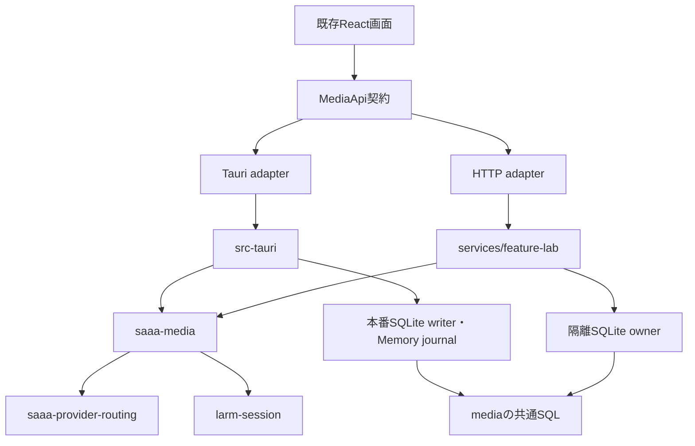

# 次の実装計画：ドメイン単体検証とFeature Labの受入、affectedの段階導入

作成日: 2026-10-07 JST  
状態: 設計のみ。今回の作業では実装・build・test・性能測定を行っていない。  
対象: `/Users/y.noguchi/Code/SAAA` の現在のcheckout。

## 0. 実装担当への依頼

この一ファイルを次段階の実装仕様とする。AGENTS.mdなど適用される指示と、各作業票に挙げたコード・テストを読む。他の計画書、レビュー文、会話履歴、別の進捗文書を必読にしない。下記のソースリンクは事実の根拠であり、追加設計を探す指示ではない。

Grokを含む実装担当が判断を補わず着手できるよう、範囲、依存順序、期待動作、検証先を固定する。特定モデルで成功率を測定した文書ではない。

1. 今回は計画作成だけ。別途実装を依頼されたときにQ00から開始する。指定IDだけの依頼ならその範囲まで。本書全体の実装依頼なら前提を満たす票を順に進め、票ごとの再承認を求めない。
2. 現在のbranchとcheckoutを使う。別worktreeや別タスクを作らず、他のタスクに依頼しない。`initial_instructions`はその会話で未実行のときだけ一度実行する。
3. 作業開始時のHEADと関連ファイルの状態を本書末尾へ記録する。既存の未コミット変更をreset、stash、上書きしない。現コードが既に条件を満たす場合は作り直さず証拠を記録する。
4. 保存設定・Provider・資格情報をリセットしない。本番DBを試験に使わない。試験は一時DBとfixtureで行い、終了時に接続・task・server・一時ディレクトリを解放する。
5. 公開IPC名、serdeの形、保存済み行の意味、既存のエラー表現を維持する。単一の本番SQLite writer、複数ドメインにまたがるtransaction、Memoryのjournal同期を維持する。
6. native音声は変更しない。macOSでは同じVoiceProcessingIOで録音とTTSを扱い、AEC・明示ducking・TTS中のASR配送を維持する。
7. 標準検証はすべて`scripts/verify.ts`経由。共有ロックとtargetを維持し、Cargo/Bun test等の直接実行や別targetで迂回しない。
8. 通常verifyにbuild/testを追加しない。advanceは静的検証＋build＋unit/contract、fullはadvance＋E2E等。日常は対象crateと必要な利用側、全体受入は全体advance、大きな変更はfull。通常のコミット前は全体advanceを行う。明示的checkpointの保存はAGENTS.mdに従い、未検証でもその限界を記録して保存できる。
9. 成功出力は`OK`一つ。失敗は完全診断で即停止し、未実行を成功扱いしない。assert削減、ignore追加、既存baseline引上げ、テスト削除で通さない。
10. 重いbuild/E2E禁止が継続する依頼では実行しない。軽量に見えるRust checkでもbuild.rsが動く。受入証拠が足りない票は「実装済・受入未完了」とし、勝手に完了にしない。
11. 本書の外へ拡張が必要なら本書末尾へ理由を記録する。関連しないMemory改修や大量の警告修正を混ぜない。依存する票だけを保留し、独立した作業は続ける。

## 1. 次に得たい成果と、今回は増やさないもの

最初の成果は、既に独立した`crates/saaa-provider-routing`で選択・検証の既存テストを単独実行できること。次にMediaの既存HTTP試験を移し、Feature Labで取消・切断・再起動を含めた共通処理の成立を確認する。その後、検証対象の自動選択を限定的に有効化する。

新しいドメインcrate、ルートworkspace、巨大Runtimeの移設、共通何でもcrateは追加しない。既存crateの単体検証を使えるようにする方が変更範囲を小さくできる。Memoryとwriterの独立化、会話・音声のHTTP化、Profile変更、LTO調整、remote cache、実サービスの性能調整は後続候補に留める。

目的は「crate数を増やすこと」ではなく「変更から必要な検証までの待ち時間を減らすこと」。コード量から改善率を推定しない。全体リンク、Tauriのbuild.rs、native音声、sidecar生成はdomain単体試験で避けられても、desktopの受入には残る。

## 2. 現在の実装を基点にする

以下は作成時のコード確認。前段の古い進捗にはHTTP未実装との記述があるが、現在は以下のファイルが存在する。実装の存在と受入完了は区別する。

| 現在確認できるもの | 次段階で行うこと |
| --- | --- |
| [MediaService](../../crates/saaa-media/src/service.rs)がsubmit/cancel/reconcile/artifact/history/shutdownを所有 | taskの寿命、永続結果、取消、終了処理の契約を直接試験する |
| [ports](../../crates/saaa-media/src/ports.rs)と[SqlStore](../../crates/saaa-media/src/store.rs)がhost境界を持つ | 既存境界を使い、AppStateをdomainへ戻さない |
| [DesktopDb/資格情報adapter](../../src-tauri/src/media_generation/host.rs)が既存writerを利用 | 本番writer/journalとの接続をdesktop統合試験に残す |
| [HTTP host](../../services/feature-lab/src/http.rs)、[起動処理](../../services/feature-lab/src/main.rs)、[隔離DB](../../services/feature-lab/src/store.rs)がある | 画像生成HTTPを作り直さず、切断・再起動・誤DB拒否を受入に加える |
| [HTTP client](../../src/features/media/mediaHttpApi.ts)、[NDJSON reader](../../src/features/media/mediaHttpStream.ts)、[launcher](../../scripts/feature-lab.ts)がある | browserまでのfixture経路とprocessの終了を検証する |
| [routingの既存テスト](../../src-tauri/src/providers/service_registry/tests.rs)はdesktop内 | 純粋な選択・検証とdesktop設定変換を分ける |
| [Replicateの既存3テスト](../../src-tauri/src/media_generation/replicate_tests.rs)はAppState/Tauri fixtureを使う | HTTP/永続化の本体をmedia crateへ移す |
| [affected計画](../../scripts/verify-affected-plan.ts)はshadow、[verify](../../scripts/verify.ts)のaffected実行は指定level全体 | 選択理由を実行結果に結びつけ、試験後に明示opt-inを導入 |
| [ownership](../../scripts/verify-affected-inputs.ts)のMEDIA_TESTSは生成・復旧の2ファイル | HTTP/preview/launcherを含む新しい利用関係へ更新する |
| [fingerprint](../../scripts/verify-fingerprint.ts)は前後比較。[verify](../../scripts/verify.ts)では初回計画作成前に取得 | 計画作成中の編集検知を維持。前後一致を入力不変の証明と呼ばない |
| [.cargo/config.toml](../../.cargo/config.toml)は共通targetを設定済み | targetを分けず、再コンパイル対象と時間を記録する |

直前レビューの5指摘は修正確認済み。本書はその修正票を再実施する計画ではない。現状は未コミットの並行編集が多く、実装開始時に基点を取り直す。

## 3. 所有者と依存方向



矢印は利用から依存先。domainに渡すのはStore/Backend/Clock/CredentialSource/AvailabilitySourceの必要な境界のみ。DB接続とcommitの所有はhost、mediaのSQLと採用規則はdomain。本番writerをlabから開かない。labでjournalを模倣して本番保証の代わりにしない。

HTTPは既存の`/api/v1/media/runs`以下の5操作を維持。NDJSONのrunId・seq・terminal、cookie・Host・Origin確認を維持する。新しいHTTP契約やエラー体系をこの段階で増やさない。

## 4. 実行と永続化の受入仕様

試験の期待値を実装担当が独自に決めないよう、次を固定する。

| 条件 | 必須の結果 |
| --- | --- |
| 同じrunIdで二重submit | Providerへの生成送信は高々1回。既存の重複/保存済み結果の契約を維持 |
| 予約・attempt記録に失敗 | 送信しない。未受付の枠・登録を解放 |
| RunHandle破棄、HTTP切断、進捗consumer停止 | 明示取消とは扱わず、service所有のtaskが確定まで進む。再接続から生成POSTを再送しない |
| UIがunmountで明示cancelする既存動作 | 上記のtransport切断とは区別して維持 |
| 取消commitが採用commitより先 | 成果物を成功として返さず、採用auditを増やさない。保存結果とterminalを一致させる |
| 採用commitが取消より先 | 確定済み結果を維持し、取消で成功を後から書換えない |
| StoreのfinishがCancelled/Unknown/Failedを返す | Providerの戻り値だけからterminalを組み立てない。実際の永続確定結果に従う |
| 予約・採用中のroute無効化 | 同じtransactionで判定し、無効なrouteの成果物を採用しない |
| DB/audit失敗 | 部分採用を残さない。成功terminalを出さず、既存HostFailureで表す |
| deadline、遠隔停止を確認できない取消 | unknown/mayHaveGeneratedの既存契約。自動的な再生成・成功扱いをしない |
| shutdown | 受付停止→有限のgrace→未確定の永続化。grace後に古いtaskが採用結果を上書きしない |
| DB再open | acceptedを維持し、残る未確定行を復旧規則で処理。起動だけで生成POSTしない |
| labの環境 | 明示された資格情報だけを使う。HOME/env/本番DBから暗黙に補わない |

時計とBackendにbarrier/channelを注入して順序を制御する。競合試験を長いsleepや「たまたま間に合った」で通さない。現在の同時生成2、download2、64MiB、prompt上限を勝手に変更しない。

## 5. テスト配置と失ってはいけない範囲

| 既存試験・保証 | 新しい正本 | 残す統合側 |
| --- | --- | --- |
| routingの選択、fingerprint、無効resource、fallback、snapshot検証 | `crates/saaa-provider-routing/src/tests/`（新規） | desktopの設定→LegacySettings変換・保存設定互換 |
| `migration_is_idempotent_and_keeps_each_credential_separate`等legacy移行 | routingのLegacySettings fixtureで同じassertを再現 | ModelProvidersSettings/RoutingSettingsからの変換も別assertとして残す |
| Replicateのdurable identity/resume/cache、unconfirmed cancel/revocation、redirect/MIMEの3ケース | `crates/saaa-media/src/tests/replicate.rs`（新規） | desktopのwriter接続、IPC変換。元ケースが混合なら分割して両側に残す |
| 既存media台帳7ケース | media crate内に維持 | domain SQL＋本番writer＋journalはdesktop側 |
| task寿命、deadline、取消/採用競合、送信回数 | media crateのservice契約テスト（新規） | HTTP切断→同じserviceの継続をlabでも確認 |
| SQLite rollback/auditとroute更新 | media crateで実SQLite | 複数ドメイン更新・journal同期・writer排他はdesktop統合 |
| HTTP認可、NDJSON、body制約、DB再open | `services/feature-lab`のunit/contract | 実processとbrowserはlab smoke |
| `media-generation.test.tsx`、`media-recovery.test.tsx` | 既存位置。React操作・状態・復旧を保証 | 実保存・遠隔停止の証拠にしない |
| `media-http-api.test.ts`、`media-http-stream.test.ts` | 既存位置。分割UTF-8、seq、終端、EOF、再POST禁止 | Rust hostの出力との相互契約を追加 |
| preview、launcher | 既存TS tests。mockの見え方と起動制御 | browserでdecode・表示、実process終了を別途確認 |
| `media_generation::ipc_tests`とIPC fixture | desktop/既存TS契約に維持 | domainへ移してTauri依存を持ち込まない |

Rustは状態遷移、送信回数、台帳、トランザクション、秘密値の取扱いを保証する。TSは表示、ユーザー操作、transportの読取りと復旧要求を保証する。IPCはcommand名、引数のcamelCase/null、enum/error、Channel進捗、成果物bytesを既存fixtureと実Rust serializeの両側で保証する。

各移動ケースに「旧完全修飾名→新名→維持したassert→fixture→feature→gate」を本書末尾へ記録する。件数だけで保存範囲を判定しない。登録漏れ、0件、skip増加を失敗とする。新側の実行と対応表の確認が終わるまで旧テストを消さない。重い旧側試験を実行できない段階では旧側を残し、移行完了としない。

## 6. affectedを実行に使うための仕様

### 6.1 CLIと段階

以下の`--mode`は新規設計。Q14の実装前には実行しない。

| コマンド | 動作 |
| --- | --- |
| `bun run --silent verify affected --explain --level advance` | 計画表示のみ。OKなし。既存入口を維持 |
| `bun run --silent verify affected --level advance` | 既定はshadow。全体advanceを実行し、候補と実行範囲をreportで分ける |
| `bun run --silent verify affected --mode selected --level advance` | allowlistを満たす場合だけ選択実行。不明な入力は同じlevelの全体へ戻す |
| `bun run --silent verify affected --mode selected --level full` | 全体full。最初の段階でfullを縮小しない |

normalは常に静的検証だけ。fallbackは「範囲」を広げ、normalをadvance/fullへ格上げしない。未知flag・未知mode・不明なbase指定を黙って無視しない。最初はworktreeとHEADとの差分を対象とし、CI用merge-base比較のCLIは追加しない。コミット後の変更なしをブランチ全体の成功と呼ばない。

### 6.2 選択根拠

- Gitのstaged/unstaged/untrackedを合成。rename/copyの両端、削除、空白・日本語・改行入りpathを扱う。入力はNUL区切りを使い、解析できなければ全体fallback。
- Cargoのnormal/dev/build/target依存の逆方向を合成。現在とHEADのmanifestの和集合を使い、削除したedgeも失わない。旧treeで必要な親manifestが読めないときはfallback。
- 正式なTOML parserを使う。固定Bun環境のparser APIを確認して利用できれば採用し、利用不可なら既存依存で使えるparserを確認する。regexを増やしてTOMLを再実装しない。parser選定が未解決ならselectedを解放しない。
- `workspace = true`、依存alias、root manifest、target条件を解決できなければfallback。cfg/optionalを理由に利用側を落とさず保守的に辺を含める。
- package設定、lockfile、toolchain、build.rs、verify基盤、IPC生成入力、共有schemaは全体fallback。genericな`src/`を理由なく「TSだけ・テストなし」へ分類しない。
- 変更したtest自身も必ず選ぶ。共通test helper/fixture、未知のTS source、登録外pathは全体へ戻す。選択済みtestが消失したら空集合で成功しない。
- 初回の選択実行allowlistは`LightAvatarBackground.tsx`と`lightAvatarBackground.css`、対応testの変更だけ。`light-avatar-background.test.tsx`とpreviewのTS/TSXテストを含める。TSのformat/lint/typecheck/buildは全言語範囲、generated/sizeは現在の全体責務を維持し、Rust commandを生成しない。
- Media UI/HTTPとRust domainの自動縮小は当初shadowのみ。受入後に一群ずつ追加する。MediaApi model変更時はdesktop/HTTP adapter、IPC利用側へ広げる。HTTP adapterだけの変更でもHTTP/stream/生成/復旧/previewを選ぶ。launcher/Vite/host変更は当初全体fallback。
- `saaa-media`やroutingの共有コード変更はsrc-tauriとfeature-lab等の利用側を含む。affectedを使えば常にdesktopを避けられる、とは約束しない。domainだけを素早く見る用途は明示的な`--package`で先に行い、最終的に利用側を確認する。

### 6.3 同じexecutor、試験分離、並行編集

選択処理は既存VerificationStepを生成する。別の検証ランナー・別ロックを作らない。選択したTS testは[frontend-tests.ts](../../scripts/frontend-tests.ts)の既存方針と同じくファイルごとにprocessを分ける。複数ファイルを一つのBun testへまとめてmock汚染を戻さない。共有チェックの重複除去はstepの意味、package、feature、引数が一致する場合だけ。

ロック取得→入力fingerprint→計画作成→検証→入力比較を維持。変更時は入力・graph・owner・stepを取り直して1回再試行し、再変更/読取不能ならOKを出さない。初回計画作成中のpackage追加、staged renameのRM→RM、untracked追加/削除、共有設定変更を回帰試験に含める。

前後hashだけでは編集後に元へ戻す操作を検出できない。selected解放前に監視を開始し、tracked/untracked sourceと検証規則の変更世代を記録する。最終scanまで監視し、overflow/監視失敗は成功にしない。対象外は`.git`内部、依存インストール物、共通target、生成成果物、外部report等、明示した出力だけ。入力と出力が混ざるディレクトリを丸ごと除外しない。watcherは絶対保証ではなく検知範囲をreportに明記する。利用不可の環境ではselectedを拒否し、shadow/manual scopedへ戻せるようにする。

reportはversion、HEAD、候補/実行step、選択理由、fallback、level/mode、実行test件数、試行別時間、lock待ち、監視状態、未測定項目を持つ。秘密値や生成promptを記録しない。試行1の時間も消さず、totalに再試行を含める。保存失敗の後にOKを出さない。report自身が入力変更を発生させないよう出力先を限定し、source pathへの上書きを拒否する。

## 7. 作業票

各票は「コード変更＋対応試験＋本書の短い記録」で一つの完了単位。目安時間は固定しない。票を跨ぐ変更が必要になったら、理由と所有者を記録する。

### Q00 — 基点と試験対応表（最初に行う）
- 読む: 第2・5節のリンク先、対象Cargo.toml、`scripts/verify-plan.ts`、`scripts/verify.ts`。
- 変更: 本書末尾だけ。旧ケースの全名、現行feature、移動/維持の対応を採取する。
- 完了: 並行編集と対象差分を区別し、未実行を含む基点がある。既存の進捗の「完了」を無条件に引き継がない。計測が許可された実装では、移動前に既存reportで旧gateの時間を記録する。禁止中なら前値未測定と記録し、後から改善率を作らない。

### Q01 — routingの純粋な選択・検証テストを独立させる
- 前提: Q00。読む/変更: `src-tauri/src/providers/service_registry/tests.rs`、`crates/saaa-provider-routing/src/{lib,resolve,validate,types}.rs`、新規`src/tests/routing.rs`。
- 手順: desktop型を使わないRegistrySnapshot fixtureを作る。fingerprint、disabled resource、capability/重複/未知ID、到達性とfallback、primary制約、review状態のassertを移す。LocalAvailability変換の確認はdesktopへ残す。
- 検証: G-R。完了: crate単独で旧不変条件が実行される。Tauri/AppStateを通常/dev依存へ追加しない。旧側未実行なら重複保持のまま受入未完了。

### Q02 — legacy移行のdomainテストとdesktop変換テストを分ける
- 前提: Q01。対象: 同じ旧tests、`crates/saaa-provider-routing/src/migration.rs`、新規`src/tests/migration.rs`、desktopの`service_registry/migration.rs`。
- 手順: LegacySettings fixtureで冪等性、別資格情報、未知provider、model options、review維持を試験。旧設定型→LegacySettingsの内容一致をdesktopに残す。実設定を読み込まない。
- 検証: G-R、G-D（許可時）。完了: 移行テストの全assertに行先があり、保存設定互換をdomainのfixtureだけで保証したと扱わない。

### Q03 — Replicateの既存3ケースをmedia crateへ移す
- 前提: Q00。対象: `src-tauri/src/media_generation/replicate_tests.rs`、`crates/saaa-media/src/{replicate,store,tests}.rs`、新規`src/tests/replicate.rs`。
- 手順: AppState/ChannelをStoreと進捗callbackへ置換。loopbackのHTTP fixture、実SQLite、POST/GET回数、redirect/認証header/MIMEのassertを維持。必要なHTTP server依存はdev-only。
- 検証: G-M、G-D（許可時）。完了: 高々1回送信、resume/cache、取消・失効、redirect/MIMEがdomainだけで実行。desktop接続を確かめる小さい統合試験は残す。

### Q04 — task寿命と送信前失敗を試験する
- 前提: Q03。対象: `crates/saaa-media/src/{service,ports,contracts}.rs`、新規`src/tests/service_lifetime.rs`。
- 手順: 制御可能Backend/Clock/Storeをtest moduleへ置く。handle drop、進捗queueの飽和、同一ID並行submit、予約/attempt失敗を別ケースにする。不備は第4節に合わせて修正。
- 検証: G-M。完了: 送信回数・枠解放・terminal/台帳をassertし、GUIや実サービスが不要。

### Q05 — 採用transactionと取消の順序を固定する
- 前提: Q04。対象: `crates/saaa-media/src/{service,store,ledger}.rs`、新規`src/tests/service_commit.rs`。
- 手順: barrierでcancel先/finish先をそれぞれ再現。FinishOutcomeとterminalを一致させる。route無効化、audit INSERT失敗、finish失敗を実SQLiteのrollbackと照合する。
- 検証: G-M。完了: terminal成功なら永続採用済みであること、取消/失効時には採用auditが増えないことを確認。SQL成功・journal失敗の扱いはdesktop試験へ渡す。

### Q06 — 終了・再起動とHTTP切断を受け入れる
- 前提: Q05。対象: service shutdown、`services/feature-lab/src/{main,http,store}.rs`、新規media/lab tests。
- 手順: active streamの切断後に同じrunをGETし、生成POST回数が増えないことを確認。grace中の完了/期限超過を試験。HTTPのdrainを無期限に待たずservice shutdownと整合させる。終了後に同じ一時DBを開き、未確定復旧とaccepted保持を確認。古いtaskの後着書込みを防ぐ。
- 検証: G-M、G-H。完了: 停止期限と再open後の台帳をassert。Store書込失敗時は診断を残し、clean shutdownと記録しない。

### Q07 — labのDB・資格情報・認可を契約試験にする
- 前提: Q06。対象: `services/feature-lab/src/{store,auth,http}.rs`、`crates/saaa-media/src/contracts.rs`、対応tests。
- 手順: 非lab DB拒否と内容不変、再起動時の既存route保持、明示tokenなしの拒否、無関係envからの補完なしを試験。peer/Host/Origin/cookie、body制約の失敗で送信回数0を確認。秘密値のDebug/log/HTTP漏出も試験する。
- 検証: G-H、G-M。完了: 専用試験が登録され、初期化失敗でDBを削除しない。環境変数を使う試験は別processで隔離する。

### Q08 — desktopのwriterとIPCの接続を保持する
- 前提: Q02、Q05。対象: `src-tauri/src/media_generation/{host,generation,ipc_tests}.rs`、`src-tauri/src/persistence/sqlite/writer.rs`、既存writer/journal tests。
- 手順: 一時DBの本物のSqliteWriterで共通Storeを試験。単一writerの排他、media採用とauditの原子性、既存の複数ドメインtransaction/journal試験の維持を確認。lab fixtureと共通の入力・期待terminalを照合。IPCのnull/enum/bytesを既存fixtureで比較。
- 検証: G-D、G-IPC、関連writer/journal試験をG-Dと同じverify入口で個別指定。完了: in-memoryのjournalなしwriterだけで本番保証を代替していない。重い検証禁止なら受入未完了で止める。

### Q09 — launcherとブラウザのfixture経路を完成させる
- 前提: Q06、Q07。対象: `scripts/feature-lab.ts`、Vite設定、`tests/feature-lab-launcher.test.ts`、HTTP/previewのTS tests。
- 手順: 既存部品を使い、ready前/後のhost終了、spawn失敗、port衝突、abortでhost/Viteが残らない試験を追加。browser smokeの専用verify stage `lab-smoke`を追加し、fixtureのみで画像decode→履歴→取消→再接続を確認する。通常verify/advanceにはbrowser起動を混ぜず、fullから呼ぶ。
- 検証: G-TSとG-LAB-SMOKE（新設後・実行許可時）。完了: browserの成功をmock-only試験で代替しない。real LARMはこのgateに含めない。

### Q10 — 変更一覧とCargo graphの入力を整える
- 前提: Q00。対象: `scripts/verify-affected-{changes,graph,plan}.ts`、`tests/verify-affected.test.ts`。
- 手順: 第6.2節のNUL path入力、正式TOML parser、current/HEAD graph和集合、保守的fallbackを実装。依存subtableだけでなくalias/dev/build/target/未解決workspace/削除をfixture化。
- 検証: G-V。完了: 不明入力が小さい検証範囲にならない。まだ実行対象を縮小しない。

### Q11 — 所有ルールと選択stepを同じ計画にする
- 前提: Q10。対象: `scripts/verify-affected-{inputs,plan}.ts`、`scripts/verify-plan.ts`、既存frontend test runner。
- 手順: 第6.2節のowner表を実装し、新HTTP/host/launcherを登録。候補stepを生成し、TSファイル別processと共有step重複除去を保つ。normal/advance/fullの不変条件をassertする。
- 検証: G-V。完了: source、test自身、共通fixture、公開MediaApi、未知pathの選択結果が固定fixtureで確認できる。advanceで必要なtestが0件となる選択を成功にしない。normalは仕様どおりtestを実行しない。

### Q12 — reportにshadowの比較根拠を残す
- 前提: Q11。対象: `scripts/verify.ts`、affected plan、`tests/verify.test.ts`。
- 手順: 実行は全体levelのまま、候補stepと実行step、scope理由、試行別時間を記録する。Q09で新設したlab-smokeも全体full側に含める。前後の全体成功だけから選択の十分性を断定しない。
- 検証: G-V。完了: report失敗前のOK禁止、秘密値除外、再試行時間保持を試験。人工fixtureで「省略したtestが失敗する変更」を用意し、ownership不足として検出できることを確認する。

### Q13 — selected用の入力監視を追加する
- 前提: Q12。対象: `scripts/verify.ts`、`scripts/verify-fingerprint.ts`、新規`scripts/verify-input-watch.ts`と対応tests。
- 手順: 第6.3節の監視世代と最終scanを実装。編集→元に戻す操作、初回計画中のpackage追加、retry中の追加、監視overflow/失敗、生成出力の除外をfixtureで試験。ロック範囲を狭めない。
- 検証: G-V。完了: 未確定入力でselectedのOKを出さない。reportに監視範囲と限界が残る。監視不可時に全体成功へ偽装せずselectedを拒否する。

### Q14 — アバター描画だけでselectedを試験導入する
- 前提: Q11〜Q13。対象: verify CLI/plan、`tests/verify-affected.test.ts`、`tests/light-avatar-background.test.tsx`。
- 手順: 新規`--mode selected`を追加し、初期allowlistを第6.2節に限定。shadowを既定に維持。アバター＋共有設定、アバター＋未登録fileは全体fallback。他のdomainを一緒に解放しない。
- 検証: G-V、G-TS。全体基盤の受入はG-ALL。完了: selectedの実行計画にCargo/desktop buildが無く、必要なTS tests/buildがある。対象外は縮小されない。全体成功とscoped成功をreportで識別できる。

### Q15 — 前後比較と次の解放判断
- 前提: Q01〜Q09、Q12〜Q14の実装。対象: verifyの任意計測modeと本書の結果欄。
- 手順: 第9節に従って測る。lab/domain受入とaffected受入を別判定する。Mediaのselected追加は必要なtest/利用側の取りこぼしが無い証拠とG-ALLが揃った場合だけ、別の小さい票として本書に追記する。
- 検証: 許可されたG-R/G-M/G-H/G-TS/G-ALL/G-FULL。完了: 未実施を空欄ではなく理由付きで記録し、改善が無ければallowlistを広げない。ここで新crate追加を自動開始しない。

## 8. 検証コマンドと途中で止められる地点

以下は実装時のコマンド集。今回の計画作成では実行しない。新規testは各crateの`cfg(test)`/test targetへ必ず登録する。

| ID | 実行コマンド |
| --- | --- |
| G-R | `bun run --silent verify advance --package crates/saaa-provider-routing` |
| G-M | `bun run --silent verify advance --package crates/saaa-media` |
| G-H | `bun run --silent verify advance --package services/feature-lab` |
| G-D | `bun run --silent verify test --package src-tauri -- --lib media_generation::`。routing変換は同じ入口で`providers::service_registry::tests`を指定 |
| G-IPC | `bun run --silent verify test --package src-tauri -- --features conversation-queue-e2e --lib media_generation::ipc_tests`と`bun run --silent verify ipc` |
| G-TS | `bun run --silent verify advance --scope typescript` |
| G-V | 下記のファイルを一つずつ`bun run --silent verify test --scope typescript -- <file>`で実行。その後`bun run --silent verify --scope typescript` |
| G-LAB-SMOKE | 新設後のみ: `bun run --silent verify lab-smoke` |
| G-ALL | `bun run --silent verify:advance` |
| G-FULL | `bun run --silent verify:full` |

G-V対象: `tests/verify.test.ts`、`tests/verify-affected.test.ts`、`tests/verify-fingerprint.test.ts`、`tests/verify-plan-window.test.ts`、`tests/verification-lock.test.ts`、Q13の新規監視test。TS機能の焦点確認も同じ単一ファイル入口で行う。

Q09のlab-smokeはverifyの共有ロック内でhost build→起動→browser fixture試験→cleanupを実行し、内側で別verifyのロックを取り直さない。実サービス・マイク・スピーカーは必要としない。live LARMの実行は別の明示受入とする。

- Q01/Q02完了時: 新crateを増やさずroutingの単体検証が得られる。ここで止めても製品経路は維持される。
- Q03〜Q09完了時: media/HTTPの共通処理とfixtureの受入が得られる。affectedは全体実行のままで成立する。
- Q10〜Q13完了時: shadowの説明・記録が改善する。selectedをまだ使わなくても成立する。
- Q14完了時: アバター限定のopt-in。既定は全体levelに戻せる。成果やDBを破棄して戻す必要はない。

共有Rustコードを変えたときはG-R/G-Mだけで終わらず、利用側G-H/G-D/G-IPCを含める。verify自体の変更は最終的にG-ALLが必要。通常verifyやテストfilterだけではbuild readinessを示さない。module size/clippyが失敗したら関連差分を調べて分割・修正し、無関係な失敗は根拠付きで区別する。baselineを緩めて解決しない。

## 9. 待ち時間の比較方法

性能測定は本書の作成時点で未実施。許可された実装ではQ00で既存reportによる時間の基点を取り、Q12/Q15で計測項目を拡充する。前値を取れなかった項目は「現在の全体対scoped比較」と記し、分割による改善率にしない。測定目的で別worktree/別target/本番コードの巻戻しをしない。

| シナリオ | 比較対象と確認点 |
| --- | --- |
| 変更なしのwarm実行 | 全体advanceとG-R/G-M/G-H。lock待ちと実行時間を分ける |
| domainの非公開処理を変更 | 対象crateのadvanceと利用側を含むgate。再コンパイルpackage/test binaryを記録 |
| 共通契約を変更 | routing/MediaApi/portsの利用側まで再検証されること。速さより欠落0を先に確認 |
| アバター描画だけ変更 | 全体advanceとselected advance。Rust compile/linkが0であることを確認 |
| labの画像fixture | 起動待ち、送信→terminal、artifact表示。実LARMの速度と混ぜない |
| 並行編集とretry | totalにやり直しとロック待ちを含む。最後の試行だけを改善値にしない |

同じmachine/toolchain/profile、電源状態、並列数、環境変数、共有targetを記録。他のverify/startを重ねない。ウォームアップ1回＋同一条件5回を基本とし、中央値と最小/最大を保存する。初回依存compileをwarmへ混ぜない。cold測定のために共通targetを消さない。cold値が必要でも今回は未測定のままでよい。

記録項目: wall time、lock待ち、各step時間、build/test内訳、再コンパイルpackageと理由、リンク時間（採れる場合）、test登録/実行件数、失敗/未実行、peak RSS、CPU時間、計測方式。

実装方法: 任意のverify計測modeからCargoのtiming/JSON artifact情報と子processの資源情報を収集する。Cargo直接実行を手順にしない。`maxRss`が未取得ならnullのまま。macOSの子process最大RSSとprocess treeの同時合計ピークを混同しない。compile/linkを分離できない場合は未測定とする。計測modeと通常modeを区別し、計測負荷を含む条件を揃える。

domain単体gateのstep一覧とCargo artifact情報に、saaa/Tauri/native音声/sidecar buildが無いことを確認する。依存にsqliteのnative compileが残ること自体は失敗ではない。全体リンクの改善をdomain単体の速度だけから主張しない。

selectedを広げる条件: 必須ケース欠落0、旧ケースの対応完了、scopedと全体の契約整合、入力変更を検知する試験通過、対象環境で時間短縮が確認できること。速くなっても保証が減るなら採用しない。

## 10. 実装担当へ渡す開始文

> この計画のQ00から順に実装してください。AGENTS.mdと本書、および作業票に記載した実コード・テストを読んでください。他の計画MDを読み直す前提にはしません。現在の実装を再利用し、新しいdomain crateやworkspace化へ広げないでください。各票の既存ケース対応、実行したverify、失敗・未実施を本書末尾へ追記してください。重いbuild/E2Eを禁止する依頼が継続している場合は実行せず、その票を受入未完了として記録してください。scopedの成功を全体成功として報告しないでください。

## 11. 進捗と証拠（このファイル内に追記）

初期状態: Q00〜Q15は未着手。実装済みと思われる条件も、対応する試験結果が揃うまでは本書の完了にしない。

各票の記録様式:

```text
ID / 状態（未着手・作業中・実装済受入未完了・完了）:
基点HEAD / 関連差分 / 並行編集:
変更ファイルと理由:
旧ケース → 新ケース → 保持assert → fixture → feature → gate:
今回実行したverify / 対象件数 / 結果:
失敗の根拠 / 未到達・未実施 / 全体の既知失敗:
契約・設定・DB・取消に変更がないことの証拠:
計測値または未測定理由:
次に進めるID / 保留するIDと理由:
```

本書作成時の未確認: 新MediaService/HTTP実装の包括的レビュー、追加後のRust/TS全体gate、実browser/process受入、journalを含むdesktop統合、実サービス、速度とメモリ。既存文書に記録された検証結果は今回再実行した結果ではない。

## 11.1 実装記録（2026-10-07）

基点HEAD: `cced8b8177b615b50167841fe760a823c0ecbf8b`（feat/self-diagnosis-v2）。別worktreeは作っていない。並行しているMemory等の未コミット差分は戻していない。前値の所要時間は既存reportから取れなかったため前値未測定。改善率は作っていない。共有targetは消していない。

旧desktopテスト（`providers::service_registry::tests`、`media_generation::replicate_tests`）は削除していない。新側が同じ不変条件を実行できる状態だが、旧側の全件再実行はしていない。

```text
Q00 / 実装済受入未完了:
基点HEAD / 関連差分 / 並行編集: cced8b81。本書の対象とMemory等の並行差分が同じcheckoutにある。
変更ファイルと理由: 本書末尾のみ。
旧ケース → 新ケース → 保持assert → fixture → feature → gate: 対応の実行結果はQ01以降。
今回実行したverify / 対象件数 / 結果: 計測用の全体advanceは実行していない。
失敗の根拠 / 未到達・未実施 / 全体の既知失敗: 前値未測定。G-ALLとG-FULLは未実施。
契約・設定・DB・取消に変更がないことの証拠: この票は記録だけ。
計測値または未測定理由: 前値未測定。cold測定のためにtargetは消していない。
次に進めるID / 保留するIDと理由: Q01以降を同じcheckoutで実施。
```

```text
Q01 / 実装済受入未完了:
基点HEAD / 関連差分 / 並行編集: cced8b81。routing crateのtestsを追加。旧desktop testsは残置。
変更ファイルと理由: crates/saaa-provider-routing/src/tests/{mod,routing}.rs。desktop型を使わないRegistrySnapshot。
旧ケース → 新ケース → 保持assert → fixture → feature → gate: service_registry::testsの選択・fingerprint・disabled・validation・fallback・primary・reviewをrouting crateの同名契約へ。LocalAvailability変換はdesktopへ残した。
今回実行したverify / 対象件数 / 結果: 前段で `verify test --package crates/saaa-provider-routing` がOK。今回G-R advance（fmt/clippy/build）は再実行していない。
失敗の根拠 / 未到達・未実施 / 全体の既知失敗: 旧側全件は未再実行。受入完了にはしない。
契約・設定・DB・取消に変更がないことの証拠: Tauri/AppStateをcrate依存へ足していない。
計測値または未測定理由: 前値未測定。
次に進めるID / 保留するIDと理由: Q02。
```

```text
Q02 / 実装済受入未完了:
基点HEAD / 関連差分 / 並行編集: 同上。
変更ファイルと理由: crates/saaa-provider-routing/src/tests/migration.rs。desktopに変換一致テストを追加。
旧ケース → 新ケース → 保持assert → fixture → feature → gate: legacy移行の冪等性・資格情報分離・未知provider・model options・reviewはdomain fixture。desktopは `local_availability_matches_domain_reachability` と `desktop_settings_conversion_matches_an_independent_legacy_fixture`。
今回実行したverify / 対象件数 / 結果: `verify test --package src-tauri -- --lib local_availability_matches_domain_reachability` と `desktop_settings_conversion_matches_an_independent_legacy_fixture` がOK。
失敗の根拠 / 未到達・未実施 / 全体の既知失敗: 旧tests.rs全件とG-R advanceは未再実行。保存設定ファイルは読んでいない。
契約・設定・DB・取消に変更がないことの証拠: 変換テストはfixtureの内容一致。本番設定は開いていない。
計測値または未測定理由: 前値未測定。
次に進めるID / 保留するIDと理由: Q08でwriter接続。
```

```text
Q03 / 実装済受入未完了:
変更ファイルと理由: crates/saaa-media/src/tests/replicate.rs。loopback、実SQLite、POST/GET、redirect、認証header、MIME。desktopのreplicate_tests.rsは残置。
今回実行したverify / 対象件数 / 結果: 前段で `verify test --package crates/saaa-media` がOK（23件。replicate 3件を含む）。
失敗の根拠 / 未到達・未実施 / 全体の既知失敗: desktop側の旧3件は未再実行。G-M advanceは未再実行。
計測値または未測定理由: 前値未測定。
```

```text
Q04 / 実装済・受入未完了:
変更ファイルと理由: service.rsの開始attemptをsubmit/reconcileへ移し、失敗時は送信前にrelease。tests/service_lifetime.rs。
保持assert: handle dropは再送しない。進捗飽和でも送信1回。同一runIdはOkが1つ。予約/attempt失敗は送信0で枠を戻す。deadlineはunknown/mayHaveGenerated。
今回実行したverify / 結果: 上記media package testがOK。
```

```text
Q05 / 実装済・受入未完了:
変更ファイルと理由: ledger.finishは終端行を維持し、cancel_requested+Okはcancelledで採用auditを増やさない。tests/service_commit.rs。
保持assert: 取消が先なら成功にしない。採用が先なら書き換えない。route失効とaudit失敗はHostFailureで部分採用を残さない。
今回実行したverify / 結果: 上記media package testがOK。
```

```text
Q06 / 実装済受入未完了:
変更ファイルと理由: service shutdownの戻り値、feature-lab mainの有限HTTP drain、tests/shutdown.rs、acceptanceの切断テスト。
保持assert: grace後の遅着はunknownを上書きしない。再openはacceptedを維持し、起動だけではPOSTしない。HTTP切断後の再GETでpostsは1。
今回実行したverify / 結果: media package testがOK。feature-lab package testがOK（切断テストを含む）。
失敗の根拠 / 未到達・未実施: G-M/G-H advance（clippy込み）は未再実行。
```

```text
Q07 / 実装済受入未完了:
変更ファイルと理由: 非lab DB拒否、明示token、秘密値のDebug、認可失敗で送信0、別processの環境変数テスト。
今回実行したverify / 結果: `verify test --package services/feature-lab` がOK。
失敗の根拠 / 未到達・未実施: G-H advanceは未再実行。
```

```text
Q08 / 実装済受入未完了:
変更ファイルと理由: src-tauri/src/media_generation/writer_contract.rs。一時ファイルのSqliteWriter::open。from_connectionは使っていない。
旧ケース → 新ケース → 保持assert → fixture → feature → gate: 第二openはdatabase-already-owned。journal sidecar（*.forget.json）がある。成功finishはacceptedかつpurpose-route-acceptedが1。audit表を落としたfinishは失敗し、先行acceptedは残り、失敗runはreservedのまま。IPC JSONはjobId null、outcomeUnknown、bytesを含まない。
今回実行したverify / 対象件数 / 結果: `verify test --package src-tauri -- --lib media_generation::writer_contract` がOK（2件）。
失敗の根拠 / 未到達・未実施 / 全体の既知失敗: G-IPC（conversation-queue-e2eと `verify ipc`）は未実施。既存の複数ドメインjournal試験は別ファイルのまま未再実行。src-tauri lib全体は未実行。
契約・設定・DB・取消に変更がないことの証拠: 試験DBはtempfile。本番DBは開いていない。
計測値または未測定理由: 前値未測定。
```

```text
Q09 / 作業中:
変更ファイルと理由: lab-smokeは所有したhost・Chromeとその子孫を追跡し、Viteのlistener終了と専用一時profile/DBの削除まで確認してから成功にする。正常終了要求は10秒、強制終了は2秒を上限に確認する。EPERMは終了の証拠にしない。ESRCHは不在。生存プロセスが使う一時ディレクトリは先に消さない。SIGINT/SIGTERMは後始末を試みて130/143。lab-smokeはfullに残している。
今回実行したverify / 結果: `verify test --scope typescript -- tests/feature-lab-smoke.test.ts` がOK（fake process）。`tests/verification-lock.test.ts` がOK。
失敗の根拠 / 未到達・未実施: 実Chromeの `verify lab-smoke` と `verify:full` は未実施。これらは受入条件から外していない。Chromeなしでfullを成功扱いにはしない。
```

```text
Q10 / 実装済受入未完了:
変更ファイルと理由: verify-affected-changesのNUL読取、verify-affected-graphのBun.TOML、previousManifestFiles。実行縮小はまだ既定にしない。
今回実行したverify / 結果: `verify test --scope typescript -- tests/verify-affected.test.ts` がOK。
失敗の根拠 / 未到達・未実施: `verify --scope typescript` はformat/lint/typecheckの後、module sizeで失敗。原因は並行差分のratchet超過、未登録ファイル、削除済みファイルのstale baseline。baselineの既存値は引き上げていない。この計画で追加した新規ファイルだけ初期登録した。
```

```text
Q11 / 実装済受入未完了:
変更ファイルと理由: owner表。Media HTTPはhttp/stream/generation/recovery/preview。MediaApi modelはsrc-tauriとfeature-labとipc。launcher/vite/hostはfull fallback。未登録のsrc/testsはadvance fallback。変更testの欠落はownershipGapsで検出。
今回実行したverify / 結果: verify-affected.test.ts がOK。normalのselectedVerificationStepsにtest stepはない。
```

```text
Q12 / 実装済受入未完了:
変更ファイルと理由: scripts/verify-run.tsへ実行本体を移し、verify.tsは入口のまま（baseline 77、現在21行）。reportはversion、HEAD、candidate、executedSteps、attemptLog、watcher、provesInputUnchanged false。秘密値はredact。source配下へのreportは拒否。lab-smokeはfullに含まれる。
今回実行したverify / 結果: tests/verify.test.ts、verify-affected.test.ts、verify-fingerprint.test.ts、verify-plan-window.test.ts、verification-lock.test.ts がOK。
失敗の根拠 / 未到達・未実施: 全体advanceのshadow report実測は未実施。tests/verify.test.ts は既存baselineを超えたまま（このcheckoutの先行差分。baselineは上げていない）。
```

```text
Q13 / 作業中:
変更ファイルと理由: finalScanはイベント数ではなく、指定した除外を引いた全ファイルのパス集合・種別・実行権限・内容hashを比較する。symlinkの参照先文字列を含め、リポジトリ外への参照や読取不能は終了コード2。close()はscannedを立てない。trackedファイルはGit管理情報を除き除外より優先する。イベント配送を止めても、残った内容変更・追加・削除を最終walkが検出する。
report: watcherDetail.scanned / scanMatched / generationStart / generationEnd / failed / overflow / excluded。provesInputUnchangedはfalse。限界文は「開始・終了scanと観測した変更イベントを比較した。OSが通知しなかった一時変更が終了前に完全復元された場合や、観測区間外の変更まで検出する保証はない。」
今回実行したverify / 結果: `tests/verify-input-watch.test.ts`、`tests/verify-input-scan.test.ts`、`tests/verify-fingerprint.test.ts` がOK。
失敗の根拠 / 未到達・未実施: 実リポジトリでのselected実行とG-ALLは未実施。受入条件からは外していない。
```

```text
Q14 / 作業中:
変更ファイルと理由: 狭いselectedは、計画作成前から最終scanまで正常なwatcherが付いた試行だけ成功できる。一度全体fallbackを選んだ呼出しは、allowlist内へ戻ってもその呼出し中は全体のまま。reportにrequestedModeを加え、attemptLogの各試行へその時点のmode・fallback・実行step・監視結果を残す。過去の試行は最終contextで書き換えない。全体fallbackは指定levelをadvance/fullへ格上げしない。
保持assert: ロック待ち中にallowlist外から内へ変わっても、無監視の狭い実行にならない。fallback後の再試行は全体のまま。狭い実行から範囲が広がると再計画し、selected-fallbackとして報告する。
今回実行したverify / 結果: `tests/verify-selected-attempt.test.ts`、`tests/verify.test.ts`、`tests/verify-affected.test.ts`、`tests/verify-plan-window.test.ts` がOK。
失敗の根拠 / 未到達・未実施: `verify --scope typescript` はmodule sizeで停止した。失敗は並行差分のratchet超過、未登録、stale baselineで、今回追加したファイルは含まれない。既存baselineは上げていない。module sizeより後の段階は未到達。G-ALLとselectedの実advanceは未実施。MediaとRust domainのselectedは解放していない。
```

```text
Q15 / 未実施:
変更ファイルと理由: 新crateもworkspaceも追加していない。allowlistは広げていない。旧テスト `providers::service_registry::tests` と `media_generation::replicate_tests` は削除していない。
計測: 未実施。前値がないため改善率は出していない。
保留した再検証（受入条件からは削除していない）: G-R、G-M、G-H、G-IPC、旧desktopテスト、desktop lib全体、G-ALL、G-FULL、実Chromeのlab-smoke。
今回実行したverify / 結果: Q09・Q13・Q14の指定したTypeScript試験はOK。`verify --scope typescript` はmodule sizeで停止。無関係な違反は記録しただけで、修正・除外・baseline緩和はしていない。
失敗の根拠 / 未到達・未実施: このcheckoutの全体受入は保留。並行差分が整理された後に再開する。scopedのOKを全体成功とは扱わない。
```


## 11.2 指定箇所の補修と軽量検証（2026-10-07）

このcheckoutの全体受入は保留する。11.1の実行結果は前段の記録であり、この補修で再実行した結果とは分ける。実装と個別の受入証拠が揃った票だけを完了にする。未実行の必須ゲートが残る票は実装済・受入未完了。Q09・Q13・Q14は機能補修と軽量試験を実施したが、下記の対象ファイルのsize違反も残るため作業中。Q15の計測は未実施。前値なしの改善率は出さない。

基点HEADは `cced8b8177b615b50167841fe760a823c0ecbf8b`。現在のbranch・checkoutを継続した。他のチャットへの依頼、worktree作成、既存差分のreset/stash、旧テスト削除は行っていない。`providers::service_registry::tests` と `media_generation::replicate_tests` は維持した。本番DB・Provider設定・音声処理は変更していない。

### 補修内容

- Q09: `scripts/feature-lab-smoke.ts` と `scripts/verification-process.ts`。起動前のプロセス一覧を基点とし、終了待ちの間も新しい子孫と別プロセスグループを追跡する。既存のブラウザ等は所有集合に入れない。各PIDへ直接終了を要求し、10秒の正常終了待ち、2秒の強制終了待ちで終了を確認する。EPERMや確認不能を終了の証拠にしない。Chrome制御を専用子プロセスに隔離し、profileを所有する一時DBディレクトリ内へ置く。中断時も起動待ちを解除して後始末へ進む。Viteのclose確認とlistener確認が失敗した場合や所有権が確認不能な場合は一時ディレクトリを残し、PID・種類・後始末エラーを診断に出す。共通呼出し側もlab-smokeの後始末時間を確保する。full内のlab-smokeとChrome必須条件は維持した。
- Q13: `scripts/verify-input-watch.ts` と `scripts/verify-fingerprint.ts`。開始・最終walkでtracked・untracked・ignoredのパス集合、種別、実行権限の各bit、内容hash、symlinkの参照文字列を比較する。除外は指定された閉じたリストのみで、Git管理情報を除くtrackedファイルを優先する。除外ディレクトリ内のtrackedファイルのイベントも数える。参照先がリポジトリ外、解決不能、読取不能の場合はscan失敗。close()はscannedを立てず、再試行のbegin()でscan状態を取り直す。macOSの一時ディレクトリの別名も正規化して照合する。
- Q13/Q14: `scripts/verify-run.ts`。report先はリポジトリ外または `src-tauri/target/verify-reports/` に限定し、symlinkによる入力への上書きも拒否する。任意のreport先をscan除外に追加しない。最終scanとfingerprintの後もwatcherを保持し、配送済みイベント・監視エラーを判定に含める。
- Q14: 再試行ごとに開始scan・fingerprintを計画作成前に取り直す。試行のcontextと監視結果をその試行の値として保存する。全体fallbackは監視の成否を成功条件にせず、既存fingerprintと指定levelの全体チェックで判定する。狭いselectedの監視不能は2で拒否する。一度選んだ全体fallbackを同一呼出し内で固定し、normalをadvance/fullへ格上げしない。

reportは `requestedMode: "selected"` と、各attemptのmode・fallback・実行step・監視結果を保持する。`watcherDetail.scanned / scanMatched / generationStart / generationEnd / failed / overflow / excluded` を記録し、`provesInputUnchanged` はfalse。限界文は以下を維持する。

> 開始・終了scanと観測した変更イベントを比較した。OSが通知しなかった一時変更が終了前に完全復元された場合や、観測区間外の変更まで検出する保証はない。

### 今回実行した軽量検証

以下はすべて `bun run --silent verify test --scope typescript -- <対象>` で実行し、最終実行は終了コード0・`OK`一つ。

| 対象 | 確認した内容 | 最終結果 |
| --- | --- | --- |
| `tests/feature-lab-smoke.test.ts` | fake processの成功・失敗・EPERM/ESRCH・中断コード・遅れて増える子孫・別グループ・既存ブラウザ保護・Vite終了不能と一時資源保護 | OK |
| `tests/verification-lock.test.ts` | 共有ロック・中断・孫プロセスの終了に加え、lab-smoke所有者の2秒を超える後始末が完了してからロックを解放する | OK |
| `tests/verify-input-watch.test.ts` | 通知を止めた内容変更・追加・削除・権限・symlink変更の最終walk、tracked除外優先、世代・overflow・close・試行リセット | OK |
| `tests/verify-fingerprint.test.ts` | fingerprintの再試行、閉じた除外、ignored入力、tracked優先、権限bit、外部/間接/解決不能symlink | OK |
| `tests/verify.test.ts` | verify既存契約・失敗コード・単一OK・計画再作成 | OK |
| `tests/verify-affected.test.ts` | allowlist・normal/full・report先の限定とsymlink上書き拒否・従来のエラー診断 | OK |
| `tests/verify-plan-window.test.ts` | ロック待ちでallowlist外→内、fallback後の内側復帰でも全体維持、狭い範囲の拡大、監視なし/scan失敗/再変更の2、試行別report | OK |
| `tests/verify-input-scan.test.ts` | 既存のscan補助モジュールの回帰確認 | OK |
| `tests/verify-selected-attempt.test.ts` | 既存のselected試行の回帰確認 | OK |

途中、macOSの一時ディレクトリ別名による内部symlink誤判定と、report拒否の既存エラー文言に関する試験が失敗した。両方を修正して上記を再実行した。作業中の入力変更でverifyが2（STALE）を返した実行もあり、成功扱いせず再実行した。最終試験中にも並行差分 `services/feature-lab/tests/process.rs` の変更を観測したが、上記9入口の最終実行はいずれも0。

### 静的ゲートの失敗と保留

`bun run --silent verify --scope typescript` は、format (TypeScript)、lint (TypeScript)、typecheck (TypeScript)、typecheck (Vite config)、generated contexts、rendered contextsまでpassed。module sizeで終了コード1となり、`OK`は出ていない。このplanのsizeは最終stepなので同ゲート内の後続stepはない。通常verifyはbuild・unit test・E2Eを含まない。

今回の対象にあるsize違反は以下。無関係な失敗だけが原因とは報告しない。

| ファイル | 現在行数 | ratchet上限 |
| --- | ---: | ---: |
| `scripts/verification-process.ts` | 221 | 57 |
| `scripts/verify-fingerprint.ts` | 173 | 123 |
| `scripts/verify-input-watch.ts` | 108 | 95 |
| `scripts/verify-run.ts` | 499 | 446 |
| `tests/feature-lab-smoke.test.ts` | 216 | 120 |
| `tests/verification-lock.test.ts` | 371 | 327 |
| `tests/verify-affected.test.ts` | 347 | 339 |
| `tests/verify-fingerprint.test.ts` | 130 | 62 |
| `tests/verify-input-watch.test.ts` | 149 | 82 |
| `tests/verify-plan-window.test.ts` | 247 | 81 |

先行差分の `tests/verify.test.ts` は321/141。この補修では編集していない。無関係な既知の違反には `scripts/clippy-ratchet.ts`、`src-tauri/src/providers/service_registry{,/tests}.rs`、`src/features/media/MediaGenerationPanel.tsx` のratchet超過、新規ファイルの未登録、削除済みファイルのstale baselineもある。無関係な違反の修正・除外、既存baselineの引上げ、チェックの緩和は行っていない。今回の終了処理・回帰試験を含む対象のsize問題も未解決であり、受入完了・build readinessは主張しない。

保留した再検証はG-R/G-M/G-H、G-IPC、旧desktopテスト、desktop lib全体、G-ALL/G-FULL、実Chromeの `verify lab-smoke`。これらを受入条件から削除しない。重いbuild/E2E、実サービス、実マイク・スピーカー、性能計測は今回実施していない。並行差分が整理され、対象のsize問題と保留条件が解消してから全体受入を再開する。
