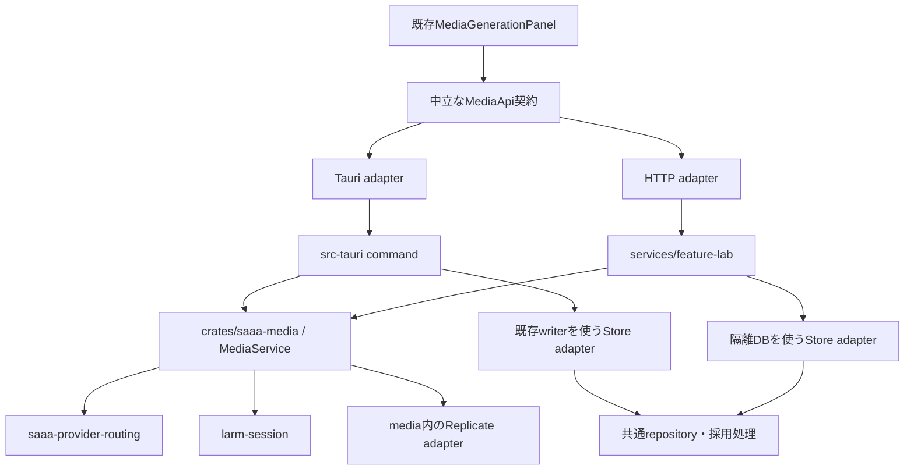

# 共通MediaServiceと画像生成用ローカルHTTPの設計

作成日: 2026年10月7日 JST  
状態: 次段階の設計。記載した新API・HTTP経路・起動方式は実装予定であり、本書作成時には動作・性能を検証していない。

## 0. 実装担当への指示 — この一ファイルで開始する

対象リポジトリは`/Users/y.noguchi/Code/SAAA`。本書に設計、変更先、実装順、テスト、完了判定、進捗記録欄を集約する。別の計画MD、レビュー文、会話履歴、別の進捗MDを読むことを前提にしない。コードへのリンクは根拠であり、別の設計文書を探す指示ではない。

適用中のシステム・ユーザー・プロジェクト指示は守る。本書はAGENTS.mdの適用を免除するものではない。必要なプロジェクト指示と、各作業に指定した実コード・テストは読む。それ以外の背景資料の探索を着手条件にしない。

### 実行ルール

1. 最初に第0〜9節を読み、第10節のN00から進める。各作業ではその票と参照された本書内の節、対象コードだけを再確認する。
2. 既存checkout・現在のbranchを使う。別worktree、別タスクへの依頼、他モデルへの送信を行わない。`initial_instructions`は会話で未実行の場合のみ一度実行し、利用不可なら記録する。
3. 本書全体の実装を依頼された場合は、前提が完了した作業を順に進める。作業ごとの再承認は求めない。特定IDだけの依頼なら、その範囲で止める。今回の文書改訂は実装開始の依頼ではない。
4. 実装済みの部分を作り直さず、実コードと受入条件を照合する。並行編集を退避・巻戻しせず、今回の変更と区別して第12節へ記録する。
5. 保存設定・Provider・資格情報をリセットしない。本番DBで試験せず、一時DBを使う。schema互換性、IPC名・serde、エラーの既存表現を維持する。
6. 単一writerと複数ドメインを跨ぐtransaction、Memoryのjournal同期を維持する。DBをcrate別に分けない。labの隔離DBは試用環境である。
7. macOSの録音とTTS再生は同じVoiceProcessingIO、AECと明示duckingを維持する。TTS中もASRへマイク入力を配送する。native音声の変更は本書の範囲外とする。
8. テストを移したら旧ケースの不変条件・fixture・feature・新配置・実行gateを第12節へ記録する。削除、assert緩和、ignore追加、baseline更新で合格させない。
9. 標準チェック・build・testはすべてverify経由。共有ロック・共有targetを使う。直接Cargo/Bun testや別targetで迂回しない。Tauri devがロックを持つ場合は終了後に検証する。
10. 通常verifyはformat/lint/typecheck等でbuild/testなし。advanceは通常verify＋build＋unit/contract。fullはadvance＋E2E等。日常は対象と利用側のadvance、コミット前は全体advance、大きな変更時はfull。明示的なcheckpoint保存はAGENTS.mdの例外に従い、未検証を記録する。
11. verify成功は`OK`一つ。失敗は完全診断と即停止。未到達を成功扱いしない。公開契約・共有依存の変更では利用側も確認し、scoped成功を全体成功にしない。
12. 重い検証が許可されていない依頼や環境では実行せず「実装済・受入未完了」とする。ビルドクラッシュの履歴があるため、検証対象・並列数・実行中のprocessを確認してから始める。通常verifyでもbuild.rsが動く可能性はある。
13. 作業票の外へ仕様変更が必要なら、根拠と必要な変更を第12節に記録する。APIを独断で別方式へ替えない。独立して進められる作業は続け、依存する作業だけを未完了にする。

Grokの特定バージョンで成功率を測定した計画ではない。設計判断を本文に固定し、追加資料と暗黙の前提を減らすための作業分解である。

## 1. この設計で実現すること

既存の画像生成画面から、Tauriを起動せずに共通のRust処理を呼べるようにする。生成、進捗、取消、履歴、成果物の表示までを一つの機能として試せる構成にする。製品のdesktop経路も同じMediaServiceを呼び、試用画面で確認した状態遷移と保存処理を製品へそのまま適用する。

本書は、既存コードレビューの指摘対応表とは独立した機能設計である。media・HTTPの実装に必要な設計と手順を本書内で完結させる。次のドメインの追加分割、affectedの内部設計、Memory改善は対象外。本書の実装にworkspace化やMemory crate化は必要ない。

最初のlab受入対象はLARM画像生成とする。desktopの音楽・Replicate・保存済み設定は維持する。将来labで音楽を扱う場合も同じmedia境界を使い、画像と音楽を別crate・別台帳に分けない。

## 2. 現在の土台と設計上の到達点

| 現在の土台 | この設計で追加する責務 |
| --- | --- |
| [saaa-media](../../crates/saaa-media/src/lib.rs)に入出力型、台帳SQL、run状態、Replicate処理がある | MediaServiceに生成から採用までの調停と5操作を集約する |
| [saaa-provider-routing](../../crates/saaa-provider-routing/src/lib.rs)に選択・検証・legacy導出がある | hostから同じ有効registryを取得し、送信時・採用時の有効性確認を共用する |
| [generation.rs](../../src-tauri/src/media_generation/generation.rs)が現在の生成順序を持つ | desktop commandを入力・進捗・結果の変換へ限定する |
| [mediaApiModel.ts](../../src/features/media/mediaApiModel.ts)と既存React部品がある | HTTP MediaApiと専用画面の起動入口を接続する |
| [SqliteWriter](../../src-tauri/src/persistence/sqlite/writer.rs)が本番DB・journal同期を所有する | 既存writerを利用するdesktop adapterと、隔離DBを所有するlab adapterを用意する |

この表は現行実装の受入完了を意味しない。実装開始時に対象ファイル、公開API、テスト登録を再確認する。

## 3. 構成と依存方向



矢印は利用側から依存先を示す。MediaServiceはhostからStore・CredentialSource・AvailabilitySourceを受け取る。図のStore adapterと共通処理の接続は、この注入によって行う。

- `saaa-media`の通常・dev・build依存からTauri、saaa、AppStateを除く。
- `services/feature-lab`は独立した実行packageとし、desktop crateの別binにはしない。
- domainのunit/contractはdomain crate、各transport契約はそれぞれのhostに置く。
- Provider routingをmedia以外の機能も使う現在の依存方向を維持する。
- native音声、Memoryのforget journal、アプリ全体の起動処理は既存所有者へ残す。

## 4. MediaServiceの公開契約

次の型名は設計上の名称。既存のGenerateInput/GenerateOutput、MediaProgress、MediaResult、MediaErrorは再利用し、保存JSONやIPCの名前を変更しない。

| 操作 | 入力 | 結果 | 所有する意味 |
| --- | --- | --- | --- |
| `submit` | GenerateInput | RunHandleまたは受付エラー | ID・入力・route・実行枠を確認し、永続予約後にservice所有のtaskを起動 |
| `cancel` | runId | 取消受付結果 | 明示取消を記録し、実行taskへ通知。Provider停止確認とは区別 |
| `history` | 最新一覧またはrunId指定 | 既存履歴shapeの配列 | 永続台帳から状態を取得。既定は既存の最新20件 |
| `reconcile` | runId | RunHandleまたは既存の確定結果 | 保存済みjobの再照合。新しい生成要求は送らない |
| `artifact` | runId、index | バイト列とMIME | 採用済み成果物だけを返す。既存の取得元・サイズ制約を適用 |

RunHandleはrunId、進捗購読、終端結果の待受を持つ。呼出元がRunHandleを破棄してもrunを取消さない。取消は必ず`cancel`を呼ぶ。desktop commandはRunHandleを待ち、既存Channelへ進捗を転送して既存GenerateOutputを返す。

受付失敗と生成失敗を分ける。入力不正、重複ID、route未設定、枠不足、予約失敗は受付エラー。受付後のProvider失敗・不明結果は既存MediaErrorとして終端結果に載せる。永続化に失敗した場合、成果物を採用済みとして返さない。

run mapやsemaphoreの変更をhostへ公開しない。移行中の互換入口は、両hostの接続完了後に内部化する。hostごとの状態遷移実装を増やさない。

### 注入する依存

| 境界 | 契約 |
| --- | --- |
| `MediaStore` | registry読出し、予約、phase保存、採用、取消、履歴、cacheを提供。transactionを跨ぐべき処理は一つのメソッドにまとめる |
| `CredentialSource` | routeに対応する秘密値を取得。出所・未設定は返せるが、秘密値をDebug・イベントへ出さない |
| `AvailabilitySource` | LARM到達性の値だけを返す。AppStateや監視service全体を渡さない |
| Provider adapter | LARM/Replicateの送信・再照合・取得・取消。既存transportと既存制約を再利用する |
| Clock | deadlineと試験用時刻。保存時刻の既存表現を維持する |

Storeは業務操作単位の境界とし、任意SQLを実行する万能traitにしない。Storeの複数メソッドを順に呼ぶことで採用transactionを表現してはならない。共有SQLを呼ぶhost adapterの契約テストを実SQLiteで実行する。

### 実装時に固定する内部契約

以下をN01a・N01bで型へ起こす。記載は未実装APIの設計であり、既存シンボルとしてimportしない。

| 名前 | 初期実装の選択 |
| --- | --- |
| `RunHandle` | runId、bounded mpscの進捗receiver、watchの終端receiver。dropで取消を発火しない |
| `RunTerminal` | `Output(GenerateOutput)`または`HostFailure(MediaHostError)`。clone可能な小さい結果をwatchに保持し、未確定はNone |
| `MediaHostError` | 安定したcodeと既存の安全なmessage。内部causeをIPC/HTTPへそのままSerializeしない |
| `HistoryQuery` | Latest（既定20件）またはByRunId。新しいDB正本・frontend台帳は持たない |
| `ArtifactBytes` | bytesと検証済みmime_type。任意pathは受け取らない |
| 取消の結果 | Accepted、AlreadyTerminal。受付と遠隔停止確認を同じboolにしない |
| `MediaStore`の主要操作 | load_registry、reserve、record_phase、finish、request_cancel、history、cache、cached、reconcile_interrupted。reserve/finish/request_cancelはそれぞれ原子的な業務操作 |
| `CredentialSource` | named secret取得とLARM token取得を分ける。秘密値はZeroizingで保持し、Debugで伏せる |
| Providerの非同期境界 | dynで注入する場合はSendなboxed futureを返す。traitのobject safetyを満たすためだけにAppStateやTauri依存を戻さない |
| 時刻 | timeoutは単調時刻、保存は現在のnow_isoと同じ表現。テストではclock/期限を制御し、長い実時間sleepを避ける |

Storeは同期的な短いDB操作を担当し、serviceの非同期taskがネットワークを担当する。desktopとlabが共通SQL調停を呼ぶことで意味を一致させる。hostの違いは接続・transactionの所有と設定入力に限定する。

一時的に旧入口を残す間も本番のrun所有者は一つとする。新しいserviceを未接続の状態で試験することはできるが、desktop切替時に旧RUNSを並行稼働させない。

注入先は`Arc`で保持し、taskから使うtraitはSend + Syncを満たす。生のrusqlite Connectionを非同期task間で共有せず、接続所有者の直列化を通す。先着取消済みIDや再照合済み結果は、終端が既に入ったRunHandleを返す形に揃え、別の生成taskを起動しない。

## 5. 生成の寿命と取消

### 生成順序

1. runId・prompt・kindを検証する。
2. 既存台帳を確認する。同じIDを再送しない。送信前取消済みIDには既存の取消結果を返す。
3. 有効registryと到達性からrouteを選び、今回のrunへ固定する。
4. 実行枠を確保し、run登録と永続予約を整合させる。予約失敗時には枠と未受付のrun登録を解放する。
5. 予約transaction内で現在のroute有効性を再検証し、重複IDを拒否する。
6. attemptを記録してからProviderへ送る。送信前に証跡保存が失敗した場合は送信しない。
7. 進捗・remote job IDを保存し、購読者へ通知する。失われた進捗通知を再送の根拠にしない。
8. 成果物を取得・cacheし、取消とroute有効性を確認して採用する。
9. 永続結果を確定してから終端結果を公開し、枠を解放する。

既存の同時生成上限2、download枠2、成果物総量64MiBの制約を引き継ぐ。上限変更は別の性能判断にする。

### 状態の扱い

| 状況 | 永続状態とUIへの意味 |
| --- | --- |
| 予約・送信・処理中 | 既存phaseを維持。remote job IDが分かれば保存 |
| 明示取消を受けた | `cancel_requested`。停止確認前に「停止完了」としない |
| 送信前取消、または遠隔停止が確認された | `cancelled`、既存のmayHaveGenerated契約を維持 |
| 結果・監査・採用がcommitされた | `accepted`。この状態の成果物を利用可能にする |
| 生成されていないことが分かる失敗 | `failed` |
| 送信後の切断・timeout・再起動で結果を確定できない | `unknown`。自動再送しない |

取消要求後の遅延進捗によって、取消要求を未取消の状態へ戻さない。取消と採用が競合する場合は同じwriter上で順序を確定する。取消が先なら採用を拒否し、採用が先なら取消によって確定結果を消さない。

台帳更新に失敗してunknownさえ保存できない場合は、状態を保存できなかったことを呼出側へ返す。メモリ内だけで成功にせず、再起動時には未終端行を保守的に扱う。

### 切断・再起動・終了

- ブラウザ切断は進捗購読の解除。runの取消ではない。
- UIの取消ボタン、または現在のパネルが行うunmount時の明示取消は`cancel`へ届く。transport切断とは別イベントとして扱う。
- 起動時、前processの未終端runを検出する。送信していないことを証明できないrunはunknownとして保持する。生成POSTを自動で再開しない。
- 同期LARM画像には再照合可能なjobがない場合がある。その場合は`synchronous_image_has_no_job`を維持し、不明結果を成功へ変換しない。
- 終了時は新規受付を停止し、runへ明示的に取消要求を渡す。待機は上限を設け、停止未確認のrunはunknownとする。強制終了後も次回起動で未終端行を処理する。

## 6. SQLite・registry・資格情報

### 保存の原子性

本番は既存のSqliteWriterを使う。DBを開くこと、journal同期、backup、migration、begin/commitの所有はdesktopに残す。labは専用のDB ownerを一つ作る。

共通repositoryは呼出元の接続・transactionを借用する。採用操作は「取消状態確認 → 有効registry再読出し → route・secret存在確認 → accepted監査 → 結果採用」を一transactionに含める。ネットワーク・awaitをこの区間へ入れない。途中失敗では監査と結果をともにrollbackする。

registryの読出しは`providers.registry/default`とlegacy overlayの現在の意味を共用する。予約時のsnapshotをそのまま採用時に使い回さず、そのtransactionで有効設定を再取得する。host側でactive確認を省略できる特別モードは設けない。

### labのデータ

- 初回は空の専用ディレクトリとSQLiteを作る。DB pathはhostが起動時に確定し、HTTPから指定させない。
- 既存の本番DBを直接開かない。lab識別情報を専用メタデータへ持たせ、別用途DBの誤指定を拒否する。
- media・registry・credentials・revision・auditの必要schemaを共通initializerから構成する。lab専用に同じCREATE文を複製しない。
- 初期化失敗でDBを消して再作成しない。現在のファイルを保持して起動エラーにする。
- 初回はlab用のLARM画像routeだけを明示設定する。設定snapshotの取込みは後続機能とし、製品設定の自動コピー・書戻しは行わない。

### 資格情報

desktopのCredentialSourceは既存SQLiteのsecretとLARMの既存env/file解決規則を保持する。labのCredentialSourceは明示投入したlab値だけを解決する。両者で同じグローバル状態を共有しない。

registryのcredential_refがある場合は、そのhostのDBからのsecret取得と同じDBでの存在確認を一致させる。LARMの既存外部tokenはcredential_refなしのrouteでも必要になり得るため、registry資格情報とLARM tokenを同一のものと仮定しない。labでは明示したtokenを使い、通常ユーザーのHOMEやenvから補完しない。

秘密値は起動設定の保護された入力、またはlab専用storeへ投入する。CLI引数、URL、ブラウザ、Vite公開env、検証reportへ入れない。初回のUIにProvider設定編集機能は追加しない。

## 7. HTTP契約 v1

HTTP hostはAxumを使う独立processを予定する。既存React画面からはViteの同一origin proxyを経由する。以下のpathは新設計であり、既存Tauri command名は変更しない。

| 操作 | method/path | 応答 |
| --- | --- | --- |
| 生成 | `POST /api/v1/media/runs` | 受付後200、進捗と終端のNDJSON stream |
| 取消 | `POST /api/v1/media/runs/{runId}/cancel` | 受付202。停止確認を意味しない |
| 履歴 | `GET /api/v1/media/runs` | 既存履歴shapeのJSON配列。任意の`runId` queryで一件を照会可能 |
| 再照合 | `POST /api/v1/media/runs/{runId}/reconcile` | 保存済みjobの進捗と終端。確定済みなら終端だけ |
| 成果物 | `GET /api/v1/media/runs/{runId}/artifacts/{index}` | 採用済みbytesと検証済みContent-Type |

生成bodyは既存GenerateInputと同じ`runId`、`kind`、`prompt`。初期labは`kind=image`のみ受付。desktopの音楽契約は変更しない。HTTPはUTF-8 JSONのbody上限64KiBを設け、その内側で既存prompt上限16,384バイトを検証する。

stream開始前の失敗は400（入力）、401/403（host認証・origin）、404（対象なし）、409（重複・競合）、429（枠不足）、422（実行設定不成立）、500（保存等）に分類する。既存の利用者向けメッセージは保持し、秘密値を含まないhostエラーコードを外側へ付ける。stream開始後の失敗はHTTP statusを変更せず、終端envelopeで返す。

stream前エラーのbodyは`{"error":{"code":"<stable-code>","message":"<safe-message>"}}`。body上限超過は413、非JSON生成要求は415とする。取消受付のbodyは`{"runId":"<uuid>","status":"accepted"}`、確定済みへの取消は同じ202で`status=alreadyTerminal`。履歴のrunId照会が見つからなければ空配列、その他の対象なしは404。未知query、非整数index、無効UUID、未対応kindは400とする。

### stream envelope

```json
{"version":1,"runId":"<uuid>","seq":1,"type":"progress","progress":{"phase":"discovering","jobId":null,"progress":null}}
{"version":1,"runId":"<uuid>","seq":2,"type":"terminal","output":{"runId":"<uuid>","result":null,"error":{"kind":"outcomeUnknown","code":"synchronous_image_has_no_job","retryable":false,"mayHaveGenerated":true,"jobId":null}}}
```

上記は形の例であり、同じ生成で必ずこの順のphaseになる意味ではない。

- seqは一つのHTTP操作stream内で単調増加。再照合は新streamとして開始し、別streamのseqを比較しない。
- 終端は一回。transportが途切れた場合は終端なしとして扱い、成功を推定しない。
- 進捗は配送用であり正本ではない。有限queueは64件を初期値とし、遅いconsumerで溢れた中間進捗は配送を省略する。seqの欠番は許す。
- 終端結果は進捗queueと分けて保持し、進捗の混雑で捨てない。受信者が消えた場合は台帳へ照会できる状態を残す。
- host内部の予約・保存失敗には`type=error`と安全なcode/messageを使い、これもstreamの終端とする。ProviderのMediaErrorは既存output内へ入れる。
- 再接続時の自動生成POSTを禁止する。adapterはrunId指定の履歴を読み、不明・継続中・採用済みを表示する。同期画像の不明結果を再照合成功に見せない。

error envelopeは`{"version":1,"runId":"<uuid>","seq":3,"type":"error","error":{"code":"storage_failed","message":"<safe-message>"}}`。各行の上限は1MiBとし、受信側は超過した時点で通信エラーとする。hostも同じ上限でserializeを確認し、超過は小さいerror終端へ変換する。成果物bytesはstreamに入れない。Providerの既存上限・schemaとの適合をfixtureで確認してから公開する。

RunHandleのprogressは既存MediaProgressを運び、seqはHTTP adapterが配送時に付ける。terminal確定時は保留進捗を捨ててterminalを優先し、その後の進捗を配送しない。HTTP adapterが落ちても生成taskは継続し、SQLiteへ結果を保存する。

### ローカル認証

hostはloopbackだけでlistenし、起動ごとの予測困難なsession tokenを使う。Viteとhostにはlauncherからprocess用の非公開チャネルで渡し、ログに出さない。許可HostとOriginは起動時に確定する。

ブラウザにはViteの専用document応答からHttpOnly・SameSite=Strict・Path=/apiのsession cookieを設定し、HTTP adapterは同一origin fetchで送る。Provider tokenはこのcookieに入れない。Viteはpreviewのdocumentに限ってcookieを設定し、任意APIからsessionを発行しない。iframe埋込みを許さない。

Vite proxyとhostの両方で許可先を固定する。変更操作にはOrigin一致を必須にし、ブラウザからの読出しもcross-site要求を拒否する。CORSの全許可や任意invoke転送を実装しない。session失効時は履歴表示を保ったまま再接続を案内し、自動再送しない。

初期値はViteを`127.0.0.1:1422`、hostを`127.0.0.1`の空きportとする。別portへ自動fallbackせず、Vite portが使用中なら起動失敗。cookie名は`saaa_lab_session`、tokenは起動時に暗号学的乱数32byteから生成する。ローカルHTTPなのでSecure属性は初期構成では付けず、Cookieを認証した上でHostとOrigin/Fetch Metadataを必ず検証する。

同一origin GETではOriginが省略されるため、`Sec-Fetch-Site: same-origin`と正しいcookieを許可する。変更操作はOrigin一致を必須とする。OriginとFetch Metadataのどちらもない要求は初期lab APIでは拒否する。Vite proxyはこれらを検証してから元の値を転送し、ユーザー指定の任意proxy先を受け入れない。documentのcookie発行は許可HostへのトップレベルGET navigationに限定し、frame/object埋込みとcross-site subresourceを拒否する。

launcherからhostへの秘密入力はstdinの一回限りのJSON、hostからlauncherへのreadyはstdoutの一回限りのJSONとする。秘密をreadyへ含めず、以後の診断はstderrへ出す。Viteはlauncher内で起動し、tokenは設定factoryへのメモリ上の引数として渡す。公開defineやimport.meta.envへ置かない。

## 8. Reactと起動の設計

MediaGenerationPanelは中立MediaApiを受け取る。desktop wrapperはTauri adapter、lab wrapperはHTTP adapterを渡す。画面側はtransportを判定せず、生成・取消・履歴・成果物表示に専念する。

HTTP adapterはchunk境界と行境界を区別してNDJSONを読む。runId、version、type、seq、既存output/progress schemaを検証する。不正な応答や終端前EOFは通信失敗として扱い、台帳を再確認する。binary成果物はArrayBufferへ変換し、既存の表示処理へ渡す。

起動は専用launcherから行う。順序は「hostをverify経由でbuild → buildロックを解放 → host起動とready確認 → Vite起動」。hostのready確認は私的なprocess通知で行い、業務APIを追加しない。再build時は共有ロックを再取得する。起動中に別targetを使ってCargoを並行実行しない。

既定の試用はmock Providerとする。ただしHTTPからMediaService・SQLite・Provider adapterを通り、Provider endpointだけをfixtureへ差し替える。React mockだけの既存previewも画面確認用として残し、二つのモードを表示上区別する。実LARMは明示設定時に選び、起動だけでは生成要求を送らない。

終了時はViteとhostをlauncherが回収する。hostのrun停止処理を待つ上限を記録し、強制終了となったrunは次回にunknownとして扱う。再起動のたびにlab DBを初期化し直さない。

## 9. テスト構成と受入

| 場所 | 保証する振る舞い |
| --- | --- |
| `crates/saaa-provider-routing` | 選択、legacy導出、fingerprint、有効性確認。移動した既存ケースを単体で実行 |
| `crates/saaa-media` | 生成順序、同じIDの二重送信防止、取消競合、deadline、未知結果、Provider adapter、成果物制限 |
| mediaのSQLite契約 | 予約rollback、取消先行/採用先行、active失効、監査失敗、採用UPDATE失敗、再open、accepted以外の成果物拒否 |
| `services/feature-lab` | 実SQLite＋fake ProviderでHTTPの5操作、認証、stream分割、遅いconsumer、切断、終了・再起動 |
| desktopの契約 | 既存command登録、fallback、serde、Channel、binary、同じMediaServiceへの接続 |
| TypeScript | HTTP受信検証、UI操作、取消、履歴再取得、成果物表示。既存生成・復旧テストも維持 |
| 別受入 | 実LARM、WebView/packaging、既存音声実機条件。mock成功と区別 |

Provider送信回数をassertし、切断や再照合で生成POSTが増えないことを確認する。SQLite原子性はfake Storeだけで保証せず、一時DBと故障注入で検証する。両hostへ同じ契約fixtureを与え、transportの差を除いた出力・台帳・監査が一致することを確認する。

各crateのadvanceはGUI・実サービス不要とする。共通契約の変更は利用側を含めて確認し、コミット前は全体advance、大きな変更時はfullを維持する。affectedの完成を本機能の実装前提にせず、それまではverifyで対象を明示する。成功出力はOKのみ、失敗時は完全診断と即停止を維持する。

完了条件は、ブラウザで画像が一枚表示されることだけではない。単体buildにdesktop build.rs/nativeが入らないこと、既存テストの登録と保証が維持されること、desktopも同じserviceで動くことを含める。速度改善率は移行前後の同条件の測定がある場合だけ示す。

## 10. 一件ずつ実装する作業票

この節が実装順の正本。旧N01〜N13を細分化し、開始確認N00を加えた。別の作業票・進捗MDは不要。各票の「対象」は読むファイルと主な変更先を兼ねる。新設名は予定であり、既に同じ責務のmoduleがある場合はそこへ統合し、対応を第12節へ記す。

短いファイル名の基準は、desktopのmediaなら`src-tauri/src/media_generation/`、保存なら`src-tauri/src/persistence/`、registryなら`src-tauri/src/providers/service_registry/`、共通mediaなら`crates/saaa-media/src/`、hostなら`services/feature-lab/src/`、UIなら`src/features/media/`。対象が存在しない場合は指定機能の現在の定義を検索し、移動済みか未実装かを第12節へ記録する。

### 10.1 検証コマンドの略記

略記は本書内だけで使用する。コマンドを実行するときは実在するpathへ置換する。未作成packageや未登録テストを指定して合格としない。

| 略記 | 実装時に実行するコマンド |
| --- | --- |
| S-M | `bun run --silent verify --package crates/saaa-media` |
| A-M | `bun run --silent verify advance --package crates/saaa-media` |
| A-R | `bun run --silent verify advance --package crates/saaa-provider-routing` |
| A-L | `bun run --silent verify advance --package crates/larm-session` |
| A-H | `bun run --silent verify advance --package services/feature-lab` |
| S-D | `bun run --silent verify --package src-tauri` |
| T-D | `bun run --silent verify test --package src-tauri -- --lib media_generation::` |
| T-IPC | `bun run --silent verify test --package src-tauri -- --features conversation-queue-e2e --lib media_generation::ipc_tests` |
| S-TS | `bun run --silent verify --scope typescript` |
| T-TS(file) | `bun run --silent verify test --scope typescript -- <file>` |
| A-ALL | `bun run --silent verify:advance` |
| F-ALL | `bun run --silent verify:full` |

TSテストはファイルごとにT-TSを別実行する。module mockの分離を保つため、複数ファイルを一つの転送引数へまとめない。Rustのtest filterはコンパイルを隔離しない。各テストは登録・実行件数を確認する。

scoped advanceだけではgenerated/size/quality/IPCがすべて含まれるとは限らない。新crate登録・型移動・IPC/保存境界の変更では、必要な`bun run --silent verify generated`、`size`、`quality`、`ipc`も明示実行し、第12節に対象と省略理由を残す。共通変更では利用側の確認を加える。前提が成立するまで重い検証を無条件に繰り返さない。

### 10.2 実行順

まずN00を実行し、その後は下記の掲載順を既定とする。前提欄は最低限の依存であり、並行エージェントの利用を要求するものではない。実装完了と受入完了を区別し、受入未完了の前提を使う場合は、その未確認事項が後続へ及ぼす範囲を明記する。

### N00 — 現在のコードとケースを本書へ記録

- **前提:** なし。第0〜9節を読む。
- **対象:** `src-tauri/src/media_generation/`、`crates/saaa-media/src/`、`crates/saaa-provider-routing/src/`、`src/features/media/`、`scripts/verify-plan.ts`。書込先は本書第12節。
- **手順:** HEADと関連差分を記録。5 command、serde、台帳状態、secret取得元、既存テストの登録とfeatureを一覧化。既存実装で満たされる作業票も特定する。
- **テスト:** media、registry、LARM、Replicate、TS生成・復旧、IPCの旧ケース名を採取。ソース一覧と実行一覧を区別し、未実行は未実行と書く。
- **完了:** 旧ケース→新配置予定→不変条件→feature→gateが第12節で追える。別MDにだけ保存しない。

### N01a — wire型と終端型を固定

- **前提:** N00。第4・7節。
- **対象:** `crates/saaa-media/src/lib.rs`、新`contracts.rs`、既存`src/features/media/mediaContracts.ts`と`mediaApiModel.ts`。
- **手順:** 既存GenerateInput/Outputを維持し、RunTerminal、MediaHostError、HistoryQuery、ArtifactBytes、取消結果を定義。公開するhostエラーcodeとmessage変換を一箇所に置く。
- **テスト:** 既存serde fixture、null、unknown field、runId/kind不一致、秘密がerrorに出ないケース。A-M。TSを変えた場合はS-TSと既存生成・復旧を別実行。
- **完了:** HTTPの外側と既存IPC payloadが分かれ、保存JSONを変更しない。既存型の別名コピーを作らない。

### N01b — StoreとProviderの境界を型にする

- **前提:** N01a。第4節の内部契約。
- **対象:** 新`crates/saaa-media/src/ports.rs`、Provider adapterの入力型、`Cargo.toml`。
- **手順:** MediaStore、CredentialSource、AvailabilitySource、Clock、Providerの境界を定義。DB操作は同期、通信はSendなfuture。spawnに必要なTokio featureを明示する。
- **テスト:** 最小fake実装で型が使えること、秘密のDebug、Tauri/AppState非依存を確認。S-M、必要な公開API契約をA-Mで実行。
- **完了:** finishを複数commitへ分割するAPIがない。コンパイルを通すための常時成功stubを本番へ接続しない。

### N02a — schemaと有効registry読出しを共用

- **前提:** N01b。第6節。
- **対象:** `crates/saaa-provider-routing/src/schema.rs`、`src-tauri/src/persistence/schema.rs`、`settings_migration/stored_document.rs`、`service_registry_store.rs`。
- **手順:** 必要schemaとregistry/legacy overlay処理の正本を共通側へ整理。desktopは既存writer・migrationの内側から呼ぶ。既存DBのversion・設定内容を変えない。
- **テスト:** 空DBと旧fixture DBでtable・制約・revision・overlayの同値性、初期化再実行、rollbackを確認。A-Rとdesktopの保存契約をverify経由で実行。
- **完了:** lab用CREATE文の別コピーがない。Settings全体、Memory、journalをrouting crateへ持ち込まない。

### N02b — 原子的な予約と進捗保存を実装

- **前提:** N02a。
- **対象:** `crates/saaa-media/src/ledger.rs`、新Store調停module、desktopの`media_generation/ledger.rs`。
- **手順:** current registryの検証とrun予約を同じtransactionにまとめる。phase/job保存では取消要求・終端状態を遅延進捗で消さない。
- **テスト:** 重複ID、失効route、secret不在、予約rollback、cancel_requested後の進捗、job ID保持を実SQLiteで検証。A-M、desktopを接続した場合はS-D/T-D。
- **完了:** Provider送信前の予約が一回だけ成立し、repository自身がDBを開く・独立commitすることがない。

### N02c — 原子的な採用を実装

- **前提:** N02b。
- **対象:** ledgerのfinish、routingのactive/audit、desktop Store adapter。
- **手順:** 取消確認、有効registry再読出し、secret存在確認、監査、結果UPDATEを同じtransactionへまとめる。採用後にだけ成功終端を許可する。
- **テスト:** 取消先行/採用先行、route失効、監査INSERT失敗、結果UPDATE失敗で部分commitがないことを確認。A-Mと対応するdesktop保存契約。
- **完了:** snapshotの使い回しやtransaction内awaitがない。失敗時に結果だけ／監査だけ残らない。

### N02d — 取消・履歴・cache・再起動のStore操作を実装

- **前提:** N02c。
- **対象:** ledgerの履歴・cache・取消、共通Storeのreconcile_interrupted。
- **手順:** 未受付IDの先着取消、Latest/ByRunId、accepted限定cache読出し、未終端行のunknown化を実装。既存文字列・時刻形式を維持する。
- **テスト:** 存在しないID/index、20件超履歴でもID照会できること、accepted以外のbytes拒否、再open、サイズ境界、確定済み取消を確認。A-M。
- **完了:** 再起動で生成POSTを送る処理がなく、初期化失敗時にDBを消さない。

### N03a — hostごとの資格情報取得を実装

- **前提:** N01b、N02a。第6節の資格情報。
- **対象:** `src-tauri/src/credentials.rs`、`providers/dynamic_lan/credential.rs`、新desktop CredentialSource、mediaの資格情報境界。
- **手順:** 明示instanceのwriterでnamed secretを取得。LARM tokenはdesktopの既存env/file規則とlabの明示入力を別実装にする。両方で既存値の検証を共用する。
- **テスト:** 同じservice/accountを持つ二DBで混線なし、未設定、削除、競合、秘密の非露出。labが通常env/HOMEへfallbackしないこと。A-Mとdesktop資格情報の関連テスト。
- **完了:** mediaのactive確認とnamed secret取得が同じhostの保存先を使う。保存済み値を移し替えない。

### N03b — 到達性とClockを注入

- **前提:** N03a。
- **対象:** `src-tauri/src/providers/service_registry.rs`、media ports、desktopの組立adapter。
- **手順:** AppStateから到達性の値だけを取得。timeoutには単調時刻、保存には既存時刻表現を使う。labのfixture値と実probe入力を区別する。
- **テスト:** Unknown/Reachable/Unreachableの既存選択、期限直前/超過、保存時刻fixture。A-R、A-M、desktop選択テスト。
- **完了:** routing選択規則をhost側に再実装していない。

### N04a — LARMの送信・再照合・取得adapter

- **前提:** N02d、N03b。
- **対象:** desktopの`generation.rs`・`recovery.rs`内LARM処理、新`crates/saaa-media/src/larm.rs`、既存larm-session。
- **手順:** discover/generate/request guard/成果物取得を中立入力へ移す。reconcileは保存済みjobに限定。既存larm-sessionを使い、別transport実装を作らない。
- **テスト:** ローカルendpointで認証失敗、timeout、unknown、送信前取消、kind不一致、同期画像jobなし。A-M。larm-sessionを変更した場合はA-Lと利用側も確認。
- **完了:** GUIなしで同じ通信経路が試せ、再送によって試験を通していない。

### N04b — Replicateの同じ境界への接続

- **前提:** N04a。
- **対象:** `crates/saaa-media/src/replicate.rs`、desktopの`replicate.rs`・`replicate_tests.rs`。
- **手順:** 新しいStore/CredentialSourceを既存ReplicateIoへ接続。通信回帰をmediaへ移し、desktopには配線テストを残す。model/job/MIME/redirectの意味を変えない。
- **テスト:** 既存の全ケースと送信数、取消未確認、remote job再照合。A-M、T-D。
- **完了:** desktop compileなしでReplicate通信回帰を実行でき、旧テストの保証が対応表で追える。

### N05a — RunHandleと実行所有者

- **前提:** N04b。第4・5節。
- **対象:** `crates/saaa-media/src/runs.rs`、新service module。
- **手順:** serviceがtask・run map・実行枠を所有する。進捗queueと終端watchを分離し、RunHandleのdropは購読解除だけにする。既存desktopが参照する互換入口は切替まで残す。
- **テスト:** 二instance分離、handle drop後のtask継続、queue満杯、終端保持、枠解放、取消先着。fake ProviderでA-M。
- **完了:** run mapをHTTPが直接変更せず、consumer不在でProvider再送しない。

### N05b — 生成順序を一つのserviceへ集約

- **前提:** N05a。
- **対象:** 新serviceのsubmit、desktop `generation.rs`を移植元として読む。
- **手順:** 第5節の9手順をその順に接続。予約失敗は枠を戻し、attempt失敗は送信しない。終端はcommit後。未確定エラーを成功へ変換しない。
- **テスト:** 重複ID、送信前後取消、route失効、保存失敗、deadline、終端一回をfault injectionで確認。各ケースでProvider送信数とDB状態をassert。A-M。
- **完了:** 調停の正本が新serviceになり、hostが独自の予約→送信→採用を持つ必要がない。

### N05c — shutdownとrunの再起動処理

- **前提:** N05b。
- **対象:** serviceのshutdown、Storeのreconcile_interrupted接続、run管理。
- **手順:** 新規受付停止→取消要求→上限付き待機→未確認run保持の順にする。初期のgraceは10秒、超過時は遠隔停止を断定しない。
- **テスト:** 処理中終了、停止応答なし、強制終了後の再open、accepted保持、unknownから自動再送なし。fake clockと一時DBでA-M。
- **完了:** taskが待機時間を無限に延ばさず、実行中のDB行を初期化で消さない。

### N06 — desktopの生成入口を切替

- **前提:** N05c。
- **対象:** `src-tauri/src/media_generation/generation.rs`、`app_state.rs`、`lib.rs`、テスト用AppState生成箇所。
- **手順:** AppStateへ一つのserviceを組み立て、commandは入力変換・進捗Channel・終端待受にする。旧調停を削除し、IPC名と返値は保持。
- **テスト:** S-D、T-D、T-IPC、TS生成回帰。LARM画像、音楽、Replicateが同じ所有者を使うことを確認。
- **完了:** 新旧両方のRUNSで同じrunが動かない。Channel切断だけではserviceを取消さない。

### N07a — desktopの取消と履歴を切替

- **前提:** N06。
- **対象:** `media_generation/mod.rs`、`recovery.rs`の履歴、serviceのcancel/history。
- **手順:** commandからserviceを呼び、取消結果を既存IPCの戻り値へ変換。履歴のshape、最新20件、保存時刻は保持。
- **テスト:** 先着取消、生成中取消、採用後取消、履歴再表示。A-M、T-D、T-IPC、TS復旧回帰。
- **完了:** desktop固有の状態更新SQLを入口に残さない。

### N07b — desktopの再照合と成果物を切替

- **前提:** N07a。
- **対象:** `recovery.rs`、`artifacts.rs`、serviceのreconcile/artifact。
- **手順:** 保存済みjobの照会とaccepted成果物取得をserviceへ接続。binaryのTauri Response変換だけをdesktopに残す。不要なrun map公開を閉じる。
- **テスト:** 同期画像unknown、remote job復旧、binary、未採用拒否、download上限。A-M、T-D、T-IPC、TS復旧回帰。
- **完了:** 5操作が同じservice・Storeを使い、ここで止めてもdesktop経路が成立する。

### N08 — labのDB ownerと起動設定

- **前提:** N07b。
- **対象:** 新`services/feature-lab/Cargo.toml`、`src/{lib,main,store,config}.rs`、共通schema。
- **手順:** lab専用識別情報、DB owner一つ、共通initializer、明示LARM設定を組み立てる。既存の非lab DBは拒否し、設定・secretのHTTP編集APIを作らない。
- **テスト:** 空DB、再open、誤DB、初期化失敗、secret未設定、本番path不使用。A-HとA-M。verifyのpackage発見を確認。
- **完了:** Tauri/saaa/nativeの依存なしでStore契約を実行できる。

### N09a — hostの認証と要求検証

- **前提:** N08。第7節。
- **対象:** hostの新`auth.rs`・`http.rs`、router test。
- **手順:** loopback、固定許可Host/Origin、cookie、Fetch Metadata、body上限、共通エラー変換を実装。任意invoke・path・proxy先は受け付けない。
- **テスト:** 正当cookie、欠落・異値・期限切れ、Origin不一致、GETのOrigin省略、cross-site、body上限、非JSON、無効UUID。A-H。
- **完了:** 認証前にserviceへ到達しない。CORS全許可や秘密値返却がない。

### N09b — 履歴と成果物HTTP

- **前提:** N09a。
- **対象:** host routerのGET二操作。
- **手順:** 第7節のquery/path/statusをserviceへ対応付ける。Content-Typeを検証済みMIMEから返し、任意ファイルを読ませない。
- **テスト:** 最新一覧、ID照会、空配列、404、index不正、未採用拒否、正しいbinary。実SQLite＋fixtureでA-H。
- **完了:** host独自の履歴台帳とSQL分岐がない。

### N09c — 再照合HTTP

- **前提:** N09b。
- **対象:** hostのreconcile endpointとstream共通部品。
- **手順:** 保存済みjobだけをserviceへ渡し、進捗または既存終端をstream化する。同期画像のunknownを新規生成で補わない。
- **テスト:** accepted即時応答、処理中競合、jobなし、remote job、要求切断。Providerの生成POST回数が0であること。A-H。
- **完了:** 再照合と新規生成が別のservice操作として接続される。

### N10a — 生成HTTPとNDJSON配送

- **前提:** N09c。
- **対象:** hostのsubmit endpoint、stream encoder。
- **手順:** 永続予約後に200 stream開始。version/runId/seq/typeを付ける。進捗はtry_send相当で非blocking、溢れた中間進捗は省略し終端を優先する。
- **テスト:** 分割配送、遅いconsumer、queue満杯、終端一回、切断後の保存、二重POST、行上限。A-HとA-M。
- **完了:** HTTP futureのdropがProvider taskをdropせず、採用前に成功終端を送らない。

### N10b — 取消HTTP

- **前提:** N10a。
- **対象:** hostのcancel endpointと生成との統合テスト。
- **手順:** 明示取消だけをserviceへ配送。第7節の202/bodyを使い、acceptedと遠隔停止確認を混同しない。
- **テスト:** 送信前・処理中・確定後・繰返し取消、stream切断だけの場合との違い、停止未確認。A-H。
- **完了:** 5操作が揃い、HTTPだけの別取消状態を持たない。

### N11a — NDJSON受信器

- **前提:** N10a。
- **対象:** 新`src/features/media/mediaHttpStream.ts`と`tests/media-http-stream.test.ts`。
- **手順:** UTF-8 decoderと行buffer、1MiB上限、envelope schema、runId/seq/終端検査を実装。byte chunk一つをJSON一件と仮定しない。
- **テスト:** 文字途中分割、複数行chunk、欠番、重複・逆順、別runId、無効JSON、終端前EOF、終端後進捗、巨大行。S-TSとT-TS(new file)。
- **完了:** 不正応答を成功にせず、再送処理を受信器に入れない。

### N11b — HTTP MediaApi

- **前提:** N11a、N10b。
- **対象:** 新`src/features/media/mediaHttpApi.ts`と`tests/media-http-api.test.ts`。
- **手順:** 5操作を中立MediaApiへ合わせる。同一origin credential付きfetch、status分類、binary化、切断後ByRunId照会を実装。生成POSTの自動retryは禁止。
- **テスト:** status各種、認証失効、unknown、切断後accepted、成果物、明示取消、POST回数。S-TSとT-TS(new file)。
- **完了:** UIがtransportの違いを判定する必要がなく、既存serde受信検証を共用する。

### N11c — 既存画面へ接続

- **前提:** N11b。
- **対象:** `MediaGenerationPanel.tsx`、`FeatureLabPreview.tsx`、desktop wrapper、既存TS生成・復旧テスト。
- **手順:** desktopとlabがそれぞれAPIを注入。React mock、HTTP＋fixture Provider、実LARMの試用モードを区別する。HTTP切断とパネルunmountの明示取消を別扱いにする。
- **テスト:** S-TS、T-TSで生成・復旧・preview・HTTPテストを一件ずつ実行。画像のdecode、履歴、取消表示をブラウザで確認。
- **完了:** labは全AppやTauri APIを起動せず、成功画面には実際にdecodeできるfixture画像が出る。

### N12a — build・host ready・shutdownのlauncher

- **前提:** N11c。
- **対象:** 新`scripts/feature-lab.ts`、既存`verification-build.ts`・`verification-lock.ts`を参考にした起動部、launcherテスト。
- **手順:** verifyでhostをbuildしてからロックを解放。stdinで設定を渡し、秘密なしready JSONで実portを取得。ready待ち上限30秒、終了grace10秒、超過時は子processを回収する。
- **テスト:** fake processでbuild失敗、ready不正・timeout、途中終了、再buildのlock、SIGINT、secret非露出。S-TSとlauncherのT-TS。実build受入は後段で行う。
- **完了:** 独自Cargo実行や別targetがなく、失敗後にhostだけ残らない。

### N12b — Vite cookie・proxy・起動入口

- **前提:** N12a。
- **対象:** `scripts/feature-lab-vite.config.ts`、preview HTML/entry、launcher、`package.json`。
- **手順:** 第7節のdocument cookie発行・proxy検査を実装。launcher内からViteを起動しtokenをメモリ上で渡す。既存preview入口を維持し、HTTP用起動scriptを明示登録する。
- **テスト:** port衝突、document以外へのcookie非発行、frame/cross-site拒否、GET/POST転送、tokenがbundleにないこと、停止時両process回収。S-TS、関連T-TS、A-H。
- **完了:** ブラウザから5操作を呼べる。起動だけでは実Providerへ生成送信しない。

### N13a — 独立したunit/contractの受入

- **前提:** N12b。
- **対象:** N00の対応表、media/routing/host/larm-sessionのテスト登録、verify plan。
- **手順:** 旧ケースの移動先と登録を照合し、fixture・feature・実行件数を記録。純粋domainテストがdesktopへ戻らない依存を確認する。
- **テスト:** A-M、A-R、A-H、変更した場合のA-L。GUIと実サービスなしで実行。compile記録からdesktop build.rs/native/sidecarの不在を確認。
- **完了:** 0件成功やテスト未登録を除外できる。依存crateのcompileだけをそのcrateのtest成功と数えない。

### N13b — 二hostの契約を照合

- **前提:** N13a。
- **対象:** 共通契約fixture、desktop IPC、HTTP統合、SQLite故障注入。
- **手順:** 同じ要求で進捗・終端・履歴・成果物・監査を比較し、transport差以外の意味が一致することを確認。IPC feature付きケースを関連gateへ登録する。
- **テスト:** T-D、T-IPC、A-H、既存TS回帰。取消競合、保存失敗、切断・再起動、不明結果を両hostで確認。生成POST回数も比較。
- **完了:** HTTPだけ成功してdesktop未接続という状態で合格にしない。既存音楽・Replicateも回帰を保持する。

### N13c — 全体受入と次段階への引渡し

- **前提:** N13b。
- **対象:** 第12節、起動手順、全体検証結果。
- **手順:** mockでブラウザ操作を確認し、実LARMは明示された環境がある場合に別受入。変更対象と検証入力を固定し、残課題・未実施を記録する。
- **テスト:** A-ALLと大規模境界変更としてF-ALL、必要なgenerated/size/quality/IPCを確認。重い検証が許可されていなければ受入未完了とする。
- **完了:** 全体成立と単体成立を区別できる。前値を測っていない速度改善率を出さない。次のdomain分割・affected改修へ自動で範囲を広げない。

## 11. Grokへ渡す依頼文

下の文面とこのファイルだけを渡す。別MDの添付や会話履歴の投入を必須にしない。環境に適用される指示と実コードは確認対象である。

```text
SAAAの以下の設計書を実装してください。
リポジトリ: /Users/y.noguchi/Code/SAAA
設計・作業票・記録先: docs/plans/media-service-and-local-http-design.md

このファイルだけで設計と実装順が分かる構成です。
別の計画MDや過去会話を探さず、第0節から読み、第10節のN00を開始してください。
適用される環境・プロジェクト指示は守り、各作業票の実コードとテストを確認してください。
既存実装を再作成せず、前提を満たした作業を順に進めてください。
各作業の実装とテストを一緒に行い、途中結果は同じファイルの第12節へ記録してください。
作業票ごとの再承認や別タスクへの依頼は不要です。
保存済み設定・Provider・本番DB・音声契約は維持してください。
標準検証はverify経由とし、重い検証の実行可否は今回の依頼条件に従ってください。
失敗・未到達・未実施を記録し、単体成功やmock成功を全体受入にしないでください。
```

一件だけ依頼する場合は、冒頭を「作業ID Nxx 一件を実施してください」とし、他IDを自動で開始しない旨を加える。分割された作業票は実装単位であり、全体を依頼された場合の停止指示ではない。

## 12. このファイル内の進捗・引渡し記録

初期状態: 本書の設計と作業分解のみ。N系列の実装・受入は本書作成時には未実施。リポジトリの既存実装はN00で照合して引き継ぐ。レビュー指摘対応の完了を推定しない。

実装担当は、各IDを次の形式でこの節へ追記する。別の進捗ファイルを作る必要はない。

```text
作業ID:
状態: 未着手 / 実装中 / 実装済・受入未完了 / 完了
前提IDと現在のコードで確認したこと:
基点HEAD・関連差分・並行編集の有無:
変更ファイルと変更理由:
維持したIPC/SQL/設定/取消契約:
旧記号 → 新所有者・公開API:
旧ケース → 新配置 → 不変条件 → fixture → feature → gate:
実行したverifyコマンド・登録/実行件数・結果:
失敗・未到達・未実施（全体gateを含む）:
一時実装の削除先ID・残課題・次の前提:
```

検証失敗の全文はverifyの診断に残し、本節には原因と未到達範囲を記す。入力が並行編集で変わった場合、その結果を現在入力のreadiness証拠にしない。検証基盤に問題がある場合はその制約を記録し、直接ツール実行による迂回や成功の断定を行わない。

作業ID: N00
状態: 完了
前提IDと現在のコードで確認したこと: 開始時HEADは `cced8b8177b615b50167841fe760a823c0ecbf8b`。`initial_instructions` MCPはカタログに無く未実施。memory、affected-verify、音声以外の未コミット差分が並行して存在し、この機能の成否に数えない。
基点HEAD・関連差分・並行編集の有無: 上記HEAD。作業treeは並行編集あり。設定・Provider・本番DB・音声実装は変更していない。
変更ファイルと変更理由: この節への記録だけ。
維持したIPC/SQL/設定/取消契約: 既存command名、serde、日本語エラー、音楽・Replicate、同時生成2、download 2、成果物64MiB、prompt 16384バイト。
旧記号 → 新所有者・公開API: 記録時点では未移行。後続IDで `MediaService` が台帳と実行の所有者。
旧ケース → 新配置 → 不変条件 → fixture → feature → gate: saaa-mediaの台帳ケース、desktopのreplicate/ipc、TSの生成・復旧・previewを維持対象として採取。全件の再実行はN13まで持ち越し。
実行したverifyコマンド・登録/実行件数・結果: このID自体のverifyは無し。
失敗・未到達・未実施（全体gateを含む）: A-ALL、F-ALL、ブラウザ受入は未実施。
一時実装の削除先ID・残課題・次の前提: 次はN01。

作業ID: N01a / N01b
状態: 完了
前提IDと現在のコードで確認したこと: `crates/saaa-media` にhostエラー、RunHandle、Store、資格情報、到達性、Clock、MediaBackendを置いた。RunHandleのdropは取消しない。
基点HEAD・関連差分・並行編集の有無: N00と同じ。並行編集は未改変。
変更ファイルと変更理由: `crates/saaa-media/src/{contracts,ports,lib}.rs`。desktopとlabが同じ境界を使うため。
維持したIPC/SQL/設定/取消契約: 秘密値はDebugで出さない。容量メッセージと重複メッセージは既存文面。
旧記号 → 新所有者・公開API: 旧in-memory `runs()` は公開しない。所有者は `MediaService`。
旧ケース → 新配置 → 不変条件 → fixture → feature → gate: 二つのserviceが取消を共有しないテストを別DBで維持。gateはA-M。
実行したverifyコマンド・登録/実行件数・結果: 同一作業の前段で `bun run --silent verify advance --package crates/saaa-media` がOK。この続きではsaaa-mediaを変更していない。
失敗・未到達・未実施（全体gateを含む）: 全体advanceは未実施。
一時実装の削除先ID・残課題・次の前提: N02へ進んだ。

作業ID: N02a–N02d
状態: 実装済・受入未完了
前提IDと現在のコードで確認したこと: schema CREATEと `read_named_secret` はrouting crate。reserve/finish/cancel/reconcileはsaaa-mediaのSQL。phase更新は取消要求と終端状態を消さない。
基点HEAD・関連差分・並行編集の有無: N00と同じ。
変更ファイルと変更理由: `crates/saaa-media/src/{ledger,store}.rs`、`crates/saaa-provider-routing/src/{schema,lib}.rs`。desktopのlegacy overlayはsettings読込に依存するためdesktop persistenceに残した。
維持したIPC/SQL/設定/取消契約: 既存DBのversionは変えない。labは `providers.registry/default` の保存文書だけを読む。
旧記号 → 新所有者・公開API: 台帳操作の正本は `saaa_media::ledger` と `SqlStore`。
旧ケース → 新配置 → 不変条件 → fixture → feature → gate: duplicate reserve、audit失敗、cancelled finish、過大cacheはA-Mに含まれる。故障注入の全項目は未追加。
実行したverifyコマンド・登録/実行件数・結果: A-Mは前段でOK。
失敗・未到達・未実施（全体gateを含む）: desktop側のlegacy overlay移動は意図的に見送った。SQLエラーはhost code `storage_failed` に寄せ、文面は維持する。HTTP statusが409/422に細分されない場合がある。
一時実装の削除先ID・残課題・次の前提: N03。overlay移動は後続の設定境界が分離してから。

作業ID: N03a / N03b
状態: 実装済・受入未完了
前提IDと現在のコードで確認したこと: desktopは既存writerのnamed secretと既存LARM token解決。labは明示tokenのみで、HOMEとenvへフォールバックしない。到達性は `Arc<ReachabilityState>` をAppStateとMediaServiceで共有。
基点HEAD・関連差分・並行編集の有無: N00と同じ。
変更ファイルと変更理由: `src-tauri/src/media_generation/host.rs`、`src-tauri/src/{lib,test_state,quality_eval}.rs`。
維持したIPC/SQL/設定/取消契約: token検証（空、4096超、trim空、NUL/CR/LF）とnamed secret長を共用。
旧記号 → 新所有者・公開API: `validate_larm_token` / `validate_named_secret` / `ExplicitSecrets`。
旧ケース → 新配置 → 不変条件 → fixture → feature → gate: 資格情報の専用故障テストは薄い。A-Mは前段OK。
実行したverifyコマンド・登録/実行件数・結果: A-Mは前段OK。desktop crate全体のclippyは後述の通り未達。
失敗・未到達・未実施（全体gateを含む）: labがenvを読まないことの専用テストは未追加。
一時実装の削除先ID・残課題・次の前提: N04。

作業ID: N04a / N04b
状態: 実装済・受入未完了
前提IDと現在のコードで確認したこと: 本番のLARM/Replicateは `LiveBackend`。desktopの `replicate.rs` とledgerはテスト配線だけ。
基点HEAD・関連差分・並行編集の有無: N00と同じ。
変更ファイルと変更理由: `crates/saaa-media/src/{larm,backend,replicate}.rs`、desktop `media_generation` のテスト限定module。
維持したIPC/SQL/設定/取消契約: 同期画像の `synchronous_image_has_no_job`、Replicateの再POST禁止、未確認の遠隔停止。
旧記号 → 新所有者・公開API: 送信は `MediaBackend`。desktop replicate generateはテスト専用。
旧ケース → 新配置 → 不変条件 → fixture → feature → gate: 既存replicateテストはdesktop moduleに残る。この続きではT-Dを再実行していない。
実行したverifyコマンド・登録/実行件数・結果: A-Mは前段OK。
失敗・未到達・未実施（全体gateを含む）: 実LARMは呼んでいない。
一時実装の削除先ID・残課題・次の前提: N05。

作業ID: N05a–N05c
状態: 実装済・受入未完了
前提IDと現在のコードで確認したこと: 受付、semaphore 2/2、予約、試行記録、provider、採用、終端の順。進捗queueは64。終端はwatch。shutdownは受付停止後にgraceし、中断行をunknownにする。
基点HEAD・関連差分・並行編集の有無: N00と同じ。
変更ファイルと変更理由: `crates/saaa-media/src/service.rs`。
維持したIPC/SQL/設定/取消契約: 容量、保存済み重複、送信済み重複、未確認遠隔停止の日本語。
旧記号 → 新所有者・公開API: `MediaService::{submit,cancel,reconcile,artifact,history,shutdown}`。
旧ケース → 新配置 → 不変条件 → fixture → feature → gate: 期限、handle drop、取消と採用の順序、queue溢れ、shutdown graceの専用テストは未追加。
実行したverifyコマンド・登録/実行件数・結果: A-Mは前段OK。
失敗・未到達・未実施（全体gateを含む）: 上記のserviceテストが残る。
一時実装の削除先ID・残課題・次の前提: N06。

作業ID: N06 / N07a / N07b
状態: 実装済・受入未完了
前提IDと現在のコードで確認したこと: desktop commandは `MediaService` へ委譲。IPC名は維持。起動時に `reconcile_interrupted`。終了時は10秒shutdownをspawnし、プロセス終了を待たない。次回起動のreconcileが残件をunknownにする。
基点HEAD・関連差分・並行編集の有無: N00と同じ。`window_shutdown_grace.rs` には並行編集がある。
変更ファイルと変更理由: `src-tauri/src/media_generation/{generation,recovery,artifacts,mod,host}.rs`、`src-tauri/src/lib/window_shutdown_grace.rs`。
維持したIPC/SQL/設定/取消契約: 未確認の遠隔停止はdesktop IPCではErr。HTTP 202は停止確認を意味しない。
旧記号 → 新所有者・公開API: command本体は薄いadapter。
旧ケース → 新配置 → 不変条件 → fixture → feature → gate: T-DとT-IPCはこの続きでは未実行。
実行したverifyコマンド・登録/実行件数・結果: `bun run --silent verify --package src-tauri` はclippy ratchetで失敗。警告の大半はmemoryなどこの機能以外のdirty file。baselineは更新していない。
失敗・未到達・未実施（全体gateを含む）: S-D未達。TS生成・復旧の再実行は未実施。
一時実装の削除先ID・残課題・次の前提: N08。

作業ID: N08 / N09 / N10a / N10b
状態: 実装済・受入未完了
前提IDと現在のコードで確認したこと: `services/feature-lab` は独立package。loopback、cookie `saaa_lab_session`、HostとOrigin/Sec-Fetch-Site。生成は200 NDJSON、取消は202、body 64KiB、行1MiB。初期routeは既存の実行契約に合わせ `conn:harness` + LARM画像。`conn:lab-larm` は `validate_snapshot` が拒否する。fixtureは別HTTP serverではなく、MediaServiceとSQLiteを通るin-process `MediaBackend`。
基点HEAD・関連差分・並行編集の有無: N00と同じ。
変更ファイルと変更理由: `services/feature-lab/src/{lib,main,store,auth,http,fixture}.rs` と `Cargo.toml` / `Cargo.lock`。
維持したIPC/SQL/設定/取消契約: 非lab DBは拒否。初期化失敗でファイルを消さない。起動だけでは生成しない。音楽はlabで400。
旧記号 → 新所有者・公開API: `open_lab` / `open_service` / `router` / `authorized_host`。認可Hostはlisten portではなく `allowedOrigin` のhost。
旧ケース → 新配置 → 不変条件 → fixture → feature → gate: `missing_cookie_is_unauthorized_and_does_not_reach_generation`、`fixture_image_stream_posts_once`。
実行したverifyコマンド・登録/実行件数・結果: `bun run --silent verify --package services/feature-lab` OK。`bun run --silent verify test --package services/feature-lab` OK（2件）。
失敗・未到達・未実施（全体gateを含む）: 分割配送、遅いconsumer、切断後もtaskが残ること、shutdown再open、誤DB拒否、env非参照の専用テストは未追加。A-Hのadvanceは未実施。
一時実装の削除先ID・残課題・次の前提: N11。fixtureを実LARMの偽HTTPサーバにはしていない。

作業ID: N11a / N11b / N11c
状態: 実装済・受入未完了
前提IDと現在のコードで確認したこと: NDJSONはchunkと行を分けて読む。欠番は許可し、逆順・別run・終端後・1MiB超・終端前EOFは失敗。生成POSTの自動再送はしない。切断時だけ保存済みrunをGETする。React mock、HTTP+fixture、実LARMの文言を分ける。パネルunmountの明示取消は従来どおりで、streamのdropとは別。
基点HEAD・関連差分・並行編集の有無: N00と同じ。
変更ファイルと変更理由: `src/features/media/mediaHttpStream.ts`、`mediaHttpApi.ts`、`FeatureLabPreview.tsx`、`scripts/feature-lab-preview.tsx`、対応するテスト。
維持したIPC/SQL/設定/取消契約: desktopの `desktopMediaApi` は既定のまま。Tauri commandは呼んでいない。
旧記号 → 新所有者・公開API: `readMediaNdjson`、`createHttpMediaApi`。
旧ケース → 新配置 → 不変条件 → fixture → feature → gate: `tests/media-http-stream.test.ts`、`tests/media-http-api.test.ts`、既存previewテスト。
実行したverifyコマンド・登録/実行件数・結果: 上記テストを `bun run --silent verify test --scope typescript -- ...` で実行し、launcher修正後の再実行を含めて対象はpass。`bun run --silent verify --scope typescript` はformat/lint/typecheckを通過したあとmodule sizeで停止。
失敗・未到達・未実施（全体gateを含む）: ブラウザで画像decode・履歴・取消は未確認。module sizeは後述。
一時実装の削除先ID・残課題・次の前提: N12。

作業ID: N12a / N12b
状態: 実装済・受入未完了
前提IDと現在のコードで確認したこと: launcherはverify buildのあとhostを起動し、stdin JSONとstdoutのreadyだけを使う。tokenは32byteのhexで、readyとログとViteの公開defineに出さない。Viteは `127.0.0.1:1422` strict。cookieはdocumentのトップレベルGETだけ。`/api` はproxyし、cross-siteとframeは拒否。既定providerはfixture。実LARMは `--config` のファイル経由だけ。DBは `src-tauri/target/feature-lab/lab.sqlite` を再起動で消さない。
基点HEAD・関連差分・並行編集の有無: N00と同じ。
変更ファイルと変更理由: `scripts/feature-lab.ts`、`scripts/feature-lab-vite.config.ts`、`package.json` の `feature-lab`、`tests/feature-lab-launcher.test.ts`。
維持したIPC/SQL/設定/取消契約: 既存 `feature-lab:preview` はReact mockのまま。
旧記号 → 新所有者・公開API: `runFeatureLab`、`labRequestDecision`、`featureLabViteConfig`。
旧ケース → 新配置 → 不変条件 → fixture → feature → gate: build失敗でhostを起動しない、ready不正・secret露出・timeout、abortで両側を閉じる、cookie判定。fake processのみ。
実行したverifyコマンド・登録/実行件数・結果: `tests/feature-lab-launcher.test.ts` は対象テストがpass。実binaryの起動とport衝突の実プロセス試験は未実施。debug binaryは作業時点で `src-tauri/target/debug/saaa-feature-lab` に無かった。
失敗・未到達・未実施（全体gateを含む）: 実buildからのブラウザ起動は未実施。起動だけでは生成POSTしないことはhostのmainが生成を呼ばないことで満たす。実プロセスでは未確認。
一時実装の削除先ID・残課題・次の前提: N13。

作業ID: N13a / N13b / N13c
状態: 実装済・受入未完了
前提IDと現在のコードで確認したこと: 単体の成立と全体受入を分けた。速度は測っていない。
基点HEAD・関連差分・並行編集の有無: N00と同じ。並行dirty treeのclippy/size失敗をこの機能のreadinessにしない。
変更ファイルと変更理由: この節。
維持したIPC/SQL/設定/取消契約: 変更なし。
旧記号 → 新所有者・公開API: 変更なし。
旧ケース → 新配置 → 不変条件 → fixture → feature → gate: 両hostの同一fixture比較、T-D、T-IPC、A-ALL、F-ALLは未実施。
実行したverifyコマンド・登録/実行件数・結果: 実施済みはA-M（前段）、feature-labのstaticとtest 2件、TSの新規・previewテスト。`bun run size:register` は既存ファイルがratchetを超えているため登録自体が拒否され、新規ファイルのbaselineは追加していない。baselineは更新していない。
失敗・未到達・未実施（全体gateを含む）: S-Dは無関係なclippy警告で未達。S-TSはmodule sizeで未達（並行編集の超過・staleと、この機能の新規ファイル未登録）。A-H advance、T-D、T-IPC、ブラウザ、実LARM、A-ALL、F-ALLは未実施。全体成立とは記録しない。
一時実装の削除先ID・残課題・次の前提: 残るのはserviceの競合テスト、labの切断・再起動テスト、desktop回帰、size/clippyが並行差分で塞がれていることの解消、ブラウザでのfixture画像表示。domain分割とaffected改修へは広げない。

## 13. この設計書の確認範囲

設計改訂では、参照する実コード、コマンド定義、作業票の前提関係、ファイル内の整合を静的に確認する。他の計画MDを読む必要がある指示を除き、判断・手順・記録先を本書へ集約した。

HTTP API、RunHandle、認証cookie、launcher、両host契約試験は設計案である。今回の改訂はこのMarkdownだけを対象とし、製品コード・設定の変更、実装、build/test、実サービス呼出し、性能測定、他モデルへの依頼は行わない。
