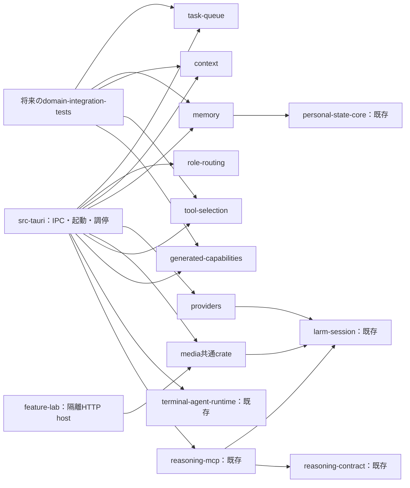

# Rustのドメインcrate分割とメモリー改善の実装計画

作成日: 2026年10月7日 JST  
状態: Grok向けの実装引渡し計画。分割・検証基盤の変更は未実施。メモリーの一部は実装済みで、全体gate・実測受入は未完了。  
調査基点: `cced8b8177b615b50167841fe760a823c0ecbf8b`。調査中に作業ツリーの更新があったため、実装開始時に差分とテスト登録を再確認する。

画像生成の縦断実証とverifyの自動選択は第14節、メモリーとの同時進行は第15節、メモリーの要件・実装状況・受入は第16節、具体的な作業票は第17節に統合した。Grokが参照する計画・仕様の入口は本書一つとする。

この計画の実行に、会話履歴、別の計画MD、調査報告、実装記録、外部Pageを読む必要はない。必要な判断と作業票は本文に収録する。本文中のコード・テストへのリンクは実装箇所を示すためのものであり、実装時には現在のコードを確認する。環境から適用される上位指示・プロジェクト指示は引き続き守る。

特定の作業IDを依頼された場合はその範囲を実施する。計画全体を依頼された場合は、前提と受入条件を満たす作業を順に実施し、各IDごとに再承認を求めない。次の抽出対象や高度な記憶機能など条件付きのbacklogは、本文の測定・選択条件を満たしてから進める。Grokへの送信やコード実装は、この計画書の編集には含まない。

## 0. Grokが最初に確認すること

- リポジトリは`/Users/y.noguchi/Code/SAAA`。既存checkout・現在のbranchを使い、他の作業の変更を退避・巻戻ししない。
- この会話で未実行の場合だけ`initial_instructions` MCPを一度実行する。ツールが使えない場合はその制約を記録し、実行済みと偽らない。
- ユーザーが明示的に依頼しない限り、別Codexタスクやスレッドへメッセージ・プロンプトを送らない。担当モデルやエージェントを追加することは本計画の要件ではない。
- HEADと関連する追跡済み・未追跡ファイルを確認し、本文の実装状況との差分を記録する。既存機能をゼロから再実装しない。
- 第2・6節の保存・音声・検証契約、第15節の共有境界を維持する。メモリーの具体的な挙動は第16節、実行順序は第17節を使う。
- 作業状態・テスト対応・結果・残課題は第18節へ追記する。他の進捗MDを入力として要求しない。詳細な機械ログを別保存する場合も判断に必要な要約は本書へ残す。

## 1. 目的と結論

目的は、Rustコードを多数のcrateへ移すことではなく、変更した機能を小さい範囲でビルド・ユニットテストできるようにし、日常の修正から検証結果が返るまでの待ち時間を短くすることにある。

「ルートCargo workspace、薄いTauri層、Tauriに依存しないドメインcrate」という方向を採用候補とする。ただし、一括移行はしない。既存crateと現在のpackage指定検証を活用し、小さい独立境界を一つ切り出して効果を確認する。

最初の小さいコンパイル境界の候補は、永続ジョブの寿命を扱う`task-queue` crateとする。一方、画面操作から保存・取消までをTauriなしで試す最初の機能には画像生成を選ぶ。task-queueの抽出とworkspace化を画像実証の前提にしない。追加提案を踏まえ、体験上の待ち時間を確かめる主経路は「既存画面のブラウザpreview → 画像生成の共通Rust処理＋ローカルHTTP host」とする。Role Routingの純粋処理は後続候補とする。

大きなRuntimeをそのまま別crateへ移したり、型や補助関数を無制限に集める`common` crateを作ったりしない。HTTP hostも開発用の機能検証入口に限定し、本番アプリの全面サーバー化は行わない。

crate構成とテスト配置は同時に変更する。各移行には、既存テストの移動、公開APIへの接続、独立実行、依存先を含む回帰確認までを含める。単体成功と全体成功を区別する。

本書の調査ではビルド、verify、テスト、E2E、性能計測を実行していない。速度改善率、現行アプリのビルド成功、実機音声の受入成功は主張しない。

## 2. 維持する制約

- 既存動作、IPC command・イベント・シリアライズ、保存データとの互換性を維持する。
- 保存済み設定、Provider、認証情報をリセット・置換しない。migrationはコピーまたは隔離DBで検証する。
- 本番SQLiteのwriterは一つとし、複数ドメインにまたがる更新の原子性を維持する。crateごとにDBやwrite接続を作らない。
- トランザクションは短く同期的に扱う。内部で推論、ネットワーク、子プロセス待機を行わない。
- macOSの録音とTTS再生は同じVoiceProcessingIOを使う。AECと明示的ducking設定を維持する。
- TTS中もマイク入力とASR配送を継続する。実際のrender PCMを使うecho処理を維持し、再生状態だけで入力を遮断しない。
- 検証は`scripts/verify.ts`を経由する。共有プロセスロックと共有targetを維持し、別target、別checkout、直接Cargo実行で回避しない。
- 通常verifyは静的検証、advanceは通常verify＋build＋ユニット・契約テスト、fullはadvance＋E2E等とする。
- 成功出力は`OK`のみ。失敗時は完全な診断を出し、後続コマンドを停止する。
- テスト削除、assert緩和、ignore追加、検証baselineリセットによって分割を成立させない。

crate抽出自体に、DBスキーマ変更、依存ライブラリ更新、音声処理の再設計、Provider選択方針の変更、未使用コードの一括削除は含めない。並行するメモリー計画で必要なschema・型・機能の変更は別の変更単位として管理し、抽出時は最新の確定済み契約を維持する。作業は既存checkout・現在のbranchで進める。

根拠: [AGENTS.md](../../AGENTS.md)、[Persistenceの契約](../../src-tauri/src/persistence/README.md)、[Memoryの契約](../../src-tauri/src/memory/README.md)。

これらは契約の出典であり、別途読むことを作業の前提にはしない。本書では、原典・検索結果を命令にしないこと、Scope・版・依存・予算の維持、no-hitを不在の証明にしないこと、commit前の再検証、外部消去の受入を分けることも固定契約とする。in-memory readerがwriter mutexを共有する場合もあるため、write/transactの中でreaderを重ねて呼ばず、借用した同じ接続を使う。

## 3. 現状とビルド負荷の見立て

### 3.1 確認した構造

調査時のRustファイルの物理行数は、テストを含めて次のとおりだった。未登録ファイルやfeatureで条件付きになるコードも含むため、コンパイル量や実行テスト数を表すものではない。

| ディレクトリ | 概算行数 |
| --- | ---: |
| `src-tauri/src/runtime` | 29,848 |
| `src-tauri/src/memory` | 29,802 |
| `src-tauri/src/tool_selection` | 24,474 |
| `src-tauri/src/providers` | 17,191 |
| `src-tauri/src/generated_capabilities` | 15,976 |
| `src-tauri/src/role_routing` | 12,950 |

多数の機能は[saaaのモジュール](../../src-tauri/src/lib.rs)であり、module単位のテストfilterはコンパイルをそのmoduleだけに限定しない。独立済みのcrateは`personal-state-core`、`reasoning-contract`、`larm-session`、`terminal-agent-runtime`で、`services/reasoning-mcp`も別packageである。

[共有target](../../.cargo/config.toml)は既に`src-tauri/target`に設定されている。ルートworkspaceはまだなく、各packageにmanifestとlockがある。workspace導入だけをキャッシュ共有の改善として数えない。

### 3.2 分割で改善する可能性と残る負荷

| 負荷 | 分割による見込み | 残るもの・注意点 |
| --- | --- | --- |
| 巨大なsaaaのコンパイル | 対象crateの検証から無関係なコードを外せる | アプリを確認する際の依存側再コンパイルは残る |
| 外部依存のコンパイル | 小さいcrateが必要な依存だけを選べる | profile・feature・versionが違うと成果物を共有できない場合がある |
| desktop build.rs | desktopに依存しない検証では外せる | desktopのbuild.rsが再実行される場合には残る |
| リンク・release最適化 | 単体テストのリンク対象を小さくできる | アプリの最終リンクとfat LTOは残る |
| テスト実行 | GUIや実サービスを必要としないケースを個別実行できる | 横断統合・IPC・E2Eの確認は別途必要 |
| 並列処理 | 独立したcrateのコンパイルに並列化の余地が生まれる | メモリの同時使用量が増える可能性もある |

[Cargo.toml](../../src-tauri/Cargo.toml)ではライブラリ出力は既に`rlib`のみ、dev/testは`debug=1`。releaseは`opt-level=3`、`lto="fat"`、`codegen-units=1`、`strip="symbols"`である。profile調整とcrate分割を同時に行うと効果を区別しにくいため、初回は現状を保つ。

[build.rs](../../src-tauri/build.rs)には次が集まっている。

- macOS VoiceProcessingIO用Cコードのコンパイルとframeworkリンク指定。
- 既存Codexバイナリの配置。
- Role Routing用Bunサイドカーのコンパイル・配置。
- WebFetchサイドカーのコンパイル・配置。ただしmacOSではスキップ。
- Tauri build処理。

`rerun-if-changed`があるため、これらがRustの編集ごとに必ず再実行されるとは限らない。一方、build.rsが実行されるとRole Routingサイドカー生成等も呼ばれる。通常verifyのcompile checkでも、必要ならbuild scriptは実行され得る。「通常verifyにbuild stageがない」ことは「native処理が一切走らない」ことを意味しない。

現行[verify-plan](../../scripts/verify-plan.ts)のRust buildは`--all-targets`であり、package内のテスト・example・bench等のコンパイル負荷も考慮する。計測前に対象を削って速く見せない。

## 4. 推奨するcrate境界

新規名は提案名であり、下表を一括作成する計画ではない。

| 対象 | 所有する責務 | 当面含めないもの |
| --- | --- | --- |
| 既存`personal-state-core` | Personal State・Worldの純粋な意味論 | SQLite、Tauri、アプリ起動 |
| 既存`reasoning-contract` | reasoningサービスの既存契約 | 全ドメインの共通型 |
| 既存`larm-session` | LARMのsession・transport契約 | 会話採用、アプリのProvider選択全体 |
| 既存`terminal-agent-runtime` | 端末エージェントの実行・通信基盤 | Stewardや会話全体 |
| 新規media共通crate（仮称`saaa-media`） | 画像・音楽の実行所有、台帳、成果物、取消・復旧の共通処理。初回実証は画像のみ | Tauri、HTTP配線、全機能の起動、通常DBの所有 |
| 新規`services/feature-lab` | 開発用loopback HTTP、隔離DB・明示資格情報の組み立て、stream配送 | Provider選択規則の複製、通常DBへの書込み、native音声 |
| 新規`task-queue` | 永続ジョブの登録、取得、完了、取消、復旧 | DB接続の所有、payloadの業務解釈、Tauri通知 |
| 新規`role-routing` | reducer、予算、有限recipe、候補選択から開始 | IPC、Provider実行、横断DB調停 |
| 新規`context` | 候補、権限区分、必要性、予算、構成、健全性 | Memory取得、Provider送信、全Runtime |
| 新規`memory` | Recall、保存・投影・忘却、Personal State Snapshot本文・根拠manifest・失効のドメイン処理 | 応答contextの最終構成、他ドメインまで含む忘却トランザクションの所有、ContextStillのEpisode生成・保存 |
| 新規`providers` | 通信、認証・lease、SSE/JSON解釈、使用量、失敗結果 | 回答採用・保存、Tool実行ループ |
| 新規`tool-selection` | 選択、補正、参照、カタログ、実行許可 | 生成機能への具体的な接続やアプリ組み立て |
| Generated Capabilities | 生成、検証、有効化、実行のまとまりを後半に抽出 | Toolカタログまで含む公開調停 |
| Voice | 後半に全二重の低レベル音声I/Oを抽出候補とする | 録音・再生を別々の所有者にする分割 |
| Conversation | queue・回答採用・外部処理の境界整理後に抽出 | 旧Runtimeを丸ごと移す構成 |

Workは、Steward・Worker・Schedule・Codingを単一の大きな`work`へ移さない。各責任を保ち、まず内部のmodule境界を整理する。変更・テストが独立する部分だけ後続crateにする。

`src-tauri`にはIPC、Tauriイベント、起動・終了、リソース解決、単一writerの組み立て、ドメイン間調停を残す。薄いTauri層は段階的な到達点であり、先に巨大な`app-core`を新設して達成したように扱わない。

### 4.1 依存方向

以下は提案する骨格。矢印は「利用側 → 依存先」。新規ドメイン間の変換・接合は、当初desktop内のアダプターが担当する。



下位crateは通常依存・dev依存・build依存のいずれでもdesktopへ戻らない。契約専用crateは複数の実装が同じ契約を必要とする場合に限り検討し、最初からドメインごとにcore/api/adapterの3crateを作らない。

## 5. 循環を解消する具体的な境界

| 現在の参照 | 所有者と解消方針 |
| --- | --- |
| [Memory投影](../../src-tauri/src/memory/personal_state/projection.rs)がRuntimeのScopeSnapshot・Candidateを使用し、[Context broker](../../src-tauri/src/runtime/context/broker.rs)がMemoryのContextWindowを使用 | Context構成型はContext、source・assertionはMemory／personal-state-coreへ。Memoryが返す本文・根拠・適格性をContext候補へ変換する処理は上位アダプターへ置く。永続Personal State SnapshotはMemory、送信時の構成はContext。Scopeの保存・解決と値型も区別する |
| [ModelStreamContext](../../src-tauri/src/providers/stream/mod.rs)がイベント、Context候補、保存処理を保持 | Providerは要求と通信結果を扱う。使用量・Tool call・通信失敗はProvider、予算判断はContext、採用・保存はConversationへ |
| [RuntimeEventSender](../../src-tauri/src/runtime/event_hub.rs)がtauri::Resultを返す | ドメインイベントとTauri非依存の送信結果を定義する。Tauri Channel実装とIPCイベントへの変換はdesktopへ |
| [ToolBackend](../../src-tauri/src/tool_selection/backends/mod.rs)の入力がGenerated CapabilitiesのCallActorに依存 | 呼出主体をToolsの実行契約として扱い、生成機能への主体変換はアダプターへ |
| [生成機能の公開](../../src-tauri/src/generated_capabilities/publication_sync.rs)がToolカタログを更新し、Tool backendが生成機能を実行 | 公開トランザクションと具体的backendを上位の接合処理へ。双方が互いのcrateを直接参照しない |

AppState全体はドメインへ渡さない。[現在のAppState](../../src-tauri/src/app_state.rs)を別名の巨大なContext構造体へ置き換えるだけにもならないよう、必要な入力値、サービスtrait、取消ハンドル、借用トランザクションへ限定する。

traitはI/Oや差し替えが必要な境界に置く。全関数をtrait化しない。イベントの型は発生元ドメインが所有し、UI用RuntimeEventはdesktopで変換する。エラー型からもTauriを除く。

取消では`RunCancellation::with_active`の採用ロックを含む意味を維持する。単なるAtomicBoolや通知への置換で、取消と結果採用の競合を再導入しない。共有取消型を抽出する場合も用途を限定し、汎用共通crateへ広げない。

Role Routingのcontractsには既定Provider IDと共通identifier検証への参照がある。純粋処理を抽出する際は、既定設定・Provider存在確認等のホスト側処理と、recipe・予算の入力契約を分ける。保存済みJSONの形式や既定値の意味を同時に変更しない。

## 6. SQLiteと音声の所有権

### 6.1 DBは一つ、writerも一つ

ドメインのrepositoryはDBファイルを開かず、アプリ側が所有する接続・トランザクションを借用する。SQLite依存を許すこととTauri依存を許すことは別の判断であり、初回からすべてをstorage traitへ置換する必要はない。

横断トランザクションでは、上位調停処理がbegin・commitを所有し、同じトランザクションを各ドメインへ渡す。各関数が独立commitする形にはしない。

保持すべき具体例:

- [忘却処理](../../src-tauri/src/memory/personal_state/commands.rs): Memory、Steward、Role Routing学習、Records、Context、適応処理をまとめて無効化。
- [生成機能の公開](../../src-tauri/src/generated_capabilities/publication_sync.rs): 有効化、Tool登録、権限付与、生成job更新。
- [回答採用](../../src-tauri/src/runtime/conversation_check/queue_runtime.rs): Context・Providerの再検証、回答保存、音声job、会話job完了、run完了。

これらを非同期イベントによる結果整合性へ変更しない。通知・外部実行はcommit後に行い、取消や再起動時の既存の確定順序も維持する。

[SqliteWriter](../../src-tauri/src/persistence/sqlite/writer.rs)はMemoryのforget journalに依存している。このため、最初にpersistence全体を共通crateへ移す案は採らない。writerの生成、migration、journal同期は当面desktopの組み立てに残す。journal同期失敗とSQLiteのcommit済み状態も混同しない。

### 6.2 音声は全二重の一つの所有者

[native/macos_vpio.c](../../src-tauri/native/macos_vpio.c)と[audio_backend/macos.rs](../../src-tauri/src/voice/audio_backend/macos.rs)の録音・再生・参照PCMを同じ境界に置く。ASRとTTSの通信クライアントは分離できても、デバイス所有者は分裂させない。

受入条件は「TTSのみでASR発話が生じない」と「TTSと重なる人声がASRへ届く」の両方。PCM fixtureによる[echo処理テスト](../../src-tauri/src/voice/audio_backend/echo_reference.rs)と実機確認を分け、再生中の入力遮断を代替策にしない。

## 7. 小さいコンパイル境界の実証候補

| 候補 | 切り出しやすさ | 単体検証の価値 | リスク・限界 |
| --- | --- | --- | --- |
| task-queue | 高い。調査時454行、7テスト、Tauri・AppState依存なし | 現在の会話・音声・Workerで使うジョブ寿命を独立検証 | lease、取消、原子性。SQLite自体の初回コンパイルは残る |
| 画像生成のmedia境界 | 中程度。保存・資格情報・registry・実行状態の整理が必要 | 既存画面で生成から保存・取消まで確認でき、日常の編集ループの改善を直接評価できる | HTTP契約と二つのhostの回帰が増える。速度効果は未計測。最新方針の最初の縦断実証に採用 |
| Role Routing純粋処理 | 高い。reducerだけなら175行、3テスト | DBなしで状態遷移・予算・recipeを検証 | 現在の通常会話の主経路ではなく、日常効果は変更頻度次第 |
| Tool Selection ranking/rules | 比較的高い | 数値・順位・補正を決定的に検証 | カタログ、許可、実行の保証は外側に残る |
| Memory／Context全体 | 低い | 独立できる範囲は大きい | scope、忘却、出力採用、保存の循環が強い |

コンパイル境界だけを最小変更で確かめる場合は[task_queue.rs](../../src-tauri/src/task_queue.rs)を選ぶ。主な依存はrusqlite、serde、uuidで、crate外参照はdatabase_error。呼出側から接続を借りるため、writer所有権を変えずに移せる。画像生成の試用を早めることを優先する場合は、この抽出を先行させず第14節へ進む。

このキューはSAAA固有であり、認証失敗時の再試行抑制、terminal questionの優先順位、Workerを非表示にするsnapshotを含む。初回はこれらを維持する。汎用キューへの再設計は行わない。

### 7.1 task-queueを抽出する場合の実装単位

1. 移動前の7ケース、統合側の利用箇所、SQL・シリアライズ・エラー表現を記録する。
2. `crates/task-queue`へ実装と7テストを移す。公開範囲は既存利用側に必要なAPIだけにする。
3. 元のmodule位置に薄い再公開を置き、呼出側の変更を抑える。エラーの文字列表現も維持する。
4. `#[path]`で実装を取り込むテストを実crateへの依存へ切り替える。実装を二重保持しない。
5. キュー単体の7ケースは新crateで実行する。会話・run・音声と連携するケースは統合として残す。
6. 対象crateのadvance、影響する統合・利用側テスト、全体advanceを確認する。失敗・未実施は明記する。
7. 対象crateのビルド記録にdesktop・Tauri・desktop build.rsが入らないことを確認する。

この段階だけで停止しても、キュー変更の独立検証が利用できる。会話生成やWorker全体まで独立したとは扱わない。

## 8. テスト構成を同時に移行する

### 8.1 配置の原則

- 各crateの`src`内: 非公開実装のユニットテスト。
- 各crateの`tests`: 公開API、保存形式、プロトコル形式の契約テスト。
- 当初の`src-tauri/tests`: 既存の横断統合、IPC、desktop/E2E。
- 複数の独立ドメインが揃った後の`crates/domain-integration-tests`: GUIなしで実ドメインを組み合わせる統合専用package。本番コードから依存しない。

ドメインのテストはGUIと実サービスを必要としない構成にする。固定入力、fake clock、ローカルHTTP/WebSocket fixture、隔離SQLite、fixture子プロセスを使う。外部サービスの代役を使っても、原子性を保証するテストのSQLiteまでmockに置換しない。

単一writer・WAL reader・lock・journal・復元は一時ファイルDBを使う。単一接続内の状態遷移にはin-memory DBを使える。本番DBや本番認証情報は使わない。

fixtureは所有するドメインの近くへ置く。巨大なAppState fixtureや共通test-support crateを下位へ持ち込まない。テスト用アダプターを共有する場合はdev依存に限定し、desktopへの逆依存を作らない。

### 8.2 既存テストの分類

下表は調査した代表ケースと領域の分類である。全ケースの登録・実行状況は、実装前の一覧採取で確定する。ディレクトリ単位の移動で済ませず、同じファイル内でも保証する境界が異なれば配置を分ける。

| 現在のテスト | 分類・配置 | 維持する保証 |
| --- | --- | --- |
| [task_queue.rs内の7ケース](../../src-tauri/src/task_queue.rs) | task-queueへ移す | 重複、再取得、取消、rollback、再試行、設定維持 |
| Role Routingの[reducer](../../src-tauri/src/role_routing/reducer.rs)、[limits](../../src-tauri/src/role_routing/limits.rs)、[recipe](../../src-tauri/src/role_routing/recipe.rs)、[selection](../../src-tauri/src/role_routing/selection.rs) | role-routingへ移す | 状態遷移、予算、有限計画、選択の決定性 |
| Toolsの[ranking](../../src-tauri/src/tool_selection/ranking.rs)、[rules](../../src-tauri/src/tool_selection/rules.rs)、[references](../../src-tauri/src/tool_selection/references.rs) | tool-selectionへ移す | 数値、条件、期限、参照検証。順位が権限を広げないこと |
| Providerの[SSE](../../src-tauri/src/providers/chat_completions/sse.rs)、[chunks](../../src-tauri/src/providers/chat_completions/chunks.rs)、[observation](../../src-tauri/src/providers/chat_completions/observation.rs) | providersへ移す | 分割受信、完了条件、使用量、失敗結果 |
| [media_generationの単体ケース](../../src-tauri/src/media_generation/mod.rs)、[Replicate回帰](../../src-tauri/src/media_generation/replicate_tests.rs)、既存LARM mediaテスト | media共通crate／既存larm-sessionへ移す・維持 | 送信前取消、重複防止、route無効化、結果不明、成果物制約。未移行Providerのケースも実行を維持 |
| [media IPC](../../src-tauri/src/media_generation/ipc_tests.rs)と将来のHTTP adapter契約 | それぞれのhostに残す／追加 | command登録、fallback handler、stream切断・順序、binary応答、同じ共通処理への接続 |
| [media画面](../../tests/media-generation.test.tsx)、[復旧画面](../../tests/media-recovery.test.tsx) | TSに維持しHTTP adapterのケースを追加 | 表示、取消操作、runId照合、履歴、成果物、結果不明時の再送抑止 |
| 既存larm-session・personal-state-core・reasoning-contract・terminal-agent-runtimeのテスト | 既存crateに維持 | 現在の公開契約。実サービスを要するliveは別レーン |
| Memoryの純粋処理と保存契約 | memory／personal-state-coreへ移す | source、version、scope、projection、保存形式 |
| [echo_reference](../../src-tauri/src/voice/audio_backend/echo_reference.rs)、[tts_streaming_contract](../../src-tauri/tests/tts_streaming_contract.rs)の純粋ケース | 将来のvoiceへ移す | 重なる人声の保持、chunk境界、発話テキスト |
| [task_queue_contract](../../src-tauri/tests/task_queue_contract.rs)、[conversation_queue_progress_contract](../../src-tauri/tests/conversation_queue_progress_contract.rs)、[tts_recovery_contract](../../src-tauri/tests/tts_recovery_contract.rs) | 横断統合として残す | 会話順序、取消、runとjobの整合、音声再実行抑止 |
| [Memoryのtask bundleと回答rollback・復元](../../src-tauri/src/memory/personal_state/tests/task_bundle_rolls_back_with_answer_and_rejects_e.rs) | ドメイン内契約と横断統合を分けて残す | rollback、出典外拒否、忘却後の復元による復活防止 |
| Generated Capabilitiesの[adapter_abort](../../src-tauri/src/generated_capabilities/tests/adapter_abort.rs)、[adapter_timeout](../../src-tauri/src/generated_capabilities/tests/adapter_timeout.rs)、公開接合のケース | 横断統合として残す部分あり | 取消伝播、子プロセス終了、永続記録、実行枠解放、公開原子性 |
| Workerの[復旧テスト](../../src-tauri/src/worker_agents/executor/tests_recover.rs) | 横断統合として残す | queue、Worker台帳、Tool receipt、Steward報告、再実行制約 |
| [sqlite_architecture](../../src-tauri/tests/sqlite_architecture.rs) | アーキテクチャ契約として残し探索範囲を拡張 | 新crateを含むwrite接続所有、reader利用、writer境界 |
| [ipc_contract_bindings](../../src-tauri/tests/ipc_contract_bindings.rs)、[voice_asr_contract_bindings](../../src-tauri/tests/voice_asr_contract_bindings.rs)、[ipc_receiver_tests](../../src-tauri/src/ipc_receiver_tests.rs) | desktop/IPC境界に残す | Rustシリアライズ、生成TS、fixture、IPCアダプター |
| provider／conversation／ASR E2E、desktop smoke | desktop/E2Eに残す | アプリ配線、ドメイン連携、OS機能 |
| live Provider、実音声入出力 | 環境を明記する別受入に残す | 実サービスと機器の動作。mock成功と区別 |

`task_queue_contract`はqueueだけでなく会話入力とruntime runの取消を検証しているため、丸ごとqueue crateへ移さない。Generated Capabilitiesの中断テストも、取消フラグだけを確認する小さいテストに置き換えない。

ファイル名だけで分類しない。たとえば`qwen_realtime_asr_e2e`の一部はローカルWebSocket fixture、`local_audio_output_contract`はmacOSの`say`を使用する。GUI不要とOS非依存、実サービス不要は別の条件である。

### 8.3 Rust・TypeScript・IPCの責務

| Rust | TypeScript | IPCで両側を結ぶ契約 |
| --- | --- | --- |
| 状態遷移、権限、原子性、取消、復旧、通信解析、保存互換性 | UI表示、操作、invoke引数、受信検証、イベント順序、マイク送信継続 | command名、引数、serdeの名前・tag・null、生成TS、実シリアライズfixture、ID・revision・終端 |

[TS受信検証](../../tests/ipc-validation.test.ts)と[イベント順序](../../tests/ipc-event-order.test.ts)を保持する。型の一致だけで取消後の遅延出力や重複terminalを保証したことにしない。desktop側にはcommand登録とイベント変換の実接続を確認するテストを残す。

音声はRustのPCMテストと、[TTS中のASR継続に関するTS契約](../../tests/conversation-asr-continuous.test.ts)を両方残す。実機受入も別に維持する。

### 8.4 検証範囲が減っていないことの確認

移行ごとに「旧ケース名 → 新ケース名／配置 → 不変条件 → fixture → feature → 実行ゲート」を対応付ける。

1. テストソース一覧だけでなく、実際に登録されるケース一覧を採取する。
2. default、契約用feature、E2E用feature、live/ignoredを区別する。
3. 移行後の一覧と実行結果を照合し、0件成功、未登録module、意図しないignore・feature条件を検出する。
4. assert、異常系、fixtureの内容、SQL制約、取消・timeoutの検証範囲を確認する。
5. `#[path]`による同一テストの重複実行を解消した場合は、単純な件数差と保証の減少を区別する。
6. fixtureの相対パスや`CARGO_MANIFEST_DIR`の変更を確認する。ソース探索型の契約は新crateを含める。
7. 実行失敗と未実施を記録する。既存の失敗を削除やbaseline更新で隠さない。

現行verifyは成功ログを一時ファイルから削除する。件数・登録一覧・計測を継続記録する場合は、verifyに明示的なレポート保存機能を追加する設計とし、成功出力の`OK`契約を変えない。これは今後の実装候補であり、現時点の機能ではない。

## 9. 段階的な移行手順

| 段階 | 変更範囲 | 完了条件・中断可能な状態 |
| --- | --- | --- |
| 0: 基準と画面 | テスト登録、feature、fixture、既存失敗、計測条件を整理。既存React部品へmock API／固定cueを渡す専用preview | ブラウザだけで画面を確認できる。Rust・保存・nativeの成功とは区別する |
| 1: 画像の縦断実証 | media共通crate、隔離HTTP host、同じ処理を呼ぶdesktop adapter、既存テストの移植・追加 | 第14節の保存・取消・契約を満たし、単体advanceにdesktopが入らない。既存アプリの画像・音楽・Provider経路を保つ |
| 任意: 小さい抽出 | task-queueの実装、7テスト、再公開、利用側テスト接続 | 境界の作り方を小さく確認したい場合に実施。画像実証の必須前段にはしない |
| 2: 自動選択 | affectedの選択器を既存verifyへ追加し、まずshadow運用 | 期待する選択集合のfixtureと全体gateとの比較を通す。全体advance/fullの運用を残す |
| 3: media拡張・workspace判断 | 同じmedia境界で音楽・Replicateを確認。必要ならroot manifest・lock・profileを統合 | 既存機能の回帰を維持し、依存更新を混ぜず、対象ごとの待ち時間を比較する |
| 4: 次の独立処理 | Role Routing、Tools、Context、Memory、Provider、生成機能から変更頻度と計測で一つずつ選ぶ | 独立テストと横断統合が成立し、DBと保存互換性を維持 |
| 5: 会話・音声・Work | 所有者が明確になった処理だけ抽出 | 関連E2E・必要な実機受入を通し、Tauri側を段階的に薄くする |

各段階で本番の呼出経路を新実装へ接続し、旧実装を並行した正本として残さない。再公開は互換用の入口であり、二重の状態機械やDBを作るものではない。

アプリが動くことを各段階の受入条件にする。基準時点で全体gateが失敗している場合は、その事実と修復対象を分けて扱い、単体成功からアプリの成立を推定しない。今回の文書作成では基準アプリの起動確認は行っていない。

### 9.1 workspace導入時の注意

workspaceは最初の抽出の前提にしない。既にpath依存、共有target、package指定verifyがあるため、小さい切り出しを先行できる。

- rootにはvirtual workspaceを置き、既存6packageと新crateを登録する。
- Edition 2021を維持する初期案ではresolverを`2`と明示する。resolver更新は別判断とする。
- lock統合時にversion・source・featureの差を確認し、意図しない依存更新を混ぜない。
- memberのprofileはworkspaceでは無視されるため、現行のdesktop profileをrootへ移す。既存の単独crateとのprofile差も計測条件として記録する。
- `workspace.dependencies`のfeatureを一律最大化しない。desktopに必要な機能を下位crateすべてへ強制しない。
- rootからの暗黙の全member実行に依存せず、verifyは対象packageを明示選択する。formatも含めて選択範囲を確認する。
- 現行のpackage自動発見、`--locked`、Clippy方針、generated/size、IPC、全体gateを維持する。

仕様根拠: [Cargo Workspaces](https://doc.rust-lang.org/cargo/reference/workspaces.html)、[Cargo Profiles](https://doc.rust-lang.org/cargo/reference/profiles.html)。

## 10. 検証運用

実装運用は、日常に対象crateのadvance、コミット前に全体advance、大きな変更時にfullとする。失敗した検証を隠したままコードをコミットしない。コミットやpush自体を今回の計画書編集には含めない。

| 場面 | 確認範囲 |
| --- | --- |
| 対象crate内の通常修正 | 対象crateのadvance |
| 公開型・trait・イベント・保存契約の変更 | 対象＋逆依存するドメイン＋関連統合。IPCが関係すればTS/IPCも |
| コミット前の全体受入 | 全体advance |
| workspace・共通依存・大規模分割 | fullと関連ドメインの受入 |
| 実サービス・実マイク／スピーカー | 環境を用意した別レーンの受入 |

対象crateの成功を全体成功として扱わない。共通契約変更時はCargoの依存関係だけでなく、DB・IPC等の契約上の利用側も確認する。

日常の対象選択は、信頼性を確認した後に既存verify内のaffectedへ委ねる。これは対象crateのadvanceを自動で計画する入口であり、コミット前の全体advanceや大きな変更時のfullを置き換えない。`verify affected`、`--level`、`--explain`は追加提案であり、現行コマンドではない。導入条件は第14節に記載する。

次は`crates/task-queue`作成後のコマンド例であり、現時点では未実行。`--package`はcrate名ではなくディレクトリを指定する。

```sh
bun run --silent verify advance --package crates/task-queue
bun run --silent verify build --package crates/task-queue
bun run --silent verify test --package crates/task-queue -- --lib
```

既存の入口による全体・関連確認:

```sh
bun run --silent verify
bun run --silent verify:advance
bun run --silent verify:full
bun run --silent verify generated
bun run --silent verify size
bun run --silent verify test --package src-tauri -- --test task_queue_contract
bun run --silent verify test --scope typescript -- tests/verify.test.ts
```

このリストを毎回すべて実行する意味ではない。変更の範囲に合わせて選ぶ。src-tauriのテストfilterはdesktop crateのコンパイルを隔離しない。生成・サイズ検査は現行のRust package指定では省かれるため、移動時には全体の該当検査を含める。

[verify.ts](../../scripts/verify.ts)の順次実行、成功`OK`、完全な失敗診断、後続停止を維持する。通常verifyへbuildやtestを追加しない。レポートを保存する場合も通常の標準出力を増やさない。

## 11. 計測と採否判断

ビルドでクラッシュした経緯を踏まえ、まず小さい対象で安全な並列数を決める。今回の作業では重いビルドやE2Eを実行せず、以下を実装段階の計画とする。

| 比較条件 | 確認するもの |
| --- | --- |
| 変更なしで再実行 | verify自体、ロック待ち、不要な再実行 |
| ドメイン内部の代表的な小変更 | 単体advanceの時間、再コンパイル単位、テスト実行時間 |
| 公開型・traitの変更 | 逆依存の再コンパイルと利用側テスト |
| 同じ変更からアプリを確認 | desktopの再コンパイル・リンクを含む時間 |
| 画面・アバター描画だけの変更 | ブラウザpreview起動・再表示、TS検証。Rust/native検証の省略理由を記録 |
| 画像のRust内部変更から同じ画面を確認 | 共通crateとHTTP hostの増分build・起動・単体advance、desktop経由との比較 |
| 自動選択 | 計画生成の時間、選択・除外された検証、再計画回数。省いた保証がないか |
| 初回ビルド | 外部依存、SQLite、native、sidecarの比率。安全な環境で後日実施 |

同じマシン、toolchain、profile、feature、共有target、並列数で複数回比較する。workspace移行直後のキャッシュ再構築と、定常時の編集ループを混ぜない。キャッシュを一括削除する測定は初回の必須条件にしない。

画像実証では、mock Providerを使った決定的な比較と、実Providerの外部待ち時間を分ける。初回の依存コンパイル、host起動、HTTP転送、成果物保存・表示も分けて記録する。ブラウザで画像が見えた速さだけをRustビルドの改善として数えない。

記録する値:

- wall timeとCPU時間。プロセスロック待ちと実作業時間を区別する。
- プロセスごとの最大RSS、同時実行プロセス群のメモリ、swap。親Bunだけを測らない。
- 再コンパイルされたpackage・target・featureの組合せ。
- build.rs実行回数、native・sidecar処理の有無。
- compile、codegen、link、test実行の時間。利用する計測器で区別できない区間は明記する。
- 実行ケース数、失敗、未実施、計測時の並列数。

Cargoのtimingsはコンパイル単位、build script、並列状況の確認に利用できる。ただし現行verifyはbuildへ任意引数を転送できない。計測を実装する段階でverifyへ限定的な計測オプションとレポート保存を追加する案とし、存在しないオプションを現在のコマンドとして案内しない。

仕様根拠: [Cargo build timings](https://doc.rust-lang.org/cargo/reference/timings.html)、[Cargo testの対象選択](https://doc.rust-lang.org/cargo/commands/cargo-test.html)。

### 11.1 独立検証の合格条件

- 対象crateの通常依存・dev依存・build依存にsaaa/Tauriがない。
- 単体のビルド記録にdesktop build.rs、音声Cコード、desktop用sidecarが含まれない。
- GUI・実サービスなしで対象の予定ケースが実際に実行される。
- 横断統合・IPC・E2Eの元の保証が別の検証場所に残っている。
- 個別advanceが速くても、全体advanceの大きな悪化やメモリ増加があれば原因を調べる。

次の抽出対象は、変更頻度、単体で確認できる範囲、待ち時間短縮、移行リスクで決める。行数やcrate数を成果指標にしない。初回抽出で利益が小さい場合は、大規模移行へ進む前にbuild.rs、link、検証の重複等の計測結果へ立ち戻る。

## 12. 既知の不整合と未確認事項

### 静的調査で確認した注意点

- [sqlite_architecture](../../src-tauri/tests/sqlite_architecture.rs)は、調査時に存在しなかった`runtime/conversation_inputs.rs`と`runtime/conversation_prepare.rs`を読む。到達すれば失敗するが、今回はテストを実行していない。元のreader/writer境界の保証を現在の経路へ対応付ける必要がある。
- [conversation_context_stability](../../src-tauri/tests/conversation_context_stability.rs)等にはfeature条件がある。現行fullの明示的な対象指定との照合が必要であり、ファイルの存在だけでは実行保証にならない。
- テストソースが存在してもmodule登録されていない場合がある。削除済みの会話経路を前提とするREADME・テストを、現在の主経路の保証として数えない。
- 現在の通常会話は[queue_runtime](../../src-tauri/src/runtime/conversation_check/queue_runtime.rs)を通る。[旧execute_turn](../../src-tauri/src/runtime/turns/execute_turn.rs)の一般会話経路は利用不可のエラーを返す。Role Routingの抽出効果はこの現状を前提に評価する。
- [mediaのIPCテスト登録](../../src-tauri/src/media_generation/mod.rs)は`conversation-queue-e2e` featureを要求する。一方、[fullのE2E計画](../../scripts/verify-plan.ts)は外部の`--test`対象を明示するため、そのfeature付きのライブラリ内`media_generation::ipc_tests`の実行を保証しない。既存fullに含まれると数えず、関連gateへ明示登録する計画が必要。
- [frontend-tests.ts](../../scripts/frontend-tests.ts)はファイル単位のprocess分離を行う。選択済みTSテストをverifyの転送引数へまとめるだけでは同じ分離を保証できないため、自動選択ではrunnerに対象一覧を渡すか、ファイル別stepを作る。

### 未確認

- 実測のcompile/link/build.rs比率、最大メモリ、クラッシュ原因。
- 全テストの登録一覧、実行件数、現行の全体verify/advance/fullの成否。
- workspace化後のlock・feature・profileの実際の差とキャッシュ再利用。
- 各ドメインの変更頻度と、典型的な修正の検証時間。
- macOSの機器別AEC・ducking・重なり発話の実機受入。
- media抽出後の依存閉包、隔離DBの最小schema、host間の挙動一致、HTTPの追加負荷。
- affectedの選択集合、並行編集検出、実際の節約時間。自動選択はまだ存在せず、shadow比較も未実施。

調査時の既存失敗候補は移行前の基準として記録し、新規分割の失敗と区別する。ただし、既存失敗がある状態を全体成功と報告しない。

## 13. この文書の確認範囲

この文書の作成・統合時に実施したのはコード・登録・コマンド定義と文書の静的確認であり、Rust・TypeScriptの標準検証、ビルド、テスト、E2E、実機受入は再実行していない。実装時の検証は第10・16・17節に従って実行する。

実装担当の会話でのMCP実行要件は第0節に記載する。別の会話の実行回数を引き継いだと仮定しない。

## 14. 追加提案の評価と統合方針

### 14.1 採用する範囲と先行案への修正

crate分割によるコンパイル境界に加え、同じ機能を既存画面で確かめる入口を作ることで、「修正から確認まで」の短縮を直接評価する。独立したHTTP hostの追加だけでは保存・資格情報・実行状態は独立しない。採用する仕様は以下にすべて記載する。

| 提案 | 評価・統合方針 |
| --- | --- |
| 既存React＋共通Rust＋ローカルHTTP | 採用。画像を最初の縦断実証にする。製品のTauri経路も同じ処理を使い、labだけの別実装にしない |
| `saaa-feature-runtime`一つへ共通処理を集める | 責務をmediaに限定し、仮称`saaa-media`とする。画像・音楽は台帳を共有するので同じcrate。会話・Tools・Memory全体を追加する容器にはしない |
| registry処理の共用 | 選択・検証・legacy導出を複製しない。必要な純粋処理を限定して共用し、複数ドメインが使う段階で小さいProvider routing契約を検討する。巨大なProviders抽出を前提にしない |
| 画像を最初の対象にする | 単純さではtask-queueに劣るが、画面・通信・取消・保存をまとめて検証できる価値が大きい。最新の目的では主経路に採用。task-queueは低リスクな任意候補へ変更 |
| アバターをブラウザで先行確認 | 採用。固定cueを描画部品へ渡す。音声イベント配送・Laya推論・VPIO/AECの受入は別に残す |
| 既存verifyへのaffected追加 | 採用。ただしshadow運用で選択漏れを調べる。全体gateの廃止やテスト結果キャッシュは初期範囲に入れない |

### 14.2 media境界の所有者

根拠は[生成処理](../../src-tauri/src/media_generation/generation.rs)、[台帳](../../src-tauri/src/media_generation/ledger.rs)、[復旧](../../src-tauri/src/media_generation/recovery.rs)、[成果物](../../src-tauri/src/media_generation/artifacts.rs)、[資格情報](../../src-tauri/src/credentials.rs)。

| 所有者 | 所有するもの |
| --- | --- |
| media共通crate | 要求・結果・進捗のドメイン型、MediaService、run寿命、取消・期限・同時実行枠、台帳の遷移、成果物の採用・読出し、復旧判断 |
| 必要最小限の共通境界 | CredentialStore、EventSink、既存transaction上で動くrepository。Route解決と有効性確認の意味は両hostで共用する |
| desktop adapter | Tauri State/Channel/Response変換、既存IPC名・serde契約、AppStateから必要な依存だけを組み立てる処理、既存writer |
| lab host | loopback HTTPの5操作、認証とstream配送、隔離DB・明示資格情報の組み立て、起動・終了 |
| React | 既存パネル、表示・操作・受信検証。TauriとHTTPのMediaApi adapterを切替え、第二の台帳にはしない |

[RUNS](../../src-tauri/src/media_generation/mod.rs)だけでなく、成果物側の`DOWNLOADS` semaphoreもinstanceへ移す。資格情報のグローバル`OnceLock`を別crateへ移すだけでは複数host・テストの独立性は得られない。実行中のRoute、資格情報の読出し元、[validate_active](../../src-tauri/src/providers/service_registry/active.rs)が確認する保存状態を一致させる。

初期のHTTP試用はLARM画像に限定できるが、desktopのReplicate・音楽・復旧を削除しない。共通状態や台帳を移す際は既存利用側も同じ所有者へ接続する。未移行adapterはdesktopへ残せるが、別のRUNS・重複した遷移規則を維持する形にはしない。

### 14.3 保存・資格情報で守る境界

[SqliteWriter](../../src-tauri/src/persistence/sqlite/writer.rs)はMemoryのjournal、全体schema、migration前backupに結び付いている。これを丸ごと移さず、SQLとtransaction内の検証を取り出す。本番では既存writerが同じtransactionを渡し、採用・取消確認・監査記録を一つの原子的更新として維持する。

lab専用DBは、本番をドメイン別DBへ分割する案ではない。初期は空の隔離DBと明示投入したlab資格情報を使い、通常DBのwriterを開かず、ユーザーの環境変数や資格情報ファイルも暗黙に読まない。既存設定の利用は明示的snapshotと共通loaderによる取込みに限定し、保存済みProviderを変更しない。

最小schemaはmediaの2テーブルだけでは足りない。[registry保存](../../src-tauri/src/persistence/service_registry_store.rs)の`settings_documents`・`settings_revision`、`credential_secrets`、[operation監査](../../src-tauri/src/providers/service_registry/operations.rs)の`audit_events`など、実際の読書きの閉包を確認する。schema・migration定義をhostごとにコピーしない。正本`providers.registry/default`とlegacy overlayの意味を保持する。

同期画像の応答を失った場合、現在は`synchronous_image_has_no_job`となる。再起動後の成功復旧を仮定せず、結果不明・`mayHaveGenerated`を保持し、勝手に再送しない。remote jobを持つReplicate・音楽の再照合は別の契約として維持する。

### 14.4 UI・HTTP・テストを一緒に移行する

[MediaGenerationPanel](../../src/features/media/MediaGenerationPanel.tsx)にはAPI注入点がある。ただし[mediaApi.ts](../../src/features/media/mediaApi.ts)にはTauri importと中立なschema・表示補助が同居する。中立なMediaApi型・受信schema・補助を分離し、desktop wrapperがTauri実装を渡す形にする。全Appをブラウザへ持ち込まない。[LightAvatarBackground](../../src/features/chat/avatar/LightAvatarBackground.tsx)には固定cueを渡し、Tauri購読のhookを使わない。

HTTPは生成・取消・履歴・再照合・成果物読出しに限定する。runはrequest futureではなくMediaServiceが所有する。通信切断を取消・完了・再送の許可と見なさない。パネルのunmount時の明示取消と、transport切断は区別する。runId・順序を持つHTTP envelopeはadapterで既存の進捗契約へ変換し、Tauriのpayloadを不用意に変更しない。有限queueと上限を設け、遅い受信側が取消を止めない。

loopback bind、Host/Origin制限、起動ごとのsession認証、body・成果物上限を設ける。成果物は台帳で採用されたrunId/indexからのみ読み、既存のMIME・redirect制限を保つ。ブラウザへProvider秘密値を渡さず、任意invokeや任意ファイルのHTTP公開を作らない。

| 検証場所 | 移す／残すものと追加する保証 |
| --- | --- |
| media crateのunit/contract | 既存取消・UUID・Replicate回帰を責務に沿って移す。重複runId、送信前取消、Route無効化、保存失敗、結果不明、採用条件をfake transport・隔離SQLiteで確認 |
| 既存larm-session | 媒体通信・不明結果の既存試験を維持。media側から同じadapterを使う接続も確認 |
| hostを跨ぐ共通契約fixture | 同じ要求から進捗・最終結果・取消・履歴・binary成果物が等価になること。ホスト起動や配送の契約は各adapterで実行 |
| SQLite横断統合 | reserve時の重複防止、取消と結果採用の競合、active確認・監査・採用のrollback、再起動後の不明結果を実SQLiteで確認。fake repositoryだけで代用しない |
| desktop IPC | command登録、fallback、Tauriシリアライズとbinary応答を残す。media crateにTauri dev依存を戻さない |
| HTTP host | stream切断・重複・終端、遅いconsumer、再接続、明示取消、認証・Origin・サイズ制約。GUIや実Providerなしで実行 |
| TypeScript | [生成](../../tests/media-generation.test.tsx)・[復旧](../../tests/media-recovery.test.tsx)を保持しHTTP adapterの受信検証を追加。Rustの原子性保証をUI mock試験で代用しない |
| desktop/E2E・実サービス | WebView、IPC権限、packaging、実Providerを別途確認。音声の既存受入は移動・縮小しない |

現在のfeature付きIPC unit testを明示的に確認する既存入口の例は、`bun run --silent verify test --package src-tauri -- --features conversation-queue-e2e --lib media_generation::ipc_tests`。今回は未実行。移行時には登録ケース数を確認し、関連advance・全体gateへ必要なstepを組み込む。ファイルが存在するだけで「既存保証を維持」としない。

最初の切り出し完了は、既存テストの対応表・移植・単体実行、desktop利用側の回帰、GUIと実サービスなしの契約試験、独立ビルド記録までを条件とする。実Providerへの送信は別の明示的な受入であり、mock成功から推定しない。

### 14.5 affectedを安全に既存verifyへ組み込む

選択器を[verify-plan.ts](../../scripts/verify-plan.ts)の前段へ置き、実行・共有ロック・診断・即停止は既存[verify.ts](../../scripts/verify.ts)を使う。現在の単一`--package`引数を連結せず、複数package・TS・契約のstepをplan内部で合成する。

1. index、作業ツリー、非ignoreの未追跡ファイルの和集合を扱う。rename旧新・削除元も対象とし、branch比較では明示baseとのmerge-baseからのcommit差分を加える。base不明を差分なしとしない。
2. 変更前後の依存graphを使い、所有packageと逆依存先を選ぶ。通常・dev・build依存、feature・targetを扱い、SQL・IPC・生成入力・動的import・共通fixtureは機能入力manifestで補う。Cargoが依存先をcompileしても、そのcrate自身のテストが走るとは見なさない。
3. 未登録path、graph不整合、共通lock/config/toolchain/build.rs、verify自身は広いgateへ戻す。normalは全体normal、readinessは全体advance、大規模変更はfull等、要求された検証レベルを維持する。未知の影響を「対象なし」にしない。
4. TypeScriptのlint/typecheckは当初全体を維持する。選択するテストは既存のファイル別process分離を保つ。generated-context・module-size、関連quality・IPC契約も明示計画し、省かれるscoped stepを見落とさない。
5. ロック取得後にHEAD・index・入力内容・未追跡集合・選択規則・toolchainを確定し、各段階後と終了時に再確認する。並行編集を検出した結果はstaleとして`OK`にせず、有限回の再計画後は未検証を返す。編集を巻き戻さない。

検証ロックは編集を止めない。開始・終了hashとwatcherだけでは途中で変更して元に戻す場合まで不変性を証明できない。並行編集が続いた実行からreadinessを認定せず、安定した入力で再実行する。宣言されたignore入力も追跡するが、秘密値をreportへ記録しない。

shadow段階では、未追跡・rename/delete・依存削除・共有型・SQL・IPC・fixture・並行編集をfixture化し、期待する検証集合が実際の選択集合に含まれるかをテストする。全体gateとの成功一致だけでは、未実行テストの選択漏れは証明できない。実登録ケース・feature・stepの対応表も照合し、漏れを直してから日常の入口にする。

初期は過去結果による実行省略を行わない。同一stage・command・feature・target・profileの重複だけを一計画内で除き、lint/check/build/testを相互の代用にしない。成功は一つの`OK`、選択理由・対象・時間・staleは別reportへ保存する。`--explain`は実行成功とは区別した計画表示にする。

### 14.6 止められる条件と次の判断

previewだけで止めても画面開発の入口は残る。画像実証で止めても、desktopとlabが共通mediaを使い、既存機能・テストを維持した構成で成立させる。HTTP版だけ成功してdesktop側の移行や回帰確認が未完了なら、この段階の完了とはしない。

labのコンパイルは共有ロックとverify経由で行い、完了後にロックを解放して出来たbinaryを起動する。再コンパイル時は再取得する。既存のTauri devロックを迂回しない。新しい起動コマンドは今後の実装対象である。

画像実証の前後で編集から確認までの時間とメモリを比較し、効果が確認できてから音楽・別Provider、次のドメインへ進む。効果が小さければ分割数を増やす前に、残ったリンク・起動・共通依存・検証重複を調べる。

## 15. メモリー計画との同時進行

### 15.1 判断基準と移行の基点

第16節は現在状態、Snapshot、Episode利用、訂正・忘却の挙動を定める。crate移行ではその挙動を保ったままコードとテストを移す。同じ変更単位で抽出と意味変更を混ぜず、配置の変更を理由に採用条件・保存形式・失効条件を変えない。

調査基点commitだけを移行元にしない。第16節の実装状況と、作業開始時の追跡済み・未追跡の実装、SQL、テスト登録、featureを照合して引渡し対象を確定する。実装済み、対象テスト合格、全体gate合格、実LLM品質受入は別の状態であり、古い調査の件数や局所成功を現在の全体合格に読み替えない。

### 15.2 共有する所有者

以下の新crate名は移行先の提案であり、引渡しが済むまでは現行moduleが責務を持つ。

| 境界 | 所有者と移行条件 |
| --- | --- |
| 記憶の意味論 | 既存personal-state-coreがSourceKey、Assertion、時間、状態遷移を所有する。Preference等の追加型を移行元に含め、同名の第二の型体系を作らない |
| 永続Snapshot | MemoryがProfile・Project・Topicの本文、根拠manifest、公開版、Pendingと失効を所有する。Contextは受け取った本文を予算内で構成する。MemoryはContext crateへ逆依存しない |
| Scopeと投影 | Memoryは原典のScope・版・利用可否を検証する。ContextのScopeSnapshot・Candidateへの変換はdesktopの接合処理に置く。Scopeの保存・解決を移す場合も権限revisionと所属の意味を維持する |
| 応答の受理と保存 | Conversation／当面desktopがwriter transactionを所有し、MemoryとContextの検証を同じtransaction内で呼ぶ。現在のqueue_context/validation.rsの保存直前の再検証と参照依存の記録を維持する |
| 訂正・忘却 | Memoryは依存と失効の処理を所有し、Steward・Role Routing・Records・Context・進行中応答／TTSを含む横断更新はdesktopが調停する。ContextStillへの通知は永続記録しcommit後に送る。外部配送の遅延中も旧参照の利用を止める |
| ジョブ | task-queueの抽出は既存task_queue.rsの寿命契約に限定する。personal_jobs・personal_review_workの段階、入力依存、採用条件、checkpointはMemoryに残す。一般キュー抽出を理由に統合・置換しない |
| Episode | 生成・保存正本はContextStill。SAAAのMemoryは検索transport、原典参照、版・Scope・失効の検証を持ち、Tool呼出しと回答への接合はdesktopに残す。SQLite自動取得とvibe memory化は既存前提であり、両計画の作業・完了条件に含めない |
| 推論と通信 | 抽出・Consolidation・検索の待機はtransaction外。Providerは通信結果を返し、Memory／Conversationが採用を判断する。現行context_still_dispatch.rsのAppState・writer配線をProvider crateへ持ち込まない |

### 15.3 並行できる作業と引渡し順序

画像preview・media抽出・隔離HTTP hostと、メモリーの機能改善・評価は並行してよい。Memoryのcrate化、workspace化、affected導入をメモリー利用開始の前提にしない。実LLMの比較が未完了でも、対象の決定的な契約が確定していれば、その境界の移行を検討できる。

1. 各変更単位で対象ファイルと接点を記録する。personal-state-core、memory、queue_context、回答保存、Scope、providerのTool配送、schema、Cargo/lock、verify、IPC生成物は両作業の接点として確認する。
2. 重なるファイルや同じ契約を扱う変更は順番に適用する。まず進行中の機能変更を反映し、挙動・保存形式・登録テストを固定してから、その小さい境界を移す。離れた境界の作業まで止めない。
3. 移行直前に、入力版、公開API、SQL・serde形式、対象テストとfeature、既存失敗を引渡し記録へ残す。移行中の新しい機能変更はその境界への適用を待つ。同じ実装を旧位置と新crateで別々に修正しない。
4. 実装と単体テストを一緒に移し、必要な旧入口だけ薄く再公開する。schema正本、migration番号、writer、Snapshot形式は維持する。別の作業による変更を退避・巻戻ししない。
5. 新crateの検証と実際の利用側・横断統合を通し、移行先と旧新テストの対応を本書へ反映する。その後の機能変更は新しい所有者へ適用する。

共有schema、Cargo/lock、verifyやmodule登録の編集も一つの変更単位へまとめる。検証の共有ロックは編集の競合を防がないため、受入の実行中は対象入力を安定させる。途中で入力が変わった結果は受入証拠にせず、確定後に再実行する。

### 15.4 メモリー保証の移植と検証選択

| 現在の保証・代表的な登録先 | 移行先と維持する検証 |
| --- | --- |
| personal-state-core、admission、memory_contract、source_clock、consolidation | 意味論は既存core、保存契約はMemory。ISO時刻と旧版移行、採用判定、複製、Pending、checkpointを保持する。アプリschema依存のケースは横断統合に残す |
| artifact_invalidation、episode_history、task_bundleのrollback | Memory内の依存処理はMemory、派生回答の削除・回答保存・他ドメインとのrollbackはdesktop統合。forget journalと復元後の復活防止も保持する |
| queue_context/tests.rs、queue_context/validation.rs | 通常会話へのSnapshot接続、同じ本文で根拠が変わる場合の拒否、保存直前の失効判定はdesktop統合。pureな本文構成だけで代用しない |
| context_still_search/tests、Episodeの原文fetch・参照継続 | Memoryの検索transport契約と、Tool配送・同focus参照の引継ぎ・応答依存の統合に分ける。ContextStill停止時の会話継続と旧参照拒否を保持する |

移植時の全ケース一覧を第8.4節の対応表へ追加する。代表的な登録先だけで網羅した扱いにしない。過去のContextStill側の検証はSAAAの抽出後の接続成功を証明しない。

affectedの入力manifestには、Memoryのschema.sql・snapshots.sql・source_clock.sql等、coreの型、Scope、forget journal、回答保存・Tool配送、IPC、関連TS設定とfixtureを登録する。変更したcrateだけでなく、契約の利用側と横断統合を選ぶ。取得Adapterの新設を選択器導入の完了条件に加えない。

現行で独立していないMemoryはsrc-tauriを通して検証する。通常の実装後は`bun run --silent verify`、対象テストは`bun run --silent verify test --package src-tauri -- --lib <対象filter>`を使い、必要なfeatureと実行件数を記録する。新crateへの移行後は第10節の個別advanceに利用側の統合を加える。コミット前は`bun run --silent verify:advance`、workspace導入・大規模分割では`bun run --silent verify:full`を使う。共有ロックを迂回しない。

全体gateの既存失敗、未実行の後続段階、実LLM品質・費用・音声の未受入は第18節に同じ状態として報告する。Consolidationの通常採用は品質比較に従い、crate抽出の成功によって既定オフを解除しない。

## 16. メモリー改善の要件と引渡し

### 16.1 到達点と対象外

必要な本人情報を理解し、訂正と時間変化を反映し、根拠を追跡しながら会話を続けられることを目指す。既存のSource・Assertion・Transitionを正本として使い、現在状態と小さなSnapshotを通常会話へ接続する。高度な推論や検索の追加は、単純な台帳・原文検索・Snapshotより効果がある場合に限る。

EpisodeはContextStillのEpisodeCardと既存Distillerを使う。SAAAのSQLiteをContextStillが自動で読み、vibe memory化する既存処理を前提とする。取得Adapter、差分同期、cursor、vibe memoryへの保存、Distiller投入の新設・設定・受入は今回の作業ではない。SAAAが完成Episodeを事前生成して送ることも、独自のEpisode生成・保存・検索正本を作ることも含めない。

Hindsight等の外部OSSの必須依存化、第二のFact DB、全Runtimeの移動、保存済み設定・Providerの置換は含めない。以前追加された取得関連コードは既存変更として扱い、この範囲調整を理由に削除・再作成しない。SAAA側のEpisode参照利用、訂正・忘却の伝播は対象に残る。

### 16.2 固定するデータと挙動

| 対象 | 契約 |
| --- | --- |
| 原典 | 既存会話・イベント記録が正本。ID、不変版、範囲、digest、順序、発話者、記録時刻、Scope、利用可否を保持する。原文編集で旧版を現在版として扱わない |
| 主張 | 既存AssertionのID・semantic key・型・値・対象・Scope・状態を使う。単一値、複数値、期間ごとの値を区別する。Candidate、Disputed、Pending、Activeを混同しない |
| 記憶型 | Preference、Habit、PersonalFact、Observationを既存coreに追加済み。Observationは根拠・反証・有効期間・生成条件を持つ派生推論であり、本文だけの正本や本人の明示発言とは扱わない |
| 時間 | 原典の記録、出来事、有効期間、保存時刻と順序を分ける。出来事の精度はinstant/day/month/year等の既存契約に従い、未知を捏造しない。古い出来事を新規import順で現在値にしない |
| 根拠 | SourceKey・範囲・digest・origin、支持・反証・置換を保持する。生成時に見た入力依存と、主張の論理根拠を分け、見せた入力の依存を失効検証から落とさない |
| 採用 | LLMのActive出力は提案。Hostが引用、発話者、明示／推論、確定度、時間、Scopeを判定する。過去記憶・引用・Tool結果は命令ではなく、権限・目標を与えない |
| 抽出入力 | 対象とScopeで絞り、現在の実装では最大24件・10000 bytes、入力依存最大64件。直前会話と原典を予算内で渡す。上限を理由に全台帳依存へ戻したり、見せた依存を切り捨てたりしない |
| 訂正 | 対象が一意なら受理時に旧主張を利用停止し、新値は検証後に採用する。曖昧な訂正は検索最上位を勝手に置換せず候補・Dispute・確認待ちにする。自然言語検出の完全性と、受理後の失効保証を分ける |
| 忘却 | 根拠からAssertion、Snapshot、検索参照、Checkpoint/Tailの派生要約、派生回答、進行中生成へ失効を伝播する。復元・遅延生成・再試行で復活させない。外部コピーの物理消去を一律に保証しない |
| 背景処理 | 既存durable job、lease、checkpoint、取消を使う。原典版・処理段階・policy・extractor版に結び付けて冪等に処理し、実行前・保存前に再検証する。LLM待機はtransaction外 |

型付き訂正で現在値を変えるときは、旧主張の原典版をEpisode派生用として退役し、履歴会話自体は保持する。同値の再確認では原典版を退役させない。原典編集、利用許可取消し、版退役、Scope失効、所属変更では、該当根拠を使った保存済み派生回答も除去して再取り込みを防ぐ。

### 16.3 Snapshotと応答への接続

確定AssertionからProfile・Project・Topic本文を決定的に生成する。不変本文bytes・digestと、根拠manifest・公開revision・依存集合・Scope・期限を分ける。同じ本文でも根拠の変更によって進行中応答は失効し得る。関連Pendingがある旧版は保留し、予算内に未処理原典を提示できないときは不完全性を入力へ明示する。必要なcontextの欠落を黙って正常扱いしない。

通常入力では固定instruction・Tool定義、選択Snapshot、Checkpoint、追加Tail、当該ターンの検索参照・現在の指示の順序を安定させる。正確なrole・配置は既存Compilerを維持する。送信前、結果受理時、回答を保存するwriter transaction内で原典版・Scope・適格性を再検証する。キャッシュ維持のために訂正・忘却を遅らせない。

本文の共通prefixとProviderが報告するcache利用量は別の測定とする。安定本文の実装だけでcache hitや費用削減を保証しない。

### 16.4 Episode利用と停止時の挙動

ContextStillはEpisodeの生成・採用・保存・再生成・検索を所有する。SAAAは原典・現在状態・参照・利用可否と訂正／忘却の受理を所有する。Episodeには意図・判断・行動・結果・未解決事項、開始／終了と精度、Topic・Entity、全根拠ID・版・範囲・digestを追跡できることを要求する。成果や教訓のない出来事に架空の結果を足さない。個人Scopeをrepo/globalへ無条件に読み替えない。

SAAAは個人Scope・時間を指定した検索、Episode IDとsourceKeyによる詳細取得、選択済みEpisodeの原典版だけを読む`fetch_episode_source`を使う。検索・詳細・原文は共通の3回予算、原文は1回UTF-8で8192 bytes以内。各取得時に原典版・許可・Scopeを照合し、回答保存時の依存に記録する。

同じfocus Scopeの直近16メッセージの回答から、Episode ID・sourceKey・原典版を最大5件引き継ぐ。Episode本文を別保存せず既存回答と参照台帳を使う。各ターンで全根拠を再検証し、focus変更、失効、範囲外では使わない。継続用参照を新しい本人情報や命令に昇格させない。

ContextStill停止時も原記録・現在状態・直近会話で通常会話を続ける。検証できない旧Episodeは使わず、必要な過去の根拠を確認できなければ回答にその制約を反映する。既に選択され、現在も利用可能と検証できるローカル原典のfetchまで停止させない。外部の失効配送は永続化して再送するが、旧参照のSAAA内の利用停止は配送や再蒸留を待たない。

ContextStill側の必要な失効保証は、同期済み原記録、Episode、FTS、参照、job・event、断片・保持コピーへの伝播と、生成前・保存前・検索時の再検証である。新規管理バックアップに私的原記録・派生Episodeを含めず、復元後は現行許可を確認する。SAAAのRust移行だけでこの外部保証を実装済みと推定しない。外部実装に不足が判明したら本書へ条件と影響を記録し、該当Episode利用を保留する。自動取得の再開発で穴埋めしない。

### 16.5 現在の実装状況とコードの入口

以下は2026年10月7日の引渡し状態。Grokは現在のコードで存在と登録を確認し、不足・回帰だけを変更する。

| 作業 | 状態と主な入口 |
| --- | --- |
| 現在状態・採用・bounded extraction | 実装済み。`crates/personal-state-core/src/`、`src-tauri/src/memory/personal_state/{admission,worker,worker_run,managed}.rs`。引用・発話者・時刻をHostで照合 |
| 原典の時刻・旧版移行 | 実装済み。`personal_state/sources.rs`・`source_clock.sql`・`schema.rs`。ISO日時と数値をepoch millisecondsへ変換。旧ISO整数切詰め版を退役し、新版と再抽出jobを冪等に作る |
| 公開Snapshot | 実装済み。`personal_state/snapshots.rs`・`snapshots.sql`、`runtime/conversation_check/queue_context{.rs,/projection.rs,/validation.rs}`。本文とmanifestを分離し、Pendingと保存直前の失効を確認 |
| Episode検索・原典・参照継続 | 実装済み。`memory/context_still_search.rs`・`tests/`、`personal_state/episode_export{.rs,/source.rs,/history.rs}`、`providers/stream/context_still_dispatch.rs`、`runtime/agent_tools/agent_tool_call.rs`。取得関連というファイル名でも利用・失効の処理は移行対象に残る |
| 訂正・忘却・派生回答 | 実装済み。`personal_state/{commands,journal,product_cleanup,sources}.rs`、Episode参照処理、`queue_context/validation.rs`。横断writer・forget journal・復元保証を維持 |
| Consolidation | 試験実装済み。既存jobとreview、worker、関連テスト。複製原文を独立支持として重複計上せず、推論Candidateに保持。既定オフ。品質比較に基づく通常採用は未完了 |
| 品質評価 | corpus・評価器・live runner・Rust harnessは存在。`tests/fixtures/personal-state/ja-corpus.json`、`scripts/personal-state-{eval,live,performance}.ts`、`personal_state/live_harness/`。goldの人による確認と実モデル測定は未完了 |

上表の`personal_state/`等の省略は`src-tauri/src/memory/`配下、`runtime/`・`providers/`は`src-tauri/src/`配下を指す。crate抽出後は第18節に新しい入口を記録する。現在稼働中の古いプロセスへ、ソース編集だけで変更が反映されるとは扱わない。

運用には既存のメモリー有効設定と抽出モデルの接続が必要。ContextStill検索は既存endpoint manifestを使い、別の場所なら既存`SAAA_CONTEXT_STILL_RUN_DIR`を使う。設定を推測して初期化しない。「会話から傾向を整理する」は実測受入までオフを維持する。SQLite自動取得に新しい設定手順を追加することは完了条件ではない。

### 16.6 必須の受入ケースと実行入口

| ケース | 合格条件 |
| --- | --- |
| 古い出来事の遅延取込み | 2024年の出来事を2026年に取り込んでも2026年の現在値に昇格させない。元時刻と精度を保持する |
| 本人の訂正 | 一意な訂正の受理後に旧Snapshot・参照・遅延生成を新たに採用しない。曖昧な対象は保留 |
| 複製・再実行 | 同じ根拠の複製を独立支持として増やさない。処理の再開・再実行で主張、job、適用を重複させない |
| 原典削除・生成途中の失効 | 主張、Snapshot、派生回答、検索参照、生成結果の利用を止め、再試行・復元でも復活しない |
| 短い承認 | 「それでいい」を一意な本人承認として扱う場合、提案と承認へ追跡できる。assistant提案だけを本人方針にしない |
| 本文が同じで根拠が変わる | 本文digestが同じでもmanifest・適格性を更新し、古い入力で進行中の回答を保存しない |
| Scope・利用許可 | 越境、許可取消し、所属変更、原典版退役を検証し、無許可参照を使わない |
| 停止・復帰と会話継続 | ContextStill停止中は通常会話を継続。復帰時も未検証の旧Episodeを戻さない。同focus参照の引継ぎと変更時の破棄を確認 |

許可外参照、失効後採用、忘却後復活、二重適用は一件でも不合格。以下は既存の検証入口であり、本書編集時には実行していない。移行後はfilterとpackageを更新し、予定ケースが実際に実行された件数・featureを記録する。

```sh
bun run --silent verify test --package crates/personal-state-core
bun run --silent verify test --package src-tauri -- --lib memory::personal_state::
bun run --silent verify test --package src-tauri -- --lib production_queue_snapshot
bun run --silent verify test --package src-tauri -- --lib memory::context_still_search
bun run --silent verify test --package src-tauri -- --features quality-eval-harness --lib memory::personal_state::
bun run --silent verify test --scope typescript -- tests/episode-sync-settings.test.tsx
bun run --silent verify test --scope typescript -- tests/personal-state-eval.test.ts
bun run --silent verify ipc
bun run --silent verify
```

主な追加登録は`personal_state/tests/{memory_contract,artifact_invalidation,consolidation,source_clock,episode_history}.rs`と`queue_context/tests.rs`。filter成功でも0件、未登録module、意図しないignoreなら受入にならない。Rustの同じ範囲を再度細分化して実行するのは新しい変更・失敗・未確認の懸念がある場合に限る。コミット前と大規模移行のgateは第10節を使う。

### 16.7 引継ぎ時点の検証結果と残作業

過去の対象検証では、SAAA core、Personal State、時刻移行、通常会話Snapshot、Episode参照継続・検索transport、TS設定・評価器、TS型、IPC、frontend buildが合格した。ContextStillのRust libraryは596件合格・11件未実行、隔離SAAA schemaを使ったEpisode保存・検索・詳細・失効の1件も合格した。これらは現在の作業ツリーや抽出後の再検証を代用しない。

SAAAの全体normal/fullは既存Rust警告・ratchetで停止し、module-sizeにも別領域の超過・登録不整合があった。ContextStillのnormalはschema/providerのサイズ超過で停止し、TS lintは既存wikiの2件、formatは実行時JSONで停止した。停止後のbuild・unit・E2Eを全体合格としない。既存失敗を修正する際もbaseline・上限・assertを緩めて隠さない。

残作業は、現在の入力での契約再確認、crate移行時のテスト移植と利用側受入、全体gateの障害の解消または具体的な未完了記録、実LLMによる日本語品質・費用・遅延・cache比較、実機音声と連続運用の受入である。既存コードを追加し直すことや、自動取得の実装をやり直すことではない。

品質評価は同じモデル・入力・根拠・予算で、台帳と原文検索、Snapshotあり、Consolidationありを比較する。誤Profile、訂正誤一致／見逃し、保留、時間混同、不適切な一般化、回答不能、同Topic継続、token、待ち行列、公開遅延を記録する。人がgoldの意味を確認し、LLM judgeだけに依存しない。

現在の評価器は60件以上・8分類以上・各分類5件以上を3回評価し、各回recallとprecisionが0.95以上、未処理率0.05以下、違反0、欠落0、かつhumanReviewedを認証条件としている。集計閾値だけでは誤Profile・時間・費用の個別品質を保証しないので、分類別の結果と費用／遅延上限を測定前に本書へ記録する。条件を緩めて通常採用しない。

実行bindingが未設定の状態ではlive品質は未測定のままとする。live runnerは明示したdeploymentのmodel/release/runtime、policy/prompt/tokenizer digest、Snapshotモード、入出力上限、harness commandを使い、隔離したSAAA lifecycleの結果を受け取る。適当なendpoint・代替モデル・合成正解で穴埋めしない。明示bindingを用意できた場合だけ次を使う。

```sh
bun scripts/personal-state-live.ts <deployment.json> <report.json>
bun scripts/personal-state-eval.ts <results.json> <summary.json>
```

deployment・reportは測定の入力／出力データであり、追加の計画書ではない。harness自身のbuild・標準検証はverifyと共有ロックを経由する。実ユーザーDBや保存済み設定を評価のreset対象にしない。semantic arm、Entity/graph、複数回Reflectは失敗ケースと比較効果を確認してから追加する。

### 16.8 メモリー作業の実行単位

IDはmediaのM系列と混同しないためP系列とする。既に満たす項目は維持・検証し、未実装と誤認して書き直さない。

| ID | 前提・対象・手順 | 検証と完了条件 |
| --- | --- | --- |
| P00 現状を固定 | 前提なし。第16.5節の実装・SQL・テスト登録・featureと作業ツリーを照合し、第18節へ差分と既存失敗を記録 | 第16.6節の対象検証。実装済／不足／局所合格／全体未完了を区別できる |
| P01 利用と失効の不足を補う | P00で見つかった不足に限定。現在状態、Snapshot、原典時刻、Episode参照、保存直前検証を小さい変更単位で補正。自動取得の追加はしない | 共通8ケース、実SQLiteのrollback、利用側とIPC。不足がなければ維持を確認して終了 |
| P02 移行の引渡し | P00と対象境界のP01受入後。第15節の順序で旧新記号・SQL・テスト対応を固定し、選択済み境界だけ移す | 新crateのadvance＋src-tauri利用側＋関連統合。独立コンパイル、単一writer、保存互換、失効の保証が残る |
| P03 品質と費用を測る | P01の決定的契約が成立し、明示live bindingと人が確認したgoldがある場合。第16.7節の方式比較を実行 | 同一条件の3回・分類別結果、費用と遅延を記録。条件なしなら未測定とし、他の作業は継続 |
| P04 通常採用と実運用受入 | P03で採用条件を満たす機能だけ対象。必要な音声・連続運用を確認 | 全体advance、変更規模に応じfull、実機の両音声条件。未受入機能の既定オフは維持 |

P00／P01はmedia・affectedの作業と並行できる。P02の該当境界だけ機能編集との順序を守る。P03をP02の必須前提にせず、P04の通常採用に使う。未解消の全体失敗がある状態でreadinessを認定しない。

## 17. 具体的な実行用作業票

以下に前提、対象、手順、検証、完了条件を収録する。別の実行用MDは不要。記載のない設計判断は本書の前節を使う。作業IDは移植元の番号を保つ。

### 17.1 この作業票の使い方

Grokを含め、担当モデルが会話履歴を知らなくても進められるように、入力、対象、手順、テスト、完了条件を固定する。特定モデルでの実行能力や所要時間を実測したものではない。

- 個別IDを依頼された場合はその範囲に限定する。計画全体を依頼された場合は、前提IDの完了を確認しながら順に進める。未確定の後続backlogは選択条件を満たしてから具体化する。
- 一件は一つの振る舞いまたは一つの境界の変更と、その既存テスト移動・追加・検証まで。ファイル数だけで原子的な変更を分断しない。
- 各作業の「対象」は主な変更先。呼出側の機械的なimport・再公開変更は許すが、対象外の仕様修正は混ぜない。想定外の境界変更が必要なら、理由と追加作業票を記録して依存する作業を保留する。
- 既存の実装とテストを読む前に新実装を書かない。型名・エラー文字列・SQL・featureは実コードを正とし、古い計画の記述だけで変更しない。
- 旧本番経路は新経路の接続まで動かす。一時的に未接続の新実装が必要なら作業記録に削除期限のIDを記す。二つの本番実装、二つのRUNS、二つのwriterを同時に正本にしない。
- テスト削除、assert緩和、ignore追加、baseline更新、設定リセットで完了させない。失敗と未実施を残し、単体成功を全体成功と書かない。
- 各段階のアプリ受入が終わるまで、その段階を完了扱いにしない。途中の作業完了とアプリ全体のreadinessは別である。
- 作業記録は本書の第18節へ追記する。並行編集がある場合、他の変更を上書き・巻戻ししない。

作業票中の`media_generation/`、`providers/`、`persistence/`、`credentials.rs`、AppStateは`src-tauri/src/`配下を指す。M系列の「media」は新package `crates/saaa-media`、「host」は`services/feature-lab`の略。検証時は省略形ではなく表の実ディレクトリを使う。新module・test名は実装予定であり、現在存在するとは限らない。

既存checkout・現在のbranchを使い、作業票ごとのworktree作成や別タスクへの送信は行わない。`initial_instructions`は同じ会話で再実行しない。本書の編集時点では実装していないが、実装依頼時は各票の検証を実行する。文書作成時の未実行を検証省略の許可にしない。

### 17.2 共通の実装契約

以下は各作業票に繰り返し書かなくても適用される。変更する場合は、実装前に本書を改訂して根拠を残す。

| 項目 | 固定する契約 |
| --- | --- |
| crate | 最初は`crates/saaa-media`、hostは`services/feature-lab`を予定。Tauri/saaaへの通常・dev・build依存を禁止。Runtime全体を移さない |
| Provider選択 | 現在のregistry・legacy overlay・fingerprint・revision・有効性確認を保持。HTTP専用の選択規則を作らない |
| 保存 | 本番は既存SqliteWriter一つ。共通SQLは借用transaction上で実行し、repository内部で独立commitしない。journal・backupの所有を移さない |
| 資格情報 | mediaへinstanceで注入。desktopは既存保存先、labは隔離DBの明示投入値。通常ユーザーのenv/fileをlabが暗黙読出ししない |
| 実行 | MediaServiceがrunを所有。通信切断と明示取消を区別。結果不明の自動再送を禁止。RUNSとdownload枠をinstance単位へ |
| IPC | 既存5 command、引数名、serde、binary応答、fallbackを保持。HTTP envelopeをTauriへ流用して契約を変更しない |
| 音声 | VPIO、AEC、ducking、TTS中のASR継続は変更しない。preview成功を実機受入の代用にしない |
| verify | 既存共有ロック、共有target、normal/advance/full、成功`OK`、完全診断と即停止を維持。標準チェックを直接Cargo/Bun testで実行しない |

#### 検証コードの読み方

下表のV番号は本書内の略記であり、新CLIではない。`<package>`、`<file>`等は実在する対象へ置換する。新package・新testは、該当作業で登録した後にのみ使う。複数packageは別々のverify実行とし、`--package`を連結しない。

| 略記 | 実装時に使う既存入口 |
| --- | --- |
| V-TS | `bun run --silent verify --scope typescript` |
| V-TST(`<file>`) | `bun run --silent verify test --scope typescript -- <file>`。複数ファイルは別実行としprocessを分離 |
| V-R(`<package>`) | `bun run --silent verify --package <package>` |
| V-RA(`<package>`) | `bun run --silent verify advance --package <package>` |
| V-RT(`<package>`, `<filter>`) | `bun run --silent verify test --package <package> -- --lib <filter>` |
| V-MIPC | `bun run --silent verify test --package src-tauri -- --features conversation-queue-e2e --lib media_generation::ipc_tests` |
| V-BOUNDARY | 必要な`bun run --silent verify generated`、`size`、`quality`、`ipc`をそれぞれ実行。省略する項目は理由を記録 |
| V-ALL | `bun run --silent verify:advance` |
| V-FULL | `bun run --silent verify:full`。大規模変更と関連E2E受入に使用 |

Rustのscoped advanceだけではquality/IPC/generated/sizeがすべて含まれるとは限らない。共有型・保存・Provider契約を変更した作業はB00の利用側一覧を加えて検証する。日常は対象と利用側のadvance、コミット前は全体advance、大きな変更時はfullを維持する。コードのコミット前には全体advanceを実行する。失敗・未実行を完了扱いにしない。

失敗したverifyはそこで停止する。修正後に再実行し、後続の未実行チェックを成功扱いしない。重いチェックを実行できない作業は「実装済・受入未完了」と記録する。

### 17.3 作業順序

実行順は次のとおり。分岐は依存関係を示すもので、並行エージェントへの依頼ではない。

```text
B00 → B01 → U01 → U02
          → B02 → M01 → M02 → M03 → M04 → M05 → M06 → M07
                                                      ├→ M08 ─┐
                                                      └→ M09 ─┴→ M10 → M11 → M12
M12 → H01 → H02 → H03 → H04 → H05 → G01
B00 → V01 → V02 → V03 → V04 → V05 → V06 → G02
G01 + G02 → G03 → 次の移行対象を一つ選ぶ
```

M08とM09はともにM07の後に行い、M10は両方の完了を要求する。G01までaffectedは検証を省略する根拠にしない。V系列は従来の全体gateを維持したまま実装できるが、日常運用への切替はG02まで行わない。

### 17.4 基準とブラウザ画面

#### B00 — 現行の境界とテストを一覧にする

- **前提:** なし。本書の第0・2・6・15節と作業ツリーを確認。
- **対象:** `src-tauri/src/media_generation/`、`providers/service_registry/`、`credentials.rs`、`persistence/`、`tests/media-*.test.tsx`、`scripts/verify-plan.ts`。変更は作業記録のみ。
- **手順:** HEAD・関連ファイルの状態を記録。5 commandの入出力、台帳状態、SQL対象、資格情報読出し、run所有、各利用側を表にする。既存ケースごとに旧配置・feature・不変条件・移行先・実行gateを記録する。
- **検証:** ソース上のテスト登録を追跡する。実行時の一覧採取はverify経由とし、未実行なら明記。media IPCのfeature条件、Replicate、音楽、larm-session、TS復旧を一覧から落とさない。
- **完了:** 不明な参照先・未登録ケースを含む一覧があり、既存失敗と未検証を区別できる。単にファイル数を数えただけでは未完了。

#### B01 — 移動先とAPIを記号単位で確定する

- **前提:** B00。
- **対象:** 作業記録の設計表。製品コードはまだ変更しない。
- **手順:** 移す型・関数ごとに旧所有者、新所有者、引数、返り値、async/同期、transaction所有者、エラー変換、テストIDを書く。MediaServiceの5操作、CredentialStore、EventSink、DB境界、Provider adapterについて具体的なRust宣言案を記す。
- **決定:** registry共用はmedia内の限定moduleを初期案とする。desktopの非media利用側が逆依存や機能依存を持つと判明した場合のみ、狭い`provider-routing`を別crateにする案へ変更し、依存図・後続対象・作業票を先に直す。実装担当が各自で別案を選ばない。
- **検証:** AppState/Tauriの流入、transaction内await、CredentialStoreとactive確認の保存先不一致、schemaコピー、mediaからdesktopへの逆参照がないか表を照合する。HTTPのmethod/path・status・stream終端・認証bootstrapも仕様表にする。
- **完了:** 未決事項が後続作業へ隠れていない。成立しない境界があれば理由を記録し、その依存作業だけ保留。trait追加だけで解決済みとしない。

#### B02 — 比較用の記録と移行前の基準を用意する

- **前提:** B01。UIの変更前後も比較する場合はU01より先に行う。
- **対象:** `scripts/verify.ts`・`verification-process.ts`の計測記録、対応テスト、作業記録。製品の処理は変えない。
- **手順:** 既存の静かな成功出力を維持したまま、任意のreportへlock待ち・step時間・command・対象・終了状態を保存できるようにする。まずfake processで検証し、安全な小さい対象で基準を採る。RSS等がまだ取れない場合は未取得とする。
- **検証:** V-TS、既存verify/process/lockテストとreportの新テスト。記録失敗、検証失敗、未到達step、秘密情報除外を確認。移行前のdesktop測定を実施できなければ理由を残す。
- **完了:** 移行前の測定条件と実測値、または明確な未測定が残る。前値なしでG03に速度改善率を算出させない。文書編集時の未実行と、実装時に必要な検証を区別する。

#### U01 — UIの中立な契約をTauri APIから分ける

- **前提:** B01。
- **対象:** `src/features/media/mediaApi.ts`、`mediaContracts.ts`、`MediaGenerationPanel.tsx`と直接の呼出側。
- **手順:** MediaApi型、history schema、表示補助をTauri非依存moduleへ移す。desktop wrapperで現行APIを注入し、既存呼出側を接続する。invoke名・payload・schema判定を変えない。
- **検証:** V-TS、V-TSTで既存`tests/media-generation.test.tsx`と`tests/media-recovery.test.tsx`を別実行。中立moduleのimport経路にTauriがないことを確認。
- **完了:** desktopの既存画面は同じAPIを使い、中立なパネルをTauri初期化なしでimportできる。テストの期待値を緩めない。

#### U02 — mockだけの専用previewを作る

- **前提:** U01。
- **対象:** 既存`scripts/generative-ui-preview.tsx`・`generative-ui-vite.config.ts`を参考に、新規`feature-lab-preview.tsx`・専用Vite設定、previewのテスト。
- **手順:** MediaGenerationPanelへ固定mock、LightAvatarBackgroundへ固定cueを渡す。生成成功・進捗・取消・結果不明・履歴を明示的に選べるfixtureを置く。全App・Tauri購読hookを起動しない。
- **検証:** V-TS、V-TSTで新preview契約テスト。ブラウザで表示確認し、Rust起動・実Provider送信がないことを記録。
- **完了:** ここで中断してもUIの単独確認に使える。アバターは描画のみの確認と表示し、音声・推論の成功を表示しない。


### 17.5 共通Rust処理の切り出し

#### M01 — media crateと既存入出力型を用意する

- **前提:** B02。
- **対象:** 新規`crates/saaa-media/Cargo.toml`・`src/lib.rs`・型module、desktop manifest、mediaの入出力型。
- **手順:** GenerateInput/Output等の中立型を既存serde指定のまま移し、desktopから再公開する。既存larm-session型を再定義しない。必要な依存だけ追加し、依存version更新を混ぜない。
- **検証:** V-RA(`crates/saaa-media`)、V-R(`src-tauri`)、旧新JSON fixtureの一致。verifyの自動package発見に登録されたことを確認。
- **完了:** 型の独立テストがGUIなしで実行され、desktop commandの契約が同じ。空crateのbuild成功だけでは未完了。

#### M02 — registryの純粋処理を共用する

- **前提:** M01、B01で所有先確定。
- **対象:** `providers/service_registry/{types,resolve,validate,compatibility,migration}.rs`の必要記号と対応テスト、確定した共通module、旧再公開。
- **手順:** 型・検証・選択・legacy導出を記号表どおり移す。`LocalAvailability::of(AppState)`等の収集はdesktopに残し、値だけ渡す。IPC・probe・Provider起動を移さない。
- **検証:** V-RA(所有crate)、V-R(`src-tauri`)、B00のregistry利用側テスト。既定値・無効route・cloud許可・fingerprint・legacy fixtureの前後一致を確認。
- **完了:** desktopのmedia以外の利用側も同じ実装を参照。選択規則のコピーがなく、依存図がB01と一致。

#### M03 — media資格情報をinstanceで渡せるようにする

- **前提:** M02。
- **対象:** `credentials.rs`、`providers/dynamic_lan/credential.rs`、media用CredentialStoreとdesktop adapter。
- **手順:** 明示したwriter/storeで読める実装を作り、media経路からglobal参照を除く。非mediaの既存呼出側は同じbackendへの互換入口を使える。secret存在確認と取得元を合わせる。
- **検証:** 独立した二つのstoreでsecretが混ざらない、未設定・削除・競合が既存エラーになる、秘密値が結果・ログへ出ないケース。V-RA(所有crate)とdesktop資格情報・registryの関連テスト。
- **完了:** mediaにグローバル初期化が不要。保存先・service/account名・既存Provider設定は不変。labの暗黙env/file読出しを既定にしない。

#### M04 — 台帳予約を借用transaction上へ移す

- **前提:** M03。
- **対象:** `media_generation/ledger.rs`のinitialize/reserve、共通repository、active確認の必要部分。
- **手順:** schema定義と予約SQLを移し、desktop wrapperが既存writer内でbegin/commitする。route active確認と重複runId拒否を同じtransactionに残す。エラー表現を維持。
- **検証:** 実SQLiteで重複予約、無効route、secret不在、rollback後の再予約。V-RA(`crates/saaa-media`)とdesktop利用側テスト。
- **完了:** repositoryはDBファイルを開かずcommitしない。desktopの本番呼出経路が新SQLを一度だけ使う。

#### M05 — 採用と監査を一つのtransactionで共用する

- **前提:** M04。
- **対象:** ledgerのphase/finish、`service_registry/operations.rs`の必要SQL、共通repository、desktop wrapper。
- **手順:** 取消状態確認、route再検証、accepted監査、結果採用を一つのtransactionで実行する形へ移す。unknown/failed/cancelledの判定は元のまま。
- **検証:** 取消先行・採用先行の両順序、active失効、監査INSERT失敗、結果UPDATE失敗で部分commitがないことを実SQLiteで確認。V-RA(media)と対応するdesktop回帰。
- **完了:** 監査だけ／結果だけが保存されない。ネットワークawaitをtransactionへ追加していない。

#### M06 — 履歴と成果物の保存・読出しを共用する

- **前提:** M05。
- **対象:** ledgerのget/cached/cache、recoveryの履歴query、共通repository。
- **手順:** reader側queryとcache SQLを移す。初期化はwriter、読出しはreaderの既存境界を保持。acceptedだけの成果物読出しと既存サイズ制限を残す。
- **検証:** accepted/unknown/cancelled各状態、存在しないindex、サイズ上限境界、再open後の履歴。V-RA(media)とTS復旧テスト。
- **完了:** 保存JSON・履歴shapeが旧fixtureと一致し、通常DBを別接続で初期化・更新しない。

#### M07 — run状態とdownload枠をinstance化する

- **前提:** M06。
- **対象:** media `mod.rs`のEntry/RUNS/trim/cancel、`artifacts.rs`のDOWNLOADS、新しい状態所有者、desktop組立箇所。
- **手順:** 一つのMediaService用状態へ移す。desktopの全media呼出側へ同じinstanceを渡す。取消の先着記録、cleanup、同時実行上限、download枠を保持。
- **検証:** 既存の送信前取消・UUIDテストを移す。二instanceでrunが混ざらない、枠解放、上限、取消競合を追加。V-RA(media)とdesktopのmedia回帰。
- **完了:** 本番のRUNSとDOWNLOADSの正本が各一つ。単体テストがglobal resetや実行順に依存しない。

#### M08 — LARM通信adapterを共通側へ接続する

- **前提:** M07。
- **対象:** generation/recovery内のLARM client組立、mediaのProvider adapter、既存`crates/larm-session/src/media/`。
- **手順:** larm-sessionを再利用し、route、資格情報、取消、進捗を明示入力にする。mockは同じ通信経路へローカルendpointを渡す方式とし、製品だけ別アルゴリズムにしない。
- **検証:** LARM既存回帰を維持し、認証失敗、timeout、切断後unknown、送信前取消、kind不一致を確認。V-RA(media)、larm-sessionを変更した場合はそのadvanceと利用側も。
- **完了:** Tauri/AppStateなしでadapter契約が実行できる。未知結果を成功や再送許可へ変換しない。

#### M09 — 既存Replicate経路とテストを移す

- **前提:** M07。
- **対象:** `media_generation/replicate.rs`・`replicate_tests.rs`、共通adapterと旧利用側。
- **手順:** 既存実装を移し、global state・AppStateアクセスだけを確定APIへ置換。モデル解釈、job、取消、redirect/MIME、成果物制限を変えない。
- **検証:** 旧ケースと新ケースを一対一対応させ、GUI・実サービスなしで全移動ケースを実行。V-RA(media)と旧利用側回帰。
- **完了:** 画像labがLARM限定でもdesktopのReplicateは維持される。移植が大きい場合は移動と挙動変更を分け、後者をこの作業に混ぜない。

#### M10 — 生成の調停をMediaServiceへ移す

- **前提:** M08、M09。
- **対象:** `generation.rs`の調停、新MediaService、desktop generate command。
- **手順:** route固定→予約→送信→進捗→成果物→採用の順を維持して移す。commandは入力・Channel変換だけを担当。DB・secret・Provider・EventSinkはB01の依存で渡す。
- **検証:** 同じrunId二重送信、前取消、送信後取消、route失効、成果物保存失敗、deadline、終端一回、Provider呼出回数をfixtureで確認。V-RA(media)、V-MIPC、TS生成回帰。
- **完了:** desktopの生成が共通serviceを使う。Channel配送失敗を自動的なProvider再送にしない。旧調停実装の正本を残さない。

#### M11 — 残り4操作を同じserviceへ接続する

- **前提:** M10。
- **対象:** cancel command、`recovery.rs`、`artifacts.rs`、共通service。
- **手順:** 取消・履歴・再照合・成果物読出しを共通serviceへ順に接続。各操作の変更と対応テストを一組として進める。同期画像はunknown保持、remote jobは既存再照合を使う。
- **検証:** 保存済取消、未登録ID、採用済再照合、同期画像の応答消失、remote job復旧、binary成果物。V-RA(media)、V-MIPC、TS復旧回帰。
- **完了:** 5操作が同じservice・台帳・run状態を共有。操作間で別instanceを生成しない。4操作が一度に扱い切れなければM11a〜dとして同じ順に記録。

#### M12 — desktop接続と既存テスト維持を受け入れる

- **前提:** M11。
- **対象:** media IPC登録、AppState組立、旧再公開、`scripts/verify-plan.ts`、対応テスト一覧。
- **手順:** 旧実装の一時コピーを除去。B00全ケースの配置・feature・gateを照合。feature付きmedia IPCを関連・全体advanceの契約stepとして明示登録し、planテストを追加。
- **検証:** V-RA(media)、V-MIPC、B00の利用側、V-BOUNDARY、V-ALL。大規模な接続変更として必要なV-FULLとdesktop smokeも記録。既存失敗で未到達なら受入未完了。
- **完了:** 画像・音楽・Replicate・履歴・取消のdesktop経路が成立。検証ケースの欠落なし。lab未実装でもアプリとして止められる。

### 17.6 隔離HTTP host

#### H01 — 隔離DBとhost組立を作る

- **前提:** M12。
- **対象:** 新規`services/feature-lab`、共通schema initializer、host統合テスト。
- **手順:** 空のlab DBと同じMediaServiceを組み立てる。必要tableの閉包をB00/B01から再確認し、共通schema定義を使う。資格情報は明示投入のみ。labのwriter所有・shutdownを定義。
- **検証:** V-RA(host)、隔離DBで予約・採用・監査・active確認を実行。通常DBパス拒否、secret未設定、再起動を確認。
- **完了:** saaa/Tauri/nativeを依存に持たず、本番DBを開かない。DBが起動しただけでは未完了。

#### H02 — HTTPの履歴・再照合・成果物とアクセス制限を作る

- **前提:** H01。
- **対象:** host router、認証・Origin検証、履歴・再照合・成果物adapterとテスト。再照合は保存状態を更新し得る操作として扱う。
- **手順:** B01のHTTP仕様で3操作を実装。loopback、Host/Origin、session認証、body/成果物上限を適用。任意path/invokeは受け付けない。
- **検証:** ローカルfixtureで正当・不正認証、異なるOrigin、存在しないrun/index、未採用成果物、binary/MIMEを確認。再照合はfake Provider使用。V-RA(host)。
- **完了:** 同じservice結果を変換し、HTTP側の独自保存・状態遷移がない。

#### H03 — 生成streamと明示取消を作る

- **前提:** H02。
- **対象:** hostの生成・取消adapter、run/task所有、stream契約テスト。
- **手順:** MediaService所有のrunを起動し、runId/順序/終端をHTTP envelopeへ変換。有限queue、切断処理、shutdownを実装。切断だけでは取消・再送しない。
- **検証:** 遅い受信、途中切断、重複要求、取消競合、終端重複、shutdown中run、再起動後unknown。Provider送信数をassert。V-RA(host)とmedia契約。
- **完了:** 5操作が揃い、request future消滅で台帳が成功扱いにならない。stream consumerが取消処理を塞がない。

#### H04 — ブラウザ用HTTP adapterを既存パネルへ接続する

- **前提:** H03、U02。
- **対象:** 新規`src/features/media/mediaHttpApi.ts`、preview、HTTP adapterテスト。
- **手順:** 中立MediaApiを実装し、共通schemaで受信検証。runId/kind/順序/終端を検証して既存callbackへ渡す。切断時に履歴を再取得し、自動POSTしない。
- **検証:** V-TS、V-TSTで生成・復旧・新HTTPテストを別実行。mock streamで分割chunk、無効JSON、別runId、終端後進捗、binaryを確認。
- **完了:** 既存Reactパネルを両adapterで使える。Tauri APIをブラウザで呼ばず、frontendに正式なrun台帳を作らない。

#### H05 — ロックを守る起動入口を用意する

- **前提:** H04。
- **対象:** `scripts/verification-build.ts`等の既存起動設計、新lab launcher、package scriptとそのテスト。
- **手順:** hostのbuildはverify経由・共有ロック内、完了後はロックを解放してbinaryを起動。再buildは再取得。Vite proxyとsession認証bootstrapを接続し、秘密をURL・ログ・Vite公開envへ置かない。
- **検証:** fake child processで順序、失敗時未起動、lock待ち、終了時の子process処理を確認。V-TS、launcherテスト、V-RA(host)。
- **完了:** 別target・直接Cargo・tauri devロック迂回がない。起動手順と停止手順を記録する。

### 17.7 既存verifyのaffected

各ファイル名は提案。既存verifyを置き換えず、選択関数を小さいmoduleへ分ける。V01〜V06では実Cargoを何度も起動するテストを作らず、plan・Git fixture・fake processで分岐を検証する。必要な実行証拠はG02に集約する。

#### V01 — 変更ファイル集合を収集する

- **前提:** B00。
- **対象:** 新規`scripts/verify-affected-changes.ts`、`tests/verify-affected-changes.test.ts`。
- **手順:** staged・unstaged・非ignore未追跡の和集合、rename旧新、削除元、明示baseからのcommit差分を取得。base不明・Git失敗は広い検証要求として返す。
- **検証:** V-TS、新テスト。空白を含むpath、rename/delete、未追跡、indexと作業ツリーの異なる変更、base不明、ignore入力をfixtureで確認。
- **完了:** 変更元をreportでき、未追跡だけの変更を空集合にしない。まだ検証を省略しない。

#### V02 — 機能入力と所有者の表を作る

- **前提:** V01。
- **対象:** 新規`scripts/verify-affected-inputs.ts`と対応テスト、B00の所有者表。
- **手順:** package、TS feature、SQL、IPC、生成入力、asset、fixture、関連quality契約を対応付ける。未登録pathは全体fallback。秘密の内容は記録対象にしない。
- **検証:** media Rust、UIだけ、アバター描画だけ、registry、larm-session、schema、MemoryのSQL・Scope・forget・core型・回答保存、共通fixture、build.rs、lockfile、verify自身の各変更に期待所有者・契約集合を定義。
- **完了:** 「UIだけ」と言える理由が入力表にあり、Rustやnativeへの影響がある場合は省かない。

#### V03 — 逆依存と変更前graphを解決する

- **前提:** V02。
- **対象:** 新規`scripts/verify-affected-graph.ts`と対応テスト。
- **手順:** 現在・変更前manifestの通常/dev/build依存を解析し、feature/target条件を安全側に扱う。消えた依存・packageも含む逆依存閉包を作る。解析不能はfallback。
- **検証:** 鎖・分岐・dev依存・target依存・依存削除・package削除・共通型のfixture。Cargoによるcompileと依存packageのtestを別項目で期待集合へ入れる。
- **完了:** 所有者と利用側の集合が説明可能。metadataを使う場合もverify内部・offline/lockedで取得し、取得失敗を成功扱いしない。

#### V04 — 選択集合を既存planのstepへ変換する

- **前提:** V03。
- **対象:** `scripts/verify-plan.ts`、新affected planner、`frontend-tests.ts`の対象一覧受付、対応テスト。
- **手順:** normal/advance/fullの意味を保持して複数packageとTS・契約を合成。TS lint/typecheckは全体、TS testはファイル別process。generated/sizeと必要なquality/IPCを追加。
- **検証:** normalにbuild/testなし、advanceに必要stepあり、unknownは全体、重複除去で異なるfeature/stageを落とさない、TS process分離維持。V-TS、既存verify/frontend runnerテストと新planテスト。
- **完了:** `--package`を連結せず実行可能なplanになる。新CLIはまだ通常運用へ切り替えない。

#### V05 — 並行編集で古くなった結果を検出する

- **前提:** V04。
- **対象:** `scripts/verify.ts`、既存lock/process境界、新fingerprint処理、対応テスト。
- **手順:** ロック取得後に入力を再確定。段階後・終了時の変更とwatcher通知を検出し、staleならOKを出さず有限回再計画。HEAD/index/未追跡/規則/toolchainを含める。
- **検証:** lock待ち中の編集、段階中の編集、未追跡追加、規則変更、連続stale、watcher失敗、検証自体の生成物の扱いをfake processで確認。失敗診断・即停止の既存テストを保持。
- **完了:** 編集を巻戻さずstaleを記録できる。開始終了hashだけで入力不変を証明したと報告しない。

#### V06 — 説明表示・実行report・shadow入口を追加する

- **前提:** V05、B02。
- **対象:** verifyのCLI/help、report保存、新選択器のテスト。
- **手順:** 提案`affected`、`--level`、`--explain`を登録。通常成功はOK一つ、詳細はreport。shadowでは選択結果を記録し、従来の必要gateを実行する。
- **検証:** stdout完全一致、完全失敗診断、未実行step、選択理由、fallback理由、0件テスト、秘密値除外を確認。V-TS、既存verifyテストと新CLIテスト。
- **完了:** helpと実装が一致し、未実装optionを案内しない。過去結果キャッシュで検証を省略しない。

### 17.8 段階の受入と効果確認

#### G01 — 最初の画像切り出しを受け入れる

- **前提:** H05。
- **対象:** B00テスト対応表、共通media・desktop・HTTP・TSの契約fixture、検証report。
- **手順:** 同じfixtureで二hostの結果・進捗・取消・履歴・成果物を照合。mock Providerでブラウザから画像一件、取消、切断、再起動を確認。全既存ケースの行先・実行件数を照合。
- **検証:** V-RA(media/hostを別実行)、利用側、V-MIPC、TS各テスト、V-BOUNDARY、V-ALL、必要なV-FULL。単体ビルド記録にdesktop build.rs/native/sidecarがないことを確認。
- **完了:** GUI・実サービスなしの単体契約が通り、desktopも成立。未実施があればその受入は未完了。実Provider確認は別に明示された環境で行い、mock証拠と分ける。

#### G02 — affectedの選択漏れを受け入れる

- **前提:** V06。mediaの新pathを評価する場合はG01も必要。
- **対象:** 期待選択集合fixture、shadow report、通常gate結果。
- **手順:** V01〜V05の全分類で期待集合が選択集合に含まれることを確認。既存全体advance/fullを維持して実行結果と照合。選択漏れは規則を直す。
- **検証:** 全体gateとselectedの成否一致だけで合格にせず、登録ケース・feature・command・入力manifestの対応を確認。共有verify変更としてV-ALLと必要なV-FULLを記録。
- **完了:** 日常入口にしてよい根拠と限界が残る。全体advance/fullの省略は許可しない。最初は結果キャッシュなし。

#### G03 — 次のcrateを作る前に待ち時間を比較する

- **前提:** G01、G02。実装・受入の未完了があれば測定値に明示。
- **対象:** verifyの段階別report・必要な計測支援、本書第11節の比較表。
- **手順:** B02の前値と同一条件で、変更なし、UI内部、media内部、共有型変更を比較。ロック待ち、compile/link、host起動、test、Provider外部待ち、最大RSS・同時メモリを区別。B02未測定の項目は後値だけを記録し、改善率を出さない。
- **検証:** 計測器追加もverify経由でテスト。キャッシュ全削除・別target・別checkoutで見かけ上の比較を作らない。安全な並列数で実施し、初回cold buildは必須にしない。
- **完了:** 短縮した時間、残る費用、未計測、全体gateへの影響が記録される。効果が小さい場合は次の分割を自動開始しない。

### 17.9 後続候補の扱い

以下は選択前のbacklog。G03の結果から一つ選び、本書に具体的な対象と受入条件を追記してから実装する。第16節のメモリー改善は別の既定作業であり、G03まで着手を待たせない。

| 候補 | 最初に渡す一件 | その後の順序・出口 |
| --- | --- | --- |
| task-queue | `task_queue.rs`の既存7ケースと横断利用側の対応表を最新化 | 実装＋7テストを移動 → 再公開・統合テスト接続 → 単体advanceと利用側受入。DB所有を変更しない |
| workspace | 既存manifest/lock/profile/feature差分の一覧だけを作る | 差分を確定 → virtual workspaceとlock統合 → verify選択互換の確認 → 全体受入。依存更新を混ぜない |
| Role Routing | reducerとその入力型・既存3ケースの依存を確定 | reducer単位で抽出 → 予算/recipeを別票で追加 → 利用側契約。Runtime全体を移さない |
| Context / Tools | broker全体ではなく純粋なranking・予算等の一関数群を選ぶ | 型の所有先確定 → 実装と既存ケース移動 → adapter接続 → 利用側受入 |
| Memory / Conversation / Work | 第15・16節に沿って一つの業務更新のtransaction・取消・採用を整理する | P00〜P02の引渡し条件と現行fixtureを固定し、関数群単位の抽出票を本書へ追加。Memory改善そのものはG03と独立して進める |
| Voice | 既存PCM fixture・実機受入とI/O所有者を対応付ける | 録音/再生を同じVPIO所有者に維持した抽出だけ検討。実機条件が用意できなければ実機受入未完了 |

### 17.10 Grokへ渡す依頼文と完了報告

以下はそのまま使える依頼文。個別IDを依頼する場合は「計画全体」をそのIDへ置き換える。この文面は外部へ送信していない。

```text
SAAAの計画全体を実装してください。
リポジトリ: /Users/y.noguchi/Code/SAAA
実装計画: docs/plans/rust-domain-crate-migration.md

計画書はこの一ファイルで完結しています。他の計画MDや会話履歴は不要です。
適用される環境・プロジェクト指示を守り、本書の第0節から着手してください。
現在のコード・SQL・テスト登録を確認し、既存変更を維持してください。
第17節の前提と手順に沿って、実装と対応する検証を順に完了してください。
第16節のメモリーは既に実装された部分を再作成せず、不足と受入を扱ってください。
ContextStillによるSQLite自動取得とvibe memory化は計画対象外です。
保存済み設定・Providerをリセットせず、本番DBをテストやmigration検証に使わないでください。
標準検証はverifyと共有ロックを使い、単体成功と全体合格を区別してください。
作業結果は本書の第18節へ記録してください。
他のタスクへ依頼せず、既に許可された次の作業へ進むたびに確認を求めないでください。
条件付きbacklog・未設定のlive binding・既存の全体失敗は完了と偽らず記録してください。
```

完了報告には、実施したID、変更理由、維持した契約、旧新テストの対応、実行件数・feature・gate、失敗・未実行、残課題を含める。標準検証が停止した後の未到達チェックを成功として記載しない。

## 18. 実装進捗と検証結果

初期状態: 本書の作成・統合のみ。B/U/M/H/V/G系列の実装は未着手。P系列は第16.5・16.7節の既存実装・過去検証を引き継ぐが、Grokによる現在入力の確認は未実施。

実装担当は作業単位ごとに以下を記録する。計画書の編集だけでコード実装やテスト実行が完了したことにしない。

```text
作業ID:
状態: 未着手 / 実装中 / 実装済・受入未完了 / 完了
前提IDと確認結果:
基点HEAD・関連する既存変更・入力版:
変更ファイルと各変更の理由:
維持した契約・旧入口の削除/再公開先:
旧記号 → 新所有者・公開API・SQL/serdeの互換性:
旧テスト → 新テスト → 不変条件 → fixture → feature → gate:
実行コマンド・対象・登録/実行件数・結果:
失敗・stale・未到達/未実施（全体gateを含む）:
実LLM・実サービス・音声/連続運用の受入状態:
一時実装・残課題・完了させる作業ID:
次に着手可能なIDと条件:
```

全体受入が未完了の場合は理由を残し、進められる独立した作業を続ける。契約を変えずに修復できない問題は対象・影響・必要な判断を本書へ具体化する。変更ファイルの存在、0件テスト成功、mock応答だけで受入を完了させない。

```text
作業ID: B00, B01, U01, U02, M01, M02, M04, M05, M06, M07（部分）
状態: 実装済・受入未完了
前提IDと確認結果: 計画全体の依頼。initial_instructions MCP はこの環境のツール一覧になく未実行。Serena も未接続。
基点HEAD・関連する既存変更・入力版: HEAD cced8b8177b615b50167841fe760a823c0ecbf8b、branch feat/self-diagnosis-v2。メモリー関連の追跡済み・未追跡差分は退避せず残した。
変更ファイルと各変更の理由:
- crates/saaa-provider-routing: 非mediaのdesktop利用があるため、registryの型・選択・検証・legacy導出・active確認・監査INSERTをmediaへ入れず狭いcrateへ置いた。
- src-tauri の service_registry は同じ関数名の薄い再公開。LocalAvailability::of はdesktopに残した。
- crates/saaa-media: 台帳SQL、履歴、成果物cache、run表とdownload枠をinstance化した。DBは開かずcommitしない。
- desktopのmedia_generationは既存writer上でbegin/commitし、AppState.media の一つのMediaServiceを全操作が使う。
- src/features/media/mediaApiModel.ts と FeatureLabPreview: Tauri非依存のMediaApi・履歴schema・表示補助と、mock場面のpreview。
維持した契約・旧入口の削除/再公開先: IPC名5つ、serde、エラー文字列、now_iso、単一writer、forget journal同期はdesktopのwriteのまま。RUNS/DOWNLOADSのOnceLockは削除しAppState上のinstanceへ。生成調停の本体はまだdesktopのgeneration.rs / replicate.rs / recovery.rs。
旧記号 → 新所有者: ledger SQLとvalidate_run_idとRunEntryはsaaa-media。resolve_route等はsaaa-provider-routingをdesktopが再公開。GenerateInput/GenerateOutputはsaaa-mediaをdesktopが再公開。
旧テスト → 新テスト: media modのearly cancelとUUIDはsaaa-mediaのtwo_services_do_not_share_cancellationへ。台帳の重複・rollback・監査失敗・cancelled・サイズ上限はsaaa-mediaの5件。replicateの3件はdesktopに残った。registryテストはdesktopのproviders::service_registry::tests（cargoは成功しOKを出したが、同時編集中のverify報告関数が未定義でプロセス終了コードは1。関数追加後の再実行は未実施）。
実行コマンド・結果:
- bun run --silent verify advance --package crates/saaa-media → OK（テスト5件を--listで確認）
- bun run --silent verify advance --package crates/saaa-provider-routing → OK
- bun run --silent verify test --package src-tauri -- --lib media_generation → OK（replicate 3件）
- bun run --silent verify test --scope typescript -- tests/media-generation.test.tsx → OK
- bun run --silent verify test --scope typescript -- tests/media-recovery.test.tsx → OK
- bun run --silent verify test --scope typescript -- tests/feature-lab-preview.test.tsx → OK
- ブラウザで http://127.0.0.1:1422/scripts/feature-lab-preview.html を表示。場面選択と生成フォームと「描画だけの確認」文を確認。生成ボタンは画面下端でクリックが届かず、送信確認はjsdomテスト側。Rustも実Providerも起動していない。確認後Viteは停止。
失敗・未到達: V-MIPC、registryテストのクリーンな再実行、src-tauriのadvance/clippy、V-ALL、V-FULL、P00の第16.6節テストは未実施。全体gateは未完了。
実LLM・音声: 未実施。Consolidation既定オフは維持。
未完了ID: B02の計測はverifyへ任意レポートSAAA_VERIFY_REPORTの入口があるが、本作業での基準測定は未実施。M03資格情報のinstance化、M08–M12のMediaService調停とReplicate移動、H01–H05、V01–V06の日常切替、G01–G03、P00–P04は未完了。affected用スクリプトは作業ツリーにあるが、shadow受入は未実施。
次に着手可能なID: M03、またはM08。P00はmediaと並行可能。
```
