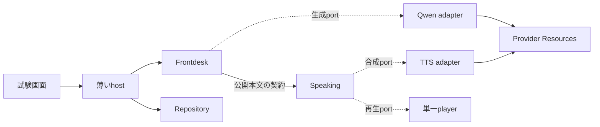

# SAAA 回答Runtime：最初の実装 I0・I1 詳細設計

2026-09-26。設計のみ。製品コード、保存設定、Provider、本番DBは変更していない。

対象は[実装計画v2](saaa-jarvis-response-runtime-implementation-plan-v2.md)のI0・I1。体験の正本は[5 Providerコンセプト](saaa-jarvis-five-provider-concept.md)。**固定テキストを送り、実Qwenが一度生成し、実TTSで実際に声が返る一本の経路を完成させる。** この段階の単純化と受入条件は本書に固定する。

## 1. 今回作る範囲

| 項目 | 今回の決定 |
|---|---|
| 入力 | テキストのみ。1セッション・同時1応答。処理中の別入力はbusyとして返し、待ち行列を作らない |
| モデル入力 | 固定指示と今回の原文。過去会話の選択・要約・長期Contextは作らない |
| 一次対応 | reply / clarifyを通す。delegateは未対応説明を返し、仕事を受け付けない |
| 生成 | Qwen要求は1回。制御JSON→公開本文を同じストリームから受ける |
| 発声 | 最初の句読点から合成。1つのworkerが句ごとに「合成→再生」を順に実行 |
| 保存 | 入力、公開本文、応答状態、音声状態、重要イベント。jobテーブルはまだ作らない |
| 再試行 | モデル再生成、音声再配送、接続の自動再作成はいずれも0回。LARM client内部の既存プロトコル処理は維持 |
| 停止 | 「読み上げ停止」と「この応答を中止」を分ける。セッション終了は資源cleanupも行う |
| UI | 開始、準備状態、入力、本文、音声状態、停止、終了が分かる小さい試験画面 |

Listening/ASR、Reasoning/ornith実行、仕事FIFO、Memory、World、embedding要求、Tool、音声割込み、pause/resume、再起動後の自動継続は後段で実装する。空の実行器や万能interfaceを先に作らない。

全体計画にある「Qwen未処理4件」「job保存」「通知claim・再配送」は必要になる段階で加える。今回は入力1件・単一の配送所有者・再配送0で始める。ID、状態所有権、停止の意味は全体計画と揃える。ASRを接続するI2では入力滞留の契約を拡張し、I3では非同期job受付と結果配送を加える。

## 2. 実装前に確認できた事実

読取り時のHEADは `a809d94981bcf729f4c985e584ee4ad0011edeb1`。削除差分は進行中で、[削除計画](saaa-jarvis-response-runtime-deletion-plan.md)にはビルド不可と記録されている。本書ではビルドを再実行していない。実装着手時に最新差分を確認し、旧経路を復元せず、共有部分の残存参照を解消した入口を受け取る。

| 確認したコード | 利用判断 |
|---|---|
| [larm_resources/mod.rs](../../src-tauri/src/providers/larm_resources/mod.rs) | 現時点ではprofile/audio変換の公開。独立した接続Ownerは未提供であり、今回必要 |
| [larm-session](../../crates/larm-session/src/lib.rs) | create→poll→claim、役割別acquire、期限付きUse、close/releaseを再利用。これを新hostで書き直さない |
| [Qwen制御parser](../../src-tauri/src/runtime/qwen_control_stream.rs) | JSONと本文の分離候補。重複キーはValue化前の厳密検証が必要。旧Runtimeへの依存を切ってから採用 |
| [SSE decoder](../../src-tauri/src/providers/chat_completions/sse.rs) | byte/UTF-8境界処理の候補。削除された親moduleを再導入せず純粋部分を移す |
| [system TTS](../../src-tauri/src/voice/system_tts.rs)、[HTTP TTS](../../src-tauri/src/voice/http_audio/requests.rs) | 合成の低水準処理を利用候補にする。旧会話の発声判断を呼ばない |
| [既存player](../../src-tauri/src/voice/http_audio/playback.rs) | 単一出力と開始/終了観測を再利用候補にする。Situation依存や暗黙の再生判断を新経路へ持ち込まない |
| [app_paths](../../src-tauri/src/app_paths.rs) | 隔離ディレクトリの検証を利用。DBの隔離だけでは背景workerを止められないため、初期化入口も分ける |

コードの存在は、新経路で接続・生成・再生が成功した証拠ではない。保存済みのTTS方式・voiceやLARM profileを読み取り、実効値を記録してから対応adapterを選ぶ。動かしやすいProviderへ置き換えない。

## 3. 最小構造



図のドメイン間の矢印はhostが運ぶ契約を示す。FrontdeskがSpeaking実装を直接呼ぶ意味ではない。実装は次の配置を基本とし、削除側が同じ責務を提供済みならその境界を使う。

```text
crates/saaa-conversation-core/src/
  lib.rs / contracts.rs       公開型。状態fieldは非公開
  frontdesk.rs                reply/clarify/delegateの扱い、本文の公開許可
  speaking.rs                 句分割、句の順序、発声状態、停止

src-tauri/src/conversation_host/
  mod.rs / commands.rs        所有者、5 IPC、宛先の結線
  repository.rs              下記3テーブルと会話本文の保存
  adapters/                  qwen、tts、playerの低水準I/O

src-tauri/src/providers/larm_resources/
  owner.rs                   既存larm-sessionを保持する小さいOwner

src/features/conversation/    試験画面と薄いIPC接続
```

### 3.1 判断の所在

| 所有者 | 判断と状態 | 外へ出すもの |
|---|---|---|
| Frontdesk | 制御の採否、本文の公開、応答の成功/失敗/取消 | 公開本文、音声投入の許可、応答の終端 |
| Speaking | 句分割、再生順、停止後の失効、音声の成功/失敗 | 合成/再生指示、音声状態 |
| Resources | 接続準備、役割handle、接続の失効、release | 準備状態、型付きhandle、資源エラー |
| host | 入力の宛先、I/Oと保存結果の返送、単一セッションの所有 | snapshot、表示イベント |
| repository | 指定された変更のtransaction、重複制約 | commit結果。生成・発声・再試行の判断はしない |

モデルや音声のI/Oをドメインの状態更新中にawaitしない。短い状態更新の後、hostが独立taskでI/Oを行い結果を返す。外部I/O中に全体lockやDB transactionを保持しない。UIは表示とcommand送信だけを担当し、音声を所有しない。

今回の並行処理は「資源準備」「Qwenの受信」「句ごとの合成・再生」の三系統に限る。汎用workflow engine、全体event bus、共通の自動retry managerは導入しない。

## 4. 公開契約と入口

以下は新規に実装する契約であり、現存IPCではない。型名は実装時に命名規則へ合わせても、責任と意味を変えない。

| 契約 | 必須項目 |
|---|---|
| `TextInput` | session_id、input_id、text。input_idはUIが送信前に発行し、通信再送で再利用 |
| `ResponseRef` | response_id、input_id。1入力に1応答。再送でも同じ対応 |
| `Control` | action: reply / clarify / delegate。モデルにIDを発行させない |
| `PublicDelta` | response_id、seq、text。seqはadapterがストリーム順に付ける |
| `SpeechRef` | response_id、speech_id、generation、clause_index。今回は応答あたりspeechは1つ |
| `Failure` | stage、code、利用者向け短文、request_id。秘密値や生のerror bodyを含めない |

IPCは5つに限定する。

| IPC | 動作 |
|---|---|
| `open_preview` | 隔離条件を検証しセッションを作る。同じprocess内の再呼出しは既存sessionを返す。準備開始後すぐ返る |
| `submit_text` | 原文・ID・busy/readyを検証し、入力を保存。response_idを返し非同期実行する |
| `stop_response(scope)` | scopeはspeech/response。speechは音声のみ、responseは生成と音声を停止 |
| `get_snapshot` | 資源・応答・音声の最新状態と本文を返す。購読の再接続で実行を開始しない |
| `close_preview` | 新入力を閉じ、稼働中処理を停止し、今回所有した資源をcleanupする。繰返し可能 |

UI更新は1種類の状態通知と本文deltaで行う。通知に単調増加のversionを付け、再接続時はsnapshotを正本にする。画面の再描画・購読解除でcloseを呼ばない。明示終了とprocess終了だけをセッション終了とする。

`submit_text`はまずinput_idを照合する。同じID・同じ原文なら現在/終端状態を返し、モデル要求を増やさない。同じID・異なる原文はconflict。新IDで処理中ならbusyとし、未送信テキストを画面に保持する。readyでなければnot_readyと準備理由を返す。これらの拒否を、受付済み入力やassistant回答として保存しない。

空白のみ・不正ID・長さ超過は保存前に拒否する。重複判定は保存した原文のUTF-8 bytesで行い、正規化や要約で別入力を同一扱いしない。利用者が明示的に同じ内容をもう一度依頼する場合は、新しいinput_idを発行する。

## 5. 状態は三つに分ける

### 5.1 資源

`preparing → ready → closing → closed`。準備・利用に失敗すれば `failed`、解放未確認なら `cleanup_pending` を残す。

preparingの詳細理由は既存LARM phaseを表示する。readyをカタログ取得やcreateのready応答だけで立てない。正式なclaim・契約検証・今回必要な役割の確認が済んでからreadyにする。現在の5役割一括claim契約を維持し、架空の役割別起動APIを作らない。

### 5.2 Frontdesk

`awaiting_control → streaming → completed`。途中から `failed / cancelled / interrupted` へ移れる。delegateは `unsupported` に終端し、今回の機能制限を明示する。

control受理と公開枠の保存が成立するまでは本文を公開しない。completedはProviderの正常終端と最終本文の保存成功で決まる。TTS完了を条件にしない。

### 5.3 Speaking

`idle → collecting → synthesizing → playing`。次の句があればsynthesizingへ戻り、本文継続待ちならcollectingへ戻る。本文正常終了かつ全句の実再生が終われば `played`。別に `stopped / failed / interrupted` を持つ。stoppedは「停止を確認した」終端であり、停止要求を出しただけでは設定しない。

Qwenの生成中にもPlayingになれる。音声だけを停止した後もFrontdeskは本文を保存する。Qwenが失敗/取消になった場合は、音声の残りを止め、未完の末尾をflushしない。すでに読み上げた範囲と、最終的に正常回答を得たかは分けて記録する。

初回の次入力は、FrontdeskとSpeakingがともに終端し、遠隔要求・playerの処理枠が利用可能と確認できた時に受理する。音声停止未確認ならbusyのまま無言で待たせず、停止未確認という状態を表示する。

## 6. 正常経路

### 6.1 開始とLARMの事前準備

1. 起動時に隔離DBと設定snapshotを読み、選択済みProvider・model・voiceを検証する。変更系の設定migrationで既存値を置き換えない。
2. セッションと、この試験専用のLARM idempotency keyを保存する。本番DBからコピーされた旧lease slotを再利用しない。
3. Resourcesが `Session::connect_with_profile_credential_key_and_phase` を一度呼ぶ。複数の準備要求は同じ実行結果を共有する。
4. 既存clientが `/v1/agent-connections` へPOSTし、必要なら同connectionをGETでpoll、`/{id}/claim` へPOSTする。client内部のRetry-After・検証・取消後cleanupを維持する。
5. claim後の実model、役割、connection/allocation IDを記録し、今回のQwen/TTS経路が使える状態へ移る。生成できたという実績は別に記録する。

prepare中は画面に「実行環境を準備中」と実phase・経過時間・終了操作を出す。応答入力の受付と「少し考えます。」はまだ発生させない。状態説明のために未準備のLLM/TTSを呼ばない。

**既存APIが全役割の準備完了を要求する以上、今回の初回起動ではQwenもその影響を受ける。** アプリ内のawait分離だけでQwenの冷間即応を達成したとはしない。役割別確保や常駐運用の可否は資源層の後続課題として残し、正式APIの制約を変更せず実測する。

### 6.2 テキストからQwen

1. input_idの重複・ready・busyを確認し、原文とresponseをtransactionで保存する。commit後だけ生成へ進む。
2. Qwen adapterがResources経由で `acquire("backchannel")`。8秒の応答期限にはacquire/health/capacity待ちも含める。
3. claim由来のendpoint/token/modelで `chat/completions` へstream要求を1回送る。メッセージは先頭system 1件と今回のuser原文。Tool/Memory/Worldを注入しない。thinking無効化は実経路の対応済み契約で行い、未知の送信キーを推測で足さない。
4. byte→SSE→Provider JSON→公開content→制御/本文の順にdecodeする。内部reasoning・tool call・別choiceは本文へ混ぜない。
5. FrontdeskがControlを検証する。reply/clarifyなら公開枠を保存し、届いていた本文をSpeakingとUIへ渡す。commit中の本文は上限付きで保持する。
6. Providerの正常なfinishを確認し、最終本文とFrontdesk completedを同じtransactionで保存する。その後だけSpeakingへ正常な本文終了を知らせ、末尾flushを許可する。

接続終了だけを正常finishにしない。`finish_reason=length`、tool call、途中切断、正常終端なしは失敗。標準のfinish/`[DONE]`の扱いはadapterの固定fixtureと実要求で確認する。timeoutを受けて同じ入力で再生成しない。

正常finishでも公開本文が空白のみなら失敗にする。Provider要求ごとの開始・正常終了/異常・停止確認は音声やモデル制御の終端と別に記録し、delegateの固定説明が保存できたことをQwen要求の正常終了と混同しない。

### 6.3 Qwenの出力契約

```text
{"action":"reply"}
おはようございます。今日もよろしくお願いします。
```

JSONは一つのobject、許可キーはactionのみ、値はreply/clarify/delegate。整形による複数行とSSE/UTF-8分割を受理する。JSONと本文の間に改行を要求する。重複キー・未知キー・不正値・JSON以外の前置きはprotocol errorにする。JSONの重複キーはserde_json::Valueへ変換する前に検出する。

制御は一度確定したら変更しない。本文に現れた文字列を再び制御として解釈しない。本文先頭に二つ目の制御objectを出す不適合ケースは固定fixtureで拒否を確認する。任意の本文JSONを処理命令として実行することはない。

delegateではモデルが続けた受付本文を公開しない。短い固定説明「思考処理はまだ接続していません。」を保存し、同じSpeakingへ一度渡す。Qwenの残りは期限内で受信・破棄して要求を終わらせ、実行中の枠を失わない。正常drainができなければ中止処理へ進む。job作成、ornith要求、本文の再推論は0。その他のprotocol/Provider障害は画面へ理由を示し、新しい音声要求を連鎖させない。

### 6.4 公開本文から実音声

1. Speakingは順番どおりのPublicDeltaを受け、`、。！？`（ASCIIの`,.!?`も同様）までを一つの句として確定する。正規表現による意図推定、発話の自然さの再判定は加えない。
2. 空白だけの句は捨てる。句を保存済み本文に対応づけてから、先頭の句をTTS adapterへ渡す。
3. 選択済みのTTS方式を使い、一句の音声を有界buffer/私有一時ファイルへ合成する。system TTSでもLARM TTSでも同じ音声artifact契約を返す。
4. 単一playerがそのartifactを再生する。最初のsampleの消費をstarted、出力のdrain完了をendedとして観測する。TTS API成功やplayer process起動だけで再生済みにしない。
5. 再生終了後に次の句へ進む。本文の正常終了を受けた時だけ、句読点のない残りを最後の句として追加する。
6. 全句の再生と状態保存が終了した時だけplayedにする。artifactは終了/停止時にこの試験の私有領域だけから削除する。

**最初は合成と再生を一句ずつ直列にする。** Qwen生成と最初の句の合成・再生は重なるため、全文完成は待たない。次句の先行合成による高速化は後段に残す。初期版には句間の無音が生じ得るので測定して記録する。

既存の「HTTP TTS要求と再生が一体」の関数を新経路から丸ごと呼ばない。低水準の要求・decode・再生だけを必要最小限に分ける。SituationやWorldを判断する旧guardは受け継がず、発声の許可はSpeakingから渡す。デバイスの単一所有はD1の境界で守る。

## 7. 保存は最小3テーブル

新規テーブル名は `conversation_preview_*` とし、隔離DBに追加する。実装時のschema versionは最新に合わせる。確定した会話本文は既存 `conversation_messages` に保存し、旧runtime_runs/rr/Butlerの状態は作らない。

| テーブル | 主な列と制約 |
|---|---|
| `conversation_preview_sessions` | session_id PK、conversation_id FK、config_fingerprint、resource_state、resource_generation、larm_key UNIQUE、connection_id nullable、cleanup_state、created_at/updated_at |
| `conversation_preview_responses` | response_id PK、session_id FK、input_id、input_hash、user_message_id、assistant_message_id nullable、action、frontdesk_state、speech_id、speech_generation、speech_state、public_text、last_persisted_clause、last_played_clause、failure_stage/code、version。UNIQUE(session_id,input_id)、UNIQUE(speech_id) |
| `conversation_preview_events` | session_id＋event_seq PK、response_id nullable、kind、wall_time、elapsed_ms、request/connection/allocation ID、必要最小限のdetail。復旧実行用キューにしない |

状態列の値は本書のenumに制限する。同じ行を使っても、FrontdeskとSpeakingの更新APIを分け、互いの状態を変更させない。secret/token、音声binary、Providerの生responseは格納しない。本文は会話記録と限定された隔離証拠でのみ保持する。

状態更新はresponse_id・現状態・世代を条件にし、終端から稼働状態へ戻さない。句checkpointとイベント連番も同じwriterで順序を保つ。古いI/O完了や二重stopが届いても、別の応答や新しい音声世代を書き換えない。

transactionは次の四種類に絞る。

1. 入力のuser message＋response作成。receiptの原子的な確定。
2. 制御採用と公開枠確定。公開前の必須commit。
3. 句までのpublic_textと境界更新。実TTS投入前のcheckpoint。tokenごとのwriteはしない。
4. 正常finish時のassistant message＋Frontdesk completed。音声状態は別transactionで更新する。

失敗時は受信済み公開本文を部分結果としてresponseに残し、正常なassistant最終回答として保存しない。既に再生した範囲は消さない。固定の未対応説明はassistant messageとして保存し、action=delegate・frontdesk_state=unsupportedを併記する。

DB保存に失敗したら、成功した状態をUIへ出さず、生成と音声を停止する。最後にcommitできた状態と、永続化できていない障害を区別して表示する。再起動では非終端responseをinterruptedにし、自動再実行・再生は行わない。commitとprocess crashの間を埋める自動outbox executorは今回作らない。

## 8. 上限・停止・失敗

### 8.1 固定する初期上限

すべて試験hostの値。保存済み設定やProviderの安全上限を緩めない。より小さい既存上限があればそちらを使い、実効値を記録する。

| 対象 | 初期値と動作 |
|---|---|
| 資源準備 | 既存clientの最大300秒。画面は最初から準備状態を表示。取消は随時可能 |
| Qwen | 入力受付から8秒、最大512出力token。acquireを含み、開始後に期限を更新しない |
| 入力/制御/公開本文 | UTF-8で入力4 KiB、制御4 KiB、公開本文8 KiB。超過時に切り詰めて成功扱いしない |
| 公開前buffer | 8 KiB。保存待ちもQwenの8秒に含める |
| 未再生句 | 32句・合計8 KiB、一句最大2 KiB。超過は音声だけをfailedにし、本文受信・保存を続ける |
| 合成artifact | 一句16 MiB以下、decode後音声は最大30秒。既存上限が小さければそれに従う |
| 一句のTTS要求 | 15秒以内。LARM acquireと受信・decodeを含め、credential残存期限でも制限 |
| player開始/全体 | 開始15秒以内、speech全体120秒以内。無音のまま所有権を持ち続けない |
| 停止確認待ち | 5秒。超過はstopping失敗として診断し、処理枠を利用不可にする。新しいplayerを重ねない |

句読点のない本文は正常終了で一度だけ合成する。一句上限に達したら音声失敗を明示する。長さ・時刻・モデル再判定を組み合わせた複雑なchunkerは作らない。音声キューが満杯の時にQwen受信を無期限にblockしない。

### 8.2 停止と失敗の扱い

| 出来事 | 処理 |
|---|---|
| 読み上げ停止 | speech世代を無効化→保留句破棄→TTS/player停止。停止後に届く本文から新しいspeechを作らない。Qwenは本文を最後まで保存できる |
| この応答を中止 | 先にメモリ上の受理を閉じて生成・音声の取消を通知し、Frontdesk cancelledを保存。後着本文を採用しない |
| Qwen異常・期限 | failedと理由を記録。音声の残りは止め、未完末尾をflushしない。再生成0 |
| TTS/player異常 | speech failed。回答本文の生成・保存を継続。失敗した句を飛ばして次の句を読まない |
| DB異常 | 新たな公開・合成を止め、生成/再生を取消。未保存の成功を報告しない |
| UI再接続 | backendの応答・音声を維持しsnapshotを取得。生成・再生の再開命令を自動送信しない |
| セッション終了 | 新入力拒否→生成と音声停止→Use解放→今回所有した接続のclose。成功/失敗を記録 |

停止通知は通常本文キューやDB writeの完了を待たず、対象taskの取消経路へ渡す。音声開始前の停止もそのresponse全体に有効とする。DB保存に失敗しても実音声の停止を取り消さない。

取消後のcallbackはsession/resource/speechの世代とresponse_idで拒否する。**HTTP streamを閉じたことは遠隔生成停止の証明にしない。** 停止を確認できない役割は利用不可にし、`request_outcome_unknown`を理由として新要求を止める。共有接続全体をjob/応答単位でcloseしない。試験セッション終了時は所有範囲を確認してreleaseし、解放未確認ならcleanup_pendingを残す。自動的に別接続を作って逃げない。

LARM createの待機中に取消された場合も、既存clientの「ID取得後に解放する」処理を途中で捨てない。借りたUseを再生終了まで保持せず、Provider I/O終了後に解放する。QwenとTTSのUseを互いに待たせる全体mutexを作らない。

## 9. 隔離起動とUI

開発用 `conversation-preview` featureの入口を設ける（新設予定）。既存TauriのIPC/描画を使うが、preview初期化では新host、設定読取り、必要な音声I/Oだけを起動する。通常AppStateを丸ごと渡さず、旧会話、Memory抽出、World、steward等の背景workerは起動しない。

SQLite Online Backupで読み取り元から隔離コピーを作り、`SAAA_MVP2X_APP_DATA_DIR` 等の既存検証を経てそのコピーを使う。単純な稼働中DBファイルのcpに依存しない。絶対path・実ディレクトリ・0700・本番との不一致を検証する。隔離指定がなければpreviewは起動拒否し、本番pathへfallbackしない。

起動前後で設定・Provider・credential参照・話者登録のfingerprintを比較する。コピー内の旧lease情報は接続・cleanup対象にしない。新hostが発行したkeyの資源だけを所有する。同じ音声出力やLARM枠を使う稼働アプリとの競合は実機試験前に確認し、既存アプリを無断で終了しない。

画面は次に限定する。

- 準備中：実phase、経過時間、選択済みmodel/TTS、終了操作。
- ready：入力欄と送信。処理中は送信を無効化するが、本文表示・停止操作は維持。
- 応答：受信本文とFrontdesk状態、別に音声状態。「本文完成」と「読み上げ完了」を分ける。
- 障害：失敗工程と短い理由。TTS失敗なら本文を残す。再試行を実装するまでは、状態を説明し明示終了・再開始を使う。

実装前に削除後のTauri build境界・snapshot・primary conversationが成立することを確認する。未成立なら不足箇所を修復する作業として分け、旧ChatPage/旧Runtimeの復元を暗黙に行わない。

## 10. qwen-audio-agentから採用する最小部分

参照HEADは `2b70ebc4fffde4a7ce384bc04660346aab30e862`。[全体の対応表](saaa-jarvis-response-runtime-implementation-plan-v2.md#21-qwen-audio-agentを制御構造の基準にする)から今回必要なものだけを使う。

| 参考先 | 今回採用する契約 | 今回作らないもの |
|---|---|---|
| RealtimeProviderSession | 同じ接続試行の共有、古い接続callback排除、有限buffer | 自動再接続のbackoff loop |
| AnnouncementWindow / PresentationRuntime | 生成終了と再生終了の分離、実再生receipt、停止後の遅着排除 | 音声割込み判定・pause/resume |
| AnnouncementManager | 一つの配送所有者、同じ結果の二重発声禁止 | 複数client間のclaim lease・通知再配送 |
| RealtimeResponseSlot | timeout後に遠隔枠が空いたと決めつけない | 未確認のまま次要求を送る復旧 |

TaskOperations/TaskManagerとTurnCorrelationの移植はI2/I3で行う。今回のreply経路に、まだ存在しないASR/jobの状態を加えない。参考先の再生開始confirmを、SAAAの全文再生成功へ直接対応づけない。

## 11. 実装順と受入試験

各行は完了物を確認してから次へ進む。すべて本書作成後に実施する試験であり、今回の実行結果ではない。

| 順序 | 実装するもの | 必須の確認 |
|---|---|---|
| 1 | 削除後build境界、隔離入口、Resources Owner | 設定不変、単一create、poll/claim/phase、取消中createのcleanup、release結果 |
| 2 | Frontdesk/Speakingの純粋状態と3テーブル | 重複inputは要求1回、異なる原文はconflict、保存失敗の外部処理0、busy拒否、終端の整合 |
| 3 | Qwen adapter、実hostからの本文保存 | SSE全byte境界、重複JSONキー、分割header、正常finish/切断/上限、内部reasoning非公開、実Qwen1要求 |
| 4 | 一句ずつのTTS/player | 最初の句で開始、全文完成待ち0、句順、末尾flush、音声buffer上限、生成と再生の終端分離 |
| 5 | UI・停止・再接続、実機反復 | 停止後音声0、音声停止中も本文保存、TTS障害でも本文保存、UI再接続で追加要求0、終了解放 |

特に実hostの試験で「遅いTTS中もQwenの本文受信が進む」「stopが通常の本文キューを待たない」を確認する。単体の純粋テストだけで並行処理が安全と判定しない。

停止は制御到着前・合成中・再生中・最終DB commitとの競合で試す。最終commitが先に成立した場合は本文completedを保ち音声だけ停止し、取消が先に成立した場合は遅着完了でcompletedへ戻さない。いずれも読み上げ停止後の新しい音声開始は0とする。

実機の固定ケース:

| 入力・操作 | 期待 |
|---|---|
| 「おはよう」 | reply、Qwen1要求、公開本文保存、実TTS開始/終了 |
| 「1+1は？」 | 短い正答、ornith/Tool要求0、実発声 |
| 「短い挨拶を二文で答えて」 | 最初の句がモデル正常終了より前に合成開始。できなかった試行も残す |
| delegateを要する固定入力 | 分類fixtureと実モデル評価を分ける。delegate時は未対応説明、job/ornith要求0 |
| 音声だけ停止 | 音声を止め、最終本文保存は成立。自動読み直し0 |
| Qwen/TTS中のUI再読込み | 同一responseの表示復元、追加生成・二重再生0 |

直接回答経路を10回以上実行し、全試行のrequest ID、connection/allocation、実model/voice、制御、本文開始、最初の句、TTS要求、player開始/終了、DB終端、releaseを関連づける。SSE記録による時間の前後関係と、実スピーカーで聞こえることの両方を確認する。最初のsampleのcallbackだけで人間の可聴確認を代用しない。

冷間では準備状態・取消・cleanup、温間では本回答と実発声を別に検証する。カタログ、直接model URL、wav生成のみ、模擬Providerのみを実機合格に数えない。10回の反復は安定したp95の保証ではない。初音・句間無音・全文完了時間を記録する。

予定コマンドと既存gate:

```sh
# 新設後に利用可能になる試験入口
cargo test --manifest-path crates/saaa-conversation-core/Cargo.toml
cargo test --manifest-path src-tauri/Cargo.toml conversation_host

# 既存gate
bun run quality:check
bun run desktop:smoke
bun run ipc:check
bun run check:local
```

desktop smokeは隔離設定でsnapshotとprimary conversationが読み込まれた状態で行う。IPCを追加したら既存のbinding生成手順と整合させる。初回応答を変更した場合は指定回帰の結果を記録する。

ASRは今回変更しない。共有音声I/Oの変更がASRへ及ぶ場合は、関連するBunテストと `cargo test --manifest-path src-tauri/Cargo.toml voice::streaming_asr` を実行する。既存baseline失敗と新規失敗は分け、試験や上限の削除で通さない。

## 12. 今回の完了条件と残る課題

**隔離画面で入力し、実Qwenの本文が保存され、選択済みTTSで実際に読み上げが終わり、停止・重複・失敗・資源解放を追跡できること。** interfaceだけ、mockだけ、音声artifactだけでは完了しない。

実装時に確定する残課題は、削除後のbuild境界、実効TTS方式に必要なadapter、Qwen経路のthinking無効化/finish契約、遠隔取消の確認手段である。確認できないものを代替Providerや旧会話経路で埋めない。合成と再生の直列化による句間遅延、全役割claimによる冷間待ちは測定し、I0/I1の成功と区別して報告する。

本書は詳細設計であり、上記の新実装・回帰・実機試験は未実施。運用ツールの会話累計：initial_instructions 1回、context_compile 9回、compile_eval 9回（今回の評価を含む）。
