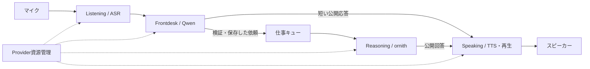

# SAAA：回答Runtimeを独立して作り直す提案

2026-09-26／設計提案。実装・削除・設定変更は未実施。

後続の[削除計画](saaa-jarvis-response-runtime-deletion-plan.md)で対象ファイル、共有依存、撤去順序を具体化した。追加のユーザー指示により、Memory・World Modelと会話の接続は一旦切り、保存済みデータと管理機能は保持する。

体験の正本は [5 Providerコンセプト](saaa-jarvis-five-provider-concept.md)。本書は、その体験を実現する実装構造と開発順序を変更する案である。コンセプト第5章の「既存Runtimeへの小さい変更」と[旧実装計画](saaa-jarvis-five-provider-implementation-plan-v1.md)の既存台帳・入口への接続方針は、今回の「回答構造を最初からやり直す」という依頼に合わせて再検討する。本人限定入力、1.5秒更新、Qwen即応、思考キュー、早期TTSという最終目標は維持する。

## 1. 結論

**回答を進行させるRuntimeは新しく作り直す。Provider資源管理とデバイスの低水準I/Oは、独立した境界を通して利用する。最初の成果物は実マイクから実音声回答まで動く、単一の細い経路にする。**

「全部削除」は新経路が旧回答制御へ依存しないという意味で先に実現し、物理的な削除は新経路の実機合格・入口切替に続けて行う。旧Runtimeの内部に新しい分岐を足したり、新Runtimeが旧execute_turnを呼んだりする方式は採らない。旧コードは切替まで保存するが、新経路からの自動fallback先にはしない。

全量削除してから資源取得・マイク・認証まで再実装すると、正常に使えている部分も同時に失い、原因の切り分けが再び難しくなる。置換の対象を「回答制御」に絞ることが、今回の根本的な変更になる。

## 2. この判断の根拠と限界

確認済みの事実:

- 旧初回実装計画は、最初の音声統合に長考中の別件受付、質問返送、条件変更、停止、再起動復旧を含む。最小の返答経路の実機成功より前に、複数の高度な契約を成立させる計画だった。
- 今回読んだHEADは `52207165d4d7aa8c962320164c9551a8ce8b4c11`。作業開始時のgit statusはclean。現在の [providers/larm_voice/frontdesk.rs](../../src-tauri/src/providers/larm_voice/frontdesk.rs) には会話受付・監査・保存との連携があり、同ディレクトリに [会話の永続化](../../src-tauri/src/providers/larm_voice/frontdesk_repository.rs) と [発話優先制御](../../src-tauri/src/providers/larm_voice/speech_priority.rs) もある。資源接続と会話の振る舞いの境界が、少なくともこの実装配置では混在している。
- [conversation_turn.rs](../../src-tauri/src/runtime/conversation_turn.rs) はContext、roles、入力、Memory、Provider、出力保存等を横断する。[useConversationTurn.ts](../../src/features/chat/useConversationTurn.ts) にも入力・run・取消・音声に関わる制御がある。新経路からこれらを丸ごと呼ぶと、既存の結合を引き継ぐ。
- 元runではLARMの実行枠競合によりreadiness probeが進まず、claim前にユーザーが停止した。[調査Report](../evidence/handoff-investigation-20260926/REPORT.md)参照。これは当時のrunの証拠であり、その後の変更を含む現在の全経路の実機評価ではない。

設計上の判断:

- 機能を追加するたびに複数の入口・状態・終了条件を整合させる方式は、今回の開発を難しくしていると考える。新しい責務境界と小さな実機合格単位へ変える価値がある。
- ただし「現在の構造だけが全不具合の原因」「書き直せば速くなる」は未証明。LARMの容量・公平性、ASRの認識精度、音声機器の制約は書き直し後も残る。

## 3. 境界：4つのドメイン、薄い接続制御、独立した資源層

| 部分 | 自分が所有するもの | 他へ任せるもの |
|---|---|---|
| Listening（ASR待受け） | 聞き取りの寿命、発話ID/版、本人確認・音声活動の結果、partial/final/障害 | 仕事の作成、LLMの振分け、回答再生 |
| Frontdesk（Qwen一次対応） | 入力更新の整理、小さい会話状態、1回生成の制御レコードと本文、返答/依頼の提案 | ornith完了待ち、接続作成、業務Tool、直接のTTS起動 |
| Reasoning（ornith仕事） | 受付済み仕事、FIFO、原文・条件、実行と結果。将来のContext/Tool処理 | マイク制御、Qwen受付の占有、直接のTTS起動 |
| Speaking（TTS・再生） | 公開本文の句分割、合成キュー、再生順、実player、停止と音声の終端 | 回答の生成・言い換え、仕事の成功判定、マイクの停止 |
| Session接続制御 | ドメイン間の型付き配送、短い状態投影、対象IDの検証、セッション終了 | Provider通信や合成の長いawait、各ドメインの内部処理 |
| Provider Resources | 保存済み設定の読取、認証、LARM create→poll→claim、役割別handle、lease・renew・release、資源状態 | 相槌文、会話履歴、仕事の振分け、発話優先順位 |

5種類のProviderは資源・能力の種類であり、会話の状態機械を5個作るという意味ではない。embeddingは資源として利用可能に保ち、検索機能を追加する段階でReasoningのContext処理から使う。最初の短い応答にembedding呼出しを無理に組み込まない。

図の経路はSession接続制御を介する。Qwenからornithを呼んでawaitする再帰的handoffにしない。仕事の受付後、Qwenは次の入力へ戻り、ornithの結果は共通のSpeakingへ届く。ornithの回答をQwenで再生成しない。

最初は同一Rustプロセス内のモジュールと型付きchannelで十分。マイクロサービス、汎用Agent framework、DAGエンジン、汎用イベントバスは不要。UIは操作と表示に集中し、仕事や音声の開始・終了を独自判断する正本を持たない。

### 境界をコードでも守る

新しいcoreの配置案は `crates/saaa-conversation-core/`。内部を `listening`、`frontdesk`、`reasoning`、`speaking` と小さな `session` に分ける。HTTP・LARM・Tauri・SQLの具象型をcoreへ渡さず、必要な入出力だけを型で定義する。汎用的な一つの巨大Provider interfaceにまとめず、ASRイベント、LLMストリーム、TTS音声など実際の能力に対応した小さな境界にする。

Tauri側のhostは設定・保存・デバイス・adapterを組み立てる。新coreから旧 `execute_conversation_turn`、Role Routing、Butler、UIのturn制御への依存を禁止し、build依存と境界チェックで検出する。既存のHTTPクライアントやSSE解析を使う場合も、その依存が旧会話Runtimeへ戻らないことを確認する。

低水準の音声I/Oは共有可能だが、AECの再生参照とマイク入力は同じAudio I/O所有者で扱う。ドメインを分けるために、別々の経路で勝手にデバイスを開いて自声除去を壊さない。

## 4. 最初の一気通貫経路

最初の試作は、**一つの会話・一件のornith仕事・Toolなし・Memory検索なし**に限定する。次の実経路を同じ入口で通す。

1. マイクから本人として受理した発話をASRが確定し、原文と発話IDを保存する。
2. Qwenが1回の生成で `wait / reply / delegate` の制御と必要な短い本文を返す。正しい制御レコードだけ採用し、本文は検証・必要な保存の成立後に公開する。
3. `reply` なら共通Speakingへ本文を送る。`delegate` なら原文を持った仕事を一度だけ保存し、受付応答をSpeakingへ渡す。保存前に「受け付けました」と発声しない。
4. 独立したReasoning workerが資源handleを取得してornithを呼ぶ。接続・実行待ちの間もListeningとFrontdeskを止めない。
5. ornithの公開回答だけをSpeakingへ送る。最初から句読点で合成し、全文完成を待たない。制御JSON、reasoning、Tool出力は読ませない。
6. 本文保存、生成終了、再生終了を別々に記録する。TTSが失敗しても本文を残し、回答全体を再推論しない。

初回はfinal入力を処理し、partialは観測・表示までに限定する。この試作をコンセプトの常時応対完成とは呼ばない。次段階で同じ発話ID/版を使って1.5秒更新を有効にする。最初からその情報を受け取れる形にするが、訂正・複数仕事・音声意図による取消を同時実装しない。

`wait` は発話の続きを待つ判断であり、受付済み仕事の代わりに使わない。確定発話の依頼対象が不明なら短い確認を返す。制御不正・応答なしは期限内に失敗として終え、無期限の「考えています」に変換しない。R0では失敗後のモデル自動再試行を追加せず、まず一回の実行とその終端を安定させる。

Qwen・ornithの実プロトコルが制御と本文を分離できない場合、初回から明示的なadapter不適合として扱う。旧Runtimeへのfallbackや本文用の二重推論で隠さない。既存調査の複数行JSON→本文の観測をfixtureとして利用する。

### 最小でも省かない契約

- **待ちを所有する。** Sessionのイベント処理はネットワークをawaitしない。Qwen・ornith・合成・再生はそれぞれ独立worker、同時実行数は当初各1。キューには上限を設け、満杯なら受付不能を明示する。
- **期限を所有する。** セッションはユーザーが閉じるまで存続。Qwen応対、受付済み仕事、音声配送は別の期限を持つ。仕事の期限は受付時に一度だけ決め、queue・準備・生成・再試行が同じ絶対期限を消費する。段階を移るたびに120秒を付け直さない。
- **止まる。** 最初は対象ID付きUIで「音声停止」「仕事取消」を用意する。音声自然言語の意図判定は後段。失効したrequest/job/speechの遅着イベントを採用しない。遠隔計算の停止未確認とローカル出力抑止を分ける。
- **状態を偽らない。** `accepted / waiting-resource / generating / result-ready / failed / expired / cancelled` と、音声の `queued / playing / played / failed / stopped` を区別する。timeout説明をモデル回答成功にしない。
- **自声を仕事にしない。** 実機の自声除去未成立ならコンセプト既定の制限付きモードで検証する。取得は続けても、再生中の本人未確認認識を会話へ流さない。これを音声割込み合格と数えない。
- **同じ入力を二度処理しない。** session、utterance/revision、job、request、speech/句番号を関連づける。最終イベントやUI再接続で生成・読み上げを重複させない。

最初の仕事キューは実行1件、待機枠は小さく明示した上限でよい。複雑な優先度や実行途中の条件変更は後回しにするが、仕事中でもQwenの単純な挨拶に応じられることは最初の合格条件に含める。

## 5. 資源層は独立させるが、問題を隠さない

`crates/larm-session` の正式な取得・解放契約を資源層の出発点とする。ただし現行実装を無条件に凍結する趣旨ではなく、取得期限・cleanup・共有利用の適合を検証する。会話sessionのOwnerと仕事の取消を分け、一仕事の期限切れでASR/Qwenが使用中の共有接続を解放しない。

起動時は必要な資源の準備を独立に進める。Qwenが利用可能ならornithを待たず会話を開始する。ここでいう利用可能は、必要な正式な接続手続きを満たした状態であり、カタログ表示や直接URLの応答ではない。

**LARMのprofileが5役割の準備完了を一括claimの条件にしている場合、アプリ内の非同期化だけではQwenの冷間起動待ちを除けない。** 役割別の確保がAPIで可能か、資源層/LARM側の契約変更が必要かを切り分ける。未対応のAPIやclaim前のProvider利用を仮定して実装しない。

同様にclaim後の生成queue待ちは残る。事前確保だけで解決とせず、Qwenの枠を妨げない公平性・配置を別に測る。資源が準備できない場合も、UIは具体的な状態と有限の終了を出す。音声経路が利用可能なら確認済みの定型説明を発声し、TTSも利用不能なら表示を確実に残す。説明自体をornithの生成待ちにしない。

## 6. 開発順序と合格条件

| 段階 | 作るもの | 完了を判断する証拠 |
|---|---|---|
| R0：最小の縦経路 | 上記4ドメインと小さなhost、実adapter、隔離保存、薄い試験画面。最初はfinal入力 | 実マイク→ASR→Qwen単独応答→TTSと、実マイク→Qwen依頼→ornith回答→TTSの両方。旧回答Runtime呼出0。タイムアウトや取消も終端する |
| R1：通常入口を一本化 | R0の実機合格後、新Runtimeへ排他的に切替。旧回答制御を撤去 | 同じ発話を旧入口へ配送しない。UIの再描画・再接続で二重生成0。新旧自動fallback0。保存済み設定・履歴を維持 |
| R2：入力を発展 | 1.5秒更新、区切り即時送信、後着final、訂正、話者・自声除去の実機完成 | コンセプトの対応ケース。無音時の生成0、重複仕事0、本人の重なり発話を受理 |
| R3：仕事を発展 | 複数FIFO、質問返送、条件変更、音声による停止意図 | 元仕事との対応・取消・失効を検証。必要な分類評価をこの段階の操作範囲に合わせて追加 |
| R4：音声と知識を発展 | pause/resume、相槌失効の高度化、Tool/Memory/World/embedding、復旧 | 追加機能ごとの実機・回帰検証。コンセプト全受入は元の基準で判定 |

R2以降もListening、Frontdesk、Reasoning、Speakingの責務を変えず、対象ドメインの内部と必要な契約だけを拡張する。依存関係は守るが、一つの段階へ全機能を詰め込まない。Toolを導入する時点で操作権限・必要な承認・結果照合も導入し、旧汎用Runtime全体を再接続しない。

R0の実機試験は、Qwen単独とornith引継ぎを固定した日本語入力で各10回以上繰り返す案とする。自然な入力で期待した分類が実際に選ばれなければ失敗とし、強制routingやmock結果を音声経路の合格に混ぜない。元の「寿限無の名前を省略せず発声して」も回帰入力に入れ、保存されたASR原文・実route・回答本文を確認する。正答検証用の期待本文/許容差は試験前に決める。

さらに実ornith要求が進行中のQwen挨拶、資源未準備、claim後busy、TTS失敗、UI停止を確認する。成功回数と失敗内訳を別に記録し、失敗を除いた平均だけを出さない。各10回は最低限の経路反復であり、安定したp95やコンセプト全体の品質保証には不十分。コンセプトの30発言・10往復以上と負荷別測定は後段の最終受入で維持する。

資源不足試験で短い期限説明が出ても、モデル回答成功とは数えない。R0の通常引継ぎ成功は、実際の最終回答保存・実音声再生を必須とする。別の診断でProviderが応答しただけでも合格にしない。

## 7. 保存・削除・試験の扱い

初期試験は既存DBの隔離コピーまたは新しい隔離DBで行う。Provider設定・認証・話者登録を勝手に置換しない。新Runtimeの稼働中状態は新しい一つのrepositoryが正本となり、旧rr/Butler台帳へ二重書込みして整合を取る設計にしない。既存の会話履歴はhostの保存境界を通して継承する。

切替時は旧sessionの終了・取消・資源所有権の引継ぎを確認してから新sessionを開始する。同一sessionを新旧で同時実行しない。再起動で未完了仕事を見つけても、最初は中断として表示し、黙って再実行しない。高度な復旧は後段で追加する。

削除するのは新Runtimeに置換された回答入口・Qwen→ornith制御・発話制御・それ専用の重複状態。汎用の設定保存、資格情報、LARM手順、音声デバイス、他用途から参照されるTool/Memory機能を一括削除しない。参照を棚卸しして、共有低水準処理を残すか小さなadapterへ切り出す。削除対象の正確なファイル一覧は実装前の依存確認で確定する。

試験も整理する。旧内部経路だけを固定したテストは置換時に廃止し、利用者が期待する挙動・既知の不具合ケースは新Runtimeの試験へ移す。新しく必要なのは、境界の依存チェック、期限・取消・遅着・重複の決定的試験と、実機の細い経路の反復である。mock成功だけで実機合格としない。

凍結対象を変更する実装時は、AGENTS.mdに従う。

- ASR：`bun test tests/ambient-voice-session.test.tsx tests/voice-capture-races.test.ts tests/voice-asr-packet-sender.test.ts` と `cargo test --manifest-path src-tauri/Cargo.toml voice::streaming_asr`。
- 初回応答：`bun run quality:check` とmacOSで `bun run desktop:smoke`。後者はsnapshotとprimary conversationを読み込んだ状態で行う。
- 対応するdomainだけ、理由付きで `bun run freeze:accept:asr --reason "..."` または `bun run freeze:accept:initial-response --reason "..."`、最後に `bun run freeze:check`。失敗をfreeze更新で覆い隠さない。

今回は文書だけを追加した。実装・削除・本番DB更新・Provider要求・回帰テストは行っていない。次の実装の成果判定を「新しいクラスやテストが増えた」から「旧経路に頼らず、実音声で二つの回答経路が繰り返し完走した」へ変更する。

運用ツールの会話累計：initial_instructions 1回、context_compile 4回、compile_eval 4回（本設計の評価を含む）。
