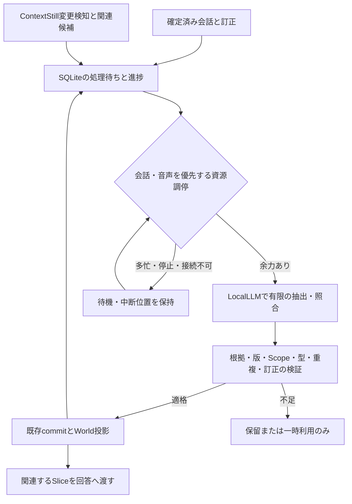

# SAAA 因果Worldの継続構築・メンテナンス実装計画

作成日: 2026-09-30（Asia/Tokyo）  
改訂日: 2026-10-01（Asia/Tokyo）  
状態: SAAA内の独立実装と隔離検証を実施。ContextStill接続・実機受入は未完了。  
対象: 日常会話とContextStill Episodeを根拠に、低優先度の継続処理でWorldを構築・更新し、会話の判断へ利用する。

## 1. 目的と確定方針

SAAAは常時起動を目指す。Worldメンテナンスを、一度限りの取り込みや時刻指定のバッチではなく、未処理の仕事を永続的に保持し、余力があるときに有限の処理を繰り返す内部タスクとして実装する。材料がなければ待機する。ユーザーへの定期通知やCodexの予約タスクを作るものではない。

ユーザーとの合意は次のとおり。

- 物理シミュレーションではなく、因果・影響、目標、条件、相関、依存を扱う既存Worldを発展させる。
- 日常会話の変更・結果・条件・訂正を取り込み、ContextStillの過去エピソードも調べる。
- 継続処理の優先度は低い。会話、ASR、TTS、ユーザーが依頼した仕事を優先する。
- 抽出・照合・整理・再評価に使うLLMは常にLocalLLM。クラウドAPIへの自動フォールバックを禁止する。API料金・利用枠を処理量の基準にしない。
- データ総量やグラフ件数を最大化せず、独立した根拠、適用条件、反例、訂正を増やす。同じ原資料の再要約を独立した証拠として数えない。
- 再起動・接続切れ・割り込み後も続きから再開する。新しい根拠がなければ、同じ仮説を読み直すだけで確実性を上げない。

ユーザーの追加指示により本計画を実装した。完了後レビューは1回とし、指摘修正後の追加レビュー循環は行わない。本番DB・保存設定・モデル・サービスは変更せず、commit/push、worktree、リポジトリ複製を行わない。ContextStill依頼書は未送信で、別リポジトリの実装は対象外。

## 2. 調査で確認した状態と未検証事項

### 2.1 調査時点の実データ

2026-09-30の通常保存先 `~/Library/Application Support/com.saaa.desktop/saaa.sqlite3` を、SQLite `-readonly` と `PRAGMA query_only=ON` で構造・件数のみ集計した。会話本文、秘密値、無関係な個人データは取得していない。以下は観測時点の値であり、実装開始時に再採取する。

| 対象 | 観測 | 判断 |
| --- | --- | --- |
| personal_sources | user 192、assistant 192、計384 | 会話ソースの登録入口は動いている |
| personal_jobs | 384件すべてqueued、result_codeなし | 完了や抽出失敗の記録がない |
| jobのScope | project 145、user 1、未指定238 | Project材料は存在する。全会話がWorld対象ではない |
| personal_assertions / personal_generations | いずれも0 | 意味状態や抽出生成の蓄積は確認できない |
| personal_contract / personal_product_binding | いずれも0 | 抽出契約の保存実績は確認できない |
| personal_world_entities / relations / focus | すべて0 | 実Worldは空 |
| personal_scope.recovery_ready | 1 | DB復旧未完了を主因とする根拠はない |

「データ入力がない」より、抽出開始前の有効化・接続条件が主な阻害候補である。ただし実行中SAAAの環境変数、LARM到達性、資格情報、capability応答は確認しておらず、原因を確定したとはしない。調査セッションの所属は、正規のproject/threadメタデータと `CODEX_THREAD_ID` でSAAA登録に一致した。cwd一致だけによる判定ではない。

### 2.2 実装済みと不足を区別する

根拠の行は調査時点。実装開始時は対象関数名を併用して確認する。

| 項目 | 現在の根拠 | 計画で扱う問題 |
| --- | --- | --- |
| Memory有効化 | `src-tauri/src/memory/control_plane/source_window.rs:57` | `SAAA_MEMORY_ENABLED=1` だけで有効。常時起動時の停止理由・保存設定との優先規則が必要 |
| 抽出接続 | `src-tauri/src/memory/personal_state/product_binding.rs:10` | LARM接続・lease・capability取得が必要。通常会話のProviderが動くことと抽出可能は別 |
| 背景実行 | `src-tauri/src/memory/personal_state/worker.rs:142` | 5秒tick、configure/tickのエラーを捨てる。停止理由が見えず、接続試行はidle判定より先に起こり得る |
| idleと再試行 | `src-tauri/src/memory/personal_state/jobs.rs:15`、`scheduler.rs:1` | 30秒のforeground間隔、slot、lease、backoffはある。音声や他の推論を含む資源調停は要確認 |
| 会話の対象 | `src-tauri/src/memory/personal_state/world/extraction.rs:20`、`sources.rs:66` | finalized Userかつproject:のみ。transcriptもUserへ対応済み。途中ASRを新規根拠として保存しない |
| 抽出表現 | `src-tauri/src/memory/personal_state/world/extraction.rs:18` | 一つのソース、最大8候補。条件・比較ID・結果更新が空/null固定で、予想や曖昧さはno_change。日常会話に不足 |
| 引用検証 | `crates/personal-state-core/src/world/extraction.rs:31` | 原文のUTF-8範囲検証あり。複数発言への根拠参照を追加する必要がある |
| 保存 | `src-tauri/src/memory/personal_state/store.rs:214`、`worker_run.rs:247` | 型・Scope・依存・CAS検証と原子的保存あり。通常状態とWorldを同じtransactionでcommit |
| 目標 | `world/extraction.rs:18`、`worker_run.rs:71` | Goalは既存active Objective必須。現在World抽出は同jobのObjective commitより前のsnapshotを見る |
| 検索・回答 | `src-tauri/src/runtime/context/world/question.rs:65` | 四つの固定文型。Scope認可、名称一意一致、空Frameのnotice、送信前再検証あり |
| 結果再評価 | `src-tauri/src/memory/personal_state/world/outcome_v2.rs:56` | 予測と反例の比較・後継patchあり。確認した呼出箇所はテストで、会話からの接続が不足 |
| ContextStill検索 | `src-tauri/src/memory/context_still_search/context_still_search_client.rs:100`、`:374` | 検索配線はあるが圧縮結果はid・refs・適用条件等を落とす。World保存の入力経路は未確認 |
| 外部根拠の資格 | `src-tauri/src/memory/personal_state/world/evidence_eligibility.rs:1` | memory_recall_v1は恒常的にtransient_only。安定ID・版・再検証・削除契約・Scope証明が不足 |
| 表示・診断 | `src-tauri/src/memory/personal_state/commands.rs:11`、`src-tauri/src/diagnosis/checks/memory.rs:81` | snapshotからWorldを除外。statusを読めるだけでOKになり、空・停止・未認定を区別しない |

既存のM4A受入記録 `spec/evidence/world-model/m4a-results.md` は合成DB・loopback HTTPの結果であり、今回の実LocalLLM抽出品質や現行ビルドの合格証明ではない。古い [G1報告](verification/world-graph-answer.md) のrunner不在等は後続M4Aで補われている。資料が食い違う場合は現行コードと新しい証拠を優先する。

### 2.3 ContextStillの実例

SAAAのrepoPathでsearch_episodesを実行し、状況・結果・教訓・原資料参照を持つEpisodeの存在を確認した。検索語と直接関係しない低順位の候補も返るため、検索結果の順位だけで採用しない。

取得したEpisode `00000000-0000-0000-18da-17f79b3b16ad`（「LARM接続の共有設計とclaim/renew/releaseの管理」）には、発話単位の接続解放を避けて会話の音声利用期間で共有する判断がある。一方、実LARM接続・音響評価は未確認と記録されている。これは設計上の因果仮説の材料であり、実機での効果を実証した証拠ではない。原資料は未取得なので、本計画ではWorldへの採用判断を行わない。

Episodeのid・updatedAt・refsが返ることは、immutable revision、失効通知、Scope認可契約が揃うことを意味しない。既存memory_recall_v1への判定とsearch/fetch Episodeの契約も混同しない。後者はP3で個別に評価する。

## 3. 対象範囲と設計上の境界

対象は既存のRust、rusqlite、単一SqliteWriter、Personal State assertion/transition、records、React/Tauriの拡張である。World投影を直接書き換えず、既存のcommitから再構築する。新しい知識DB、第二のWriter、クラウド推論基盤は作らない。

日常会話を扱うため、明示ProjectはそのScopeに保存し、Projectのない本人の会話は既存user Scope内で扱う拡張をP2で実施する。架空Projectを作る、会話内容だけでScopeや権限を推測する、複数Projectへ勝手に共有する方式は採用しない。user Scopeのgraphは現行で拒否されるため、保存側だけ緩めず照会・Frame・認可を一緒に拡張する。他人・会議の発言は既存の話者・利用許可が確認できる場合だけ対象にする。

P2のuser Scope対応には `worker_scope.rs::request` がuser ScopeをNoneに変換する経路、World validationのproject限定、projection/query、Frame認可の全境界を含める。World用のtrusted Scopeを通常状態のtask_requestと区別して渡し、既存の共有Personal Stateの意味を変えない。既存project_scope列名やv1/v2 identityの配列は変更せず、対応するScope種別の検証を追加する。本人user graphへproject/task/resourceの内容を混入させず、Projectから本人Scopeの関係を暗黙に共有しない。Scope未指定の既存ソースは、一件ずつ所有・会話・許可の既存メタデータを検証できた場合だけ本人Scopeへ対応付け、それ以外は保留する。

範囲外は、LocalLLMの学習・fine-tuning、物理予測、因果効果の数値推定、全Episodeの無制限取り込み、自律的な外部調査・実験、ContextStillへの書き戻し、他アプリの操作、World専用の新しい会話Runtimeである。ContextStillの契約変更が必要なら別リポジトリの依存タスクとして明記し、本計画だけで変更権限を得たものとしない。

## 4. 処理の流れ



最後のWorld→処理待ちは、影響を受けた関係の再評価が必要な場合だけ発生する。モデルが作った関係を新しい独立した経験として再投入する循環は作らない。

### 4.1 LocalLLM限定の実行境界

抽出専用のrole/bindingを設定し、既存のProvider設定を勝手に差し替えない。初期は既存LARM product adapterを再利用し、失敗原因を観測できる状態にする。一般会話のProvider fallbackをこのroleへ流用しない。

LocalLLMはMac内だけでなく、ユーザー管理下のLAN推論サーバーを含む。URLがlocalhost/private IPというだけでは適格としない。登録済みの実行先・管理区分と、クラウドへ転送しない実行契約を確認したbindingだけを選択する。必要な認証・入力容量・出力形式・cancel・結果照合の能力も別に検証する。

未設定、認証失効、停止、容量不足、モデル不適合なら `waiting_local_model` 等で待つ。自動モデルDL、保存Providerの上書き、クラウドへの切替は行わない。手動でbindingを変更した場合はモデル・抽出器・prompt・schema・configの版を記録し、既存の成功結果を黙って再採用しない。

API利用枠に依存しないことと無限入力は別である。モデルのcontext/output上限、同時生成数、実行時間、メモリ容量は守る。LLMには抽出・提案だけを任せ、任意Tool実行やDB更新権限は渡さない。

ContextStillからの取得は保存済み資料の読み取りに限定する。検索・fetch側で新しいLLM生成を呼ぶ公開操作は、その実行先もLocalLLMであると確認できない限り使わない。既存Episodeが過去にどのモデルで作られたかと、今回のメンテナンスがクラウド生成を起動するかは別に記録する。資料内の命令は抽出用system policyへ昇格させない。

### 4.2 継続タスクと資源調停

継続タスクは寿命の長い台帳と短いjobで構成する。一つのjobが永久に生成し続ける方式にしない。ユーザー向けの仕事と同じRuntime管理原則を継承するが、background purposeを区別し、読み上げや通常タスク一覧へ内部処理を大量に流さない。

優先順は、音声capture/AECとユーザー入力、ユーザーへの応答・依頼済み処理、Worldの根拠失効処理、World抽出・補足・整理とする。失効の検査はLLMを待たず決定的に行う。

- claimとLocalLLM接続・lease取得の前にforeground、ASR利用、TTS利用、共有推論枠、資源pressureを検査する。各モデル呼出し前にも再検査する。
- マイク常時captureだけで永遠にbusyにしない。発話検知・処理待ち・音声モデル利用を区別する。安全に余力を確認できない間は待機する。
- 別タスクが始まったらcancelを要求し、送信済みの遅い結果はgeneration fenceで棄却する。cancel未確認なら同じ実行枠で二重生成しない。
- GPU/メモリ情報が取得できない場合は、既存の推論枠を排他的に使う保守的な縮退とする。測定できない余力を捏造しない。
- 接続不能はwaiting_local_modelとし、30秒、2分、10分のbackoff後は10分以上の間隔で軽いread-onlyヘルス確認を行い、復旧を待つ。接続失敗だけでjobを永久failedにしない。資格情報・設定変更・接続復旧イベントでも待機を解除する。不正な入力や反復するschema不適合は4回の試行後にfailedとして隔離し、抽出器版の変更または明示的再処理で再開する。foreground取消はこの失敗回数へ加算しない。
- 新規会話と過去取り込みの双方が進む公平性を確保する。foregroundが続く間は遅延を許容し、進捗保証のために会話を止めない。
- 待機中のsession/lease保持は既存接続管理契約に従う。専用モデルの常時占有や不要なrenewで他の音声・推論を圧迫しない。

初期値の提案は、backgroundモデル同時実行1、job一段階あたり最大30秒、foreground後の静穏待ち30秒、会話窓は最大12発言か32KiB、候補は現行の最大8件とする。token容量が小さいモデルではさらに縮める。これは測定前の開始値で、ASRを止める時間窓ではない。条件欠落を隠す切り捨てはせず、境界を分けて次jobへ継続する。

### 4.3 永続状態・再開・無限ループ防止

既存personal_jobsはsource_sequence単位であるため、複数ソース・Episode・再評価を直接同じ意味で押し込まない。P1でRuntimeの既存タスク台帳を再利用できるか照合し、足りない場合だけ、同じSQLiteにWorld workのkind・入力参照・operation key・checkpoint・lease・retry・reasonを保存する最小の追加テーブルを設ける。どちらを採るかとmigration差分をP1終了時の成果物に固定し、同じ処理を二つの台帳で独立claimしない。

状態は queued、running、waiting_resource、waiting_local_model、waiting_evidence、retry_wait、completed、no_change、failed、cancelled を表現できるようにする。既存状態への対応表を作り、UI専用の第二の正本は作らない。

operation keyはkind、正規化した入力ID/版集合、Scope、抽出器版、必要な前提版から作る。同じ入力・版・抽出器で成功/no_changeになった仕事を周期だけで再生成しない。モデル変更は既存結果の自動全件再処理ではなく、対象を限定した再処理要求にする。checkpointと結果のcommitを同一transactionで確定し、crash後の再実行は同じoperation keyでno-opとなるようにする。

前提版は対象Objective・関係・Scope/policy・抽出設定に限定する。無関係なledger全体のrevisionをoperation keyへ含めて全jobを再生成しない。実行時のCASには現在のrevisionを使い、競合時は入力を再検証して同じ論理operationをrebaseする。commitのfalse/nullを無条件に成功扱いせず、同operationの保存済み結果が一致するno-opか、未適用の競合かを照合してからcompletedにする。

実行順は「短いsnapshot読取・claim → transaction外で資料取得/Local推論/再検証 → 短いWriter transactionで版・Scope epoch・leaseを照合してcommit」で固定する。ネットワークやLLMのawait中はDB transactionを保持しない。各段階は30秒以内の単位へ分割し、lease延長も現owner/fenceが有効な場合だけ行う。再起動で未確認の生成が残った場合はcleanup/reconciliation専用stageを実行し、その完了前に新しい生成を開始しない。Memory OFFでも削除・失効の適用と未確認生成の照合は実行できるが、新しい抽出は行わない。

後続発言で会話窓の材料が増えた場合は、新しい入力集合の版を持つjobを作り、既存関係の訂正・条件追加として処理する。前の窓がno_changeでも後続の結果を捨てない。原文に対する引用検証は同じまま、窓ごとの採用範囲を記録して重複登録を防ぐ。通常状態の保存とWorld stageを分ける場合も、それぞれ結果とcheckpointを原子的に保存し、World出力の不正JSONだけで保存済みObjectiveや通常状態を巻き戻さない。

エラーには原因別のreason codeを保存する。根拠本文やtokenを診断に出さない。再起動時はleaseの失効と未確認生成を照合し、成果不明のremote generationをいきなり再実行しない。completed/no_changeの記録は重複防止に必要な最小参照を残し、大きい中間出力・履歴は保持期限と容量を設定する。

初期の保持上限は、未完了work 1,024件、中間LLM本文16MiBか7日、診断イベント1,000件とし、P6で実測して調整する。根拠本文・忘却journal・重複防止の最小operation keyはこの中間出力削除と区別する。容量到達時は新しい外部pageの受領cursorを進めず、会話ソースの原文保存は継続し、未enqueue範囲をhigh-water markから後で取り込む。新規・過去の抽出は利用可能な枠を3:1で選択し、空の種別は他へ譲る。削除・Scope失効イベント用の経路を通常work上限から独立させ、新規抽出の滞留で失効を遅らせない。DB満杯等で失効を保存できなければWorld送信をプロセス内でも停止し、永続失効を確定するまで再開しない。

### 4.4 SQLiteの単一プロセスWriter所有権

現行SAAAは `lib.rs:213` で生成した一つの `Arc<SqliteWriter>` を共有する。`persistence/sqlite/writer.rs::open` はSQLite接続・migrationより先に `DatabaseOwnerGuard::acquire` を呼び、`owner.rs` の `saaa.sqlite3.writer.lock` に対する排他ファイルロックをプロセスの存続中保持する。第二のSAAA Writerは `database-already-owned`、所有権確認不能は `database-ownership-unavailable` で停止する。WAL、busy_timeout、Mutexだけをプロセス間所有権の保証とは扱わない。

新しい背景ワーカーはSAAA所有プロセス内の非同期taskとし、既存Arcを受け取る。推論サーバー、ContextStill、外部CLI、補助プロセスへSAAA DBの書込接続やパスを渡さない。新たな `Connection::open`、別SqliteWriter、Writer所有権なしのproduction `from_connection` を新設しない。外部の操作要求は型付きIPCで所有プロセスへ渡し、任意SQLは受け付けない。ファイルロックは協調的な所有権規約なので、それを無視するsqlite3等の直接書込を防げると過大評価しない。本番DBへの外部直接writeを運用・試験でも禁止する。

| 更新操作 | SAAA内の経路と原子性 |
| --- | --- |
| enqueue・入力版・一意operation key | Writer transactionで保存。新jobと依存参照を同時に確定 |
| claim・lease・attempt | Writerでowner/fenceを条件に更新。lease延長・取消・retryも同じ経路 |
| relation/assertion・projection・ack/checkpoint | 既存store::commitをWriter transaction内で呼び、stage結果・完了を同時に確定 |
| Episode取得・取得cursor | 外部読取はロック外。取得イベントをSAAAのwork/recordsへ保存し、同じtransactionで受領cursorを更新 |
| 訂正・削除・Scope失効 | Writer経由で依存失効・payload/投影・待機job・journalを更新。失効適用の記録後に通知のackを確定 |
| 再起動・cleanup・DB/WAL保守 | 所有権取得後にWriterで実行。外部プロセスからmigration/checkpoint/VACUUMをしない |

`write` はMutex直列化であり、複数文の原子性を自動で保証しない。複数更新には `transact` または `write` 内の明示transactionを使う。closure内でWriterへ再入しない。同じtransactionの読取は渡されたConnectionを使い、Writerロック中に `SqliteReaders::read` を呼ばない。通常の一覧・検索は `SqliteReaders` のread-only/query_only接続を使い、snapshotを取り終えたら解放してからawaitする。

ContextStillは別DB・別Writer所有者であり、SAAAのWriterで直接更新・共有transaction・ATTACHはしない。公開read APIのcursor/receiptをSAAAの別transactionで受領し、再取得による重複はoperation keyで除く。ContextStill側のWriter実装が同一であるとは仮定しない。

取消直前にtransactionがcommit済みなら保存済み結果を照合して完了扱いとする。取消がcommit前ならrollbackし、再開可能にする。`writer.rs::write` は操作後のjournal syncが失敗すると、DB更新済みでもErrとなり得るため、Errだけで未適用と断定しない。同operationのpatch/result/checkpointを再照合し、必要なjournal復旧を終えてからack/再試行を決める。所有者crash後はOSのロック解放で新所有者が取得し、残ったlockファイルを手動unlinkして所有権を奪わない。

背景のprojection再構築、失効、保持期限の整理も短いtransactionへ分割し、処理対象とcheckpointを保存する。foreground中は重い保守を開始しない。P1/P4でWriter待機とtransaction保持時間を測定し、遅延目標を満たさない全ledger再構築を無条件に再利用しない。必要ならScope単位の更新を、正本・epoch・投影の整合性を維持して同Phaseで実装する。

## 5. 日常会話からの構築

### 5.1 会話窓と引用

確定したuser/transcriptをanchorとし、許可された同一Scopeの短い前後窓を取得する。assistantは指示語解決や会話の意味の補助であり、独立した事実根拠にはしない。部分ASR、TTS PCM、AIの自己生成説明は経験として登録しない。

抽出候補には、何を変更したか、対象指標、結果、条件、予想か実施結果か、訂正対象、根拠のソースID/版/UTF-8範囲を付ける。窓の連結位置だけのquoteではなく、各原資料へ戻れる引用を検証する。Scope・時刻・権限・source IDはhostが与え、モデルの出力で新設しない。未解決の指示語は保留し、backgroundだけの都合で毎回確認質問を発話しない。

会話窓の12発言は解釈用の上限であり、commitの根拠件数ではない。現行のMAX_WORLD_SOURCES、evidence_stances、assessment_refsは各4件、条件は4件、payloadは2,000 bytes以下なので、P2では一patchの必要根拠を4件以内に選び、他は文脈参照として区別する。採用した主張に必要な引用・Objective依存等が4件に収まらない場合は意味を保てる単位に分割し、分割不能なら保留する。代表根拠だけを残して実際の依存を隠さない。単純な閾値引上げはしない。

例: 「キャッシュを入れた」「待ち時間が短くなった」「ただ初回は変わらない」から、キャッシュ→待ち時間減少の関係候補と、初回には適用されないという条件/反例候補を作る。単なる前後関係で他の変更を排除できなければ仮説のままにする。現行のkey/value条件で正確に表現できない否定・複合条件は原文参照付きで保留し、意味を反転させない。

### 5.2 予想、観測、採用状態を分ける

明示的な予想はno_changeで捨てず、再利用価値のある仮説として保持する。質問、引用、否定、他者の話、単なる例示を本人の採用済み事実へ変換しない。Activeは「現在有効な主張」であり、Epistemicのsupportedと同義ではない。

初期の自動採用は、明確なユーザー報告と明示仮説、検証済み引用、Scope、型、端点、訂正整合を満たすものに限定する。曖昧な対象統合、条件不明の因果推論、外部根拠未適格はcandidate/保留に残す。根拠なしのconfidence数値を生成せず、Episodeのconfidence/scoreをWorldの因果確実性へ流用しない。

Goalは既存Objectiveを正本とする。同jobで初めてObjectiveを抽出した場合は、Objectiveの保存完了を依存条件とする次段階でWorldを抽出する。失敗したObjectiveを参照したGoalを残さない。同じ入力で二度目のWorld jobを実行できるstage別operation keyが必要である。目標変更・撤回は依存先を失効させる。

### 5.3 対象同定と統合

同一Scopeの明確なID/name/aliasを再利用する。表記一致だけで異なる対象を統合しない。曖昧なaliasは照会でも自動選択しない。関係の識別には端点、関係型、効果入力、適用条件、比較基準を含め、条件違いを一つへ潰さない。

保存identityは `identity_v2.rs::relation_identity` の固定配列をそのまま使う。target_direction、correlation_sign、valid_from/valid_untilも含むため、追加根拠による同関係の後継版では元の有効期間を保持する。新しいrecorded_atをvalid_fromに代入して毎回別関係を作らない。条件変更は別identityとなるので、hostが訂正先を検証した場合だけ旧版をsupersedeし、通常の条件違いは併存させる。

同じ関係の新根拠は既存assertionの新しい版として追加し、履歴を保持する。P2では上限超過を保留する。P4で全根拠を保持する版付きのevidence集合を設計し、payloadには上限内の代表根拠を載せるが、資格・失効・忘却は集合全体へ適用する。この追加集合が必要かを測定し、採用する場合はSource resolver・validation・projection・queryを同じPhaseで対応させる。既存MAX_WORLD_SOURCESに違反するpatchを依存索引だけで迂回させない。

## 6. ContextStillを材料にする契約

### 6.1 探索の二つの経路

新しい会話の関係候補・未解決の条件・結果から関連Episodeを少数検索する経路と、明示的に対象としたScopeの新規/更新Episodeを少量ずつ取り込む経路を用意する。現行searchの上位結果だけでは全件巡回や変更追跡を保証できない。

初期検索は一jobで最大2クエリ・各5候補を開始値とし、状況・変更・結果の一致をLocalLLMで選別する。成功例だけでなく失敗/mixedを探す。fetch Episodeと必要な原資料範囲を取得し、適用条件・未検証・stalenessを保持する。全件一括や毎tickの全検索は行わない。

差分取り込みには、削除を含む変更cursorと安定したページングの公開契約を必要とする。まず一pageの各イベントを版付きwork/失効イベントとして永続受領し、その受領transactionと一緒に取得cursorを進める。取得cursorと内容の適用checkpointを分け、保留や不正Episode一件が後続の削除通知を塞がないようにする。適用済み・保留・failedの版を保持し、page再取得はidempotentにする。契約がない間は関連検索で発見した候補の処理だけを提供し、全Episodeを漏れなく継続追跡できるとは表示しない。

### 6.2 永続根拠として必要な情報

| 情報 | 必須の扱い |
| --- | --- |
| stable resource IDと版 | 同じ対象を特定でき、本文更新を検知できる。updatedAtだけでは代用しない |
| 原資料のID/版/範囲とdigest | quoteを原資料へ戻せる。digestだけでScopeや削除状態を証明しない |
| 適用範囲と所有者 | 認証されたadapterが許可Scopeを検証。LLMのrepoPath推定を認可にしない |
| 再検証 | commit前・回答送信前に、その根拠が現在も利用可能か確認できる |
| 削除・撤回契約 | tombstone/change cursorまたは同等の確実な照合手段で失効を検出する |
| lineage | Episodeと元会話・別要約の共通出所を識別し、証拠の重複を防ぐ |
| 取得状態 | 完全/部分/欠落を区別し、検索summaryを原資料本文として扱わない |

この契約が揃うまで永続Worldの根拠へ昇格させない。transient_onlyは回答中の参考に限り、再取得可能なlocator・保留理由を最小限保存してよいが、内容からActive関係を作らない。旧memory_recall_v1の判定をboolや名前変更で解除しない。

SAAAの検索アダプターにWorld用の型付き結果とfetch/raw読取を追加し、回答用の短い結果とは用途を区別する。一般MCP結果のrecords・範囲読取は再利用するが、取得recordがあるだけで永続根拠の資格を得たことにはしない。会話のpersonal_sourcesへ外部資料を偽のuser messageとして挿入しない。WorldのSource resolverと依存検証をrecords対応に拡張する。

ContextStill側にimmutable revision、変更cursor、削除、Scope証明がなければ、その公開契約の追加を別の依存タスクとして提示する。P3はblocked_dependencyを明示し、P2の日常会話経路は独立して完成させる。外部契約が揃わないのにContextStill永続取り込みを完了と報告しない。

### 6.3 失効と更新

外部根拠の利用確認期限を設け、期限を越えて再検証できない関係は回答用Sliceから除外する。初期最大期限24時間は運用上の提案であり、即時削除検知を保証する値ではない。公開契約がより短い期限を要求する場合は従う。削除通知を受けた時点では期限を待たず無効化する。

commit/回答前の外部再検証はtransaction外で行い、取得したID/版/Scope/digest/有効期限のreceiptをWriterで照合する。送信直前には既存のローカルFrame再検証も行う。通知到着と外部更新の競合を完全には排除できないため、契約が許す鮮度と保証範囲を表示する。24時間の期限は背景同期の上限であり、送信前の再検証を省く口実にしない。外部確認不能なら該当根拠を使った回答候補を除外し、通常の回答は継続する。

原資料の訂正・削除・権限撤回は依存関係へ波及させる。コピー済みrecords・抽出payload・alias・投影・待機jobも既存の忘却journalに参加させ、復元で消去済み情報を蘇らせない。ユーザーがSAAA内で忘却しても、ContextStillへ無断で削除要求を送らない。逆方向の削除同期は本計画の対象外である。

失効処理は新規抽出のidle条件やLocalLLM接続を待たない。複数根拠の一件が消えた場合も旧版はいったん失効させ、残る適格根拠だけで同じ主張を支えられる場合に限り新しい版をcommitする。旧版の内容をそのまま復活させたり、削除した根拠をjobの中間出力から再取り込みしたりしない。

## 7. 関係の再評価と回答への利用

新しい結果が得られたとき、対象指標・関係・条件・比較ID・観測時点が一致する予想と照合する。現行compare_outcomeはincreases/decreases、比較ID、非空条件等に制限があるため、その条件を満たす場合だけ既存のcounterexample更新へ接続する。満たさなければMissingCondition/保留とし、confidenceを機械的に下げない。

比較IDは、ユーザーが示した同じ試行・変更前後・条件の根拠をhostが検証して発行する。LLMに任意の比較IDを作らせて一致扱いにしない。予想と実際の結果のsource参照・時刻・指標方向を保存し、比較の根拠が不足すれば通常の結果報告として保持する。自動比較できない結果も捨てず、後続の説明で比較条件を補足できるようにする。

明示的なユーザー訂正は、比較実験とは別の訂正経路で旧主張をsupersedeする。両方が有効な異なる条件の報告は併存させる。同じ結果を繰り返し処理してconfidenceを何度も変えない。成功数や検索順位からsupportedへ自動昇格する一般式は初期実装で導入しない。

現行compare_outcomeのUnchanged/Mixed/UnknownはNoChangeであり、「減るはずが変わらなかった」を自動counterexampleにはしない。この場合は失敗報告の根拠を保持し、比較可能性と型の拡張を後続課題として表示する。数値confidenceの有無とdisputedへの移行は別で、confidenceがnullでも比較可能な逆方向の結果はdisputedとなる。予測・結果のsource版と対象関係版をoperation keyへ含め、並行する二つの反例はCASで一つずつ反映する。

保存後の照会は既存query_v2、WorldFrame、broker、送信前再検証を継承する。まず固定文型を生成する対象選択UIを提供し、その後、普段の会話からLocalLLMが返した型付きの少数seed/intentをhostが名称・Scope・上限で検証して使う。一般質問の解釈が失敗しても通常回答を継続し、Worldを取得したか・省略したかを記録する。全グラフを毎ターン注入しない。

回答は観測・仮説・相関・条件・反証を区別し、経路がないことを無関係の証明にしない。条件unknownは成立済みと扱わない。Worldのデータをsystem命令へ昇格させず、既存Provider別の初回/継続送信・TTL・receipt契約を維持する。

## 8. UIと診断

Memory画面へWorld一覧を追加する。関係、対象、条件、根拠、仮説/観測/争点、最終更新、登録/保留理由を表示する。危険な統合の候補確認・訂正・忘却導線を設ける。ユーザーに複雑なJSON入力を要求しない。

継続タスクの表示は、enabled、local bindingの適格性、接続/認定状態、現在のstage、待機理由、未処理件数と最古時刻、最終成功、追加/統合/反証/no_change/保留件数とする。進捗の正本は永続台帳から読み、無限タスクに虚偽の完了率を付けない。通常は通知せず、画面で確認できるようにする。

診断は停止中、未設定、接続不能、根拠契約不足、処理待ち、稼働中、空モデルを区別する。DBを読めるだけのOKを利用準備完了にしない。設定操作では既存user preferenceやProviderをリセットしない。保存済みMemory設定を既定とし、環境変数overrideの優先規則と現在の有効値を表示する。受入前は既存動作を維持し、受入後に既存設定を尊重した常時待機へ移行する。

## 9. 実装フェーズと終了条件

| Phase | 作業と主な対象 | 終了条件 |
| --- | --- | --- |
| P0 現状切分け | control_plane、worker、product_binding、diagnosis。Memory値、configure失敗、capability拒否を分類し、抽出開始前の理由を保存 | 実データを変更せず原因別診断ができる。正常fixtureでは1件抽出が開始する。実環境の原因と未確認を区別する |
| P1 継続実行とLocal限定 | scheduler、jobs、既存Runtime台帳との対応、role binding、migration。接続前admission、キャンセル、再開、backoff、reason保存 | cloud送信0。Local停止・再起動・foreground割込で結果混入/重複0。台帳の採用先とmigration差分が確定 |
| P2 会話から構築 | extraction、sources、worker_run、core extraction/model、Scope/query/Frame。複数引用、条件/仮説/訂正、Objective後のGoal、user Scope | Projectのない普段の会話でも本人Scope内に蓄積。条件を保持。Goalが正しいObjectiveを参照。空/曖昧を明示 |
| P3 Episodeの適格取り込み | context_still_search、records、evidence_eligibility、Source resolver、忘却。typed fetch/rawと公開契約照合 | idだけの資格昇格0。適格fixtureで登録、旧契約は保留。公開契約不足は依存blockerとして報告 |
| P4 統合と結果再評価 | identity、outcome_v2、依存/忘却、job stage。重複lineage、条件別併存、訂正、反例、容量制御 | 同じ原資料の重複加点0。同条件反例を一度だけ反映。根拠削除で派生情報と回答利用が失効 |
| P5 利用と可視化 | Memory/Settings/Diagnosis、question/source/turn、broker。対象選択UI、一般会話intent、送信receipt | 条件・根拠付きの回答とunknown/省略理由が見える。通常会話とProvider継続契約が回帰しない |
| P6 常時起動受入 | 実LocalLLM、稼働/中断/再起動/接続断の測定、限定backfill、運用説明 | 下記受入全件と24時間の常時起動観測。会話品質、資源、SSD、失効の限界を記録 |

P0→P1→P2を先に閉じる。P3の外部契約不足でP2を止めない。P4は会話根拠から開始できる。P5の診断はP0から段階的に提供する。既存共有コードの変更範囲・migration・公開型への影響を各Phase開始時に固定し、新しい依存や大幅な統合が必要なら範囲を更新してから進める。

## 10. 受入ケースと検証方法

### 10.1 決定的な合成データによる受入

資格情報・実ネットワーク不要のfixtureを先に作る。モデルmockの成功を実LocalLLMの品質合格とはしない。

| ID | ケース | 期待結果 |
| --- | --- | --- |
| WM-C01 | Memory OFF/override/未認定 | 停止理由が判別できる。job消失0、勝手な有効化0 |
| WM-C02 | Local bindingなし、cloudだけ設定、LAN接続断 | waiting_local_model。cloud sinkへの要求0、既存設定変更0 |
| WM-C03 | 音声/foreground開始、遅いcancel結果 | background中断、古い結果commit0、ASR capture/配送継続 |
| WM-C04 | 空キューと同じno_change入力の反復tick | LLM要求0、同operation再生成0、待機中DB増加が上限内 |
| WM-C05 | claim直後/生成後/commit直後のcrash | lease復旧、checkpoint整合、二重関係/証拠0 |
| WM-C06 | キャッシュ導入・結果・初回例外の複数発言 | 引用3件を検証し、条件と仮説性を保持。AI発言を独立根拠にしない |
| WM-C07 | 明示予想、引用、否定、曖昧な「これ」 | 予想は仮説、引用/否定は事実化しない、曖昧は保留 |
| WM-C08 | Objectiveを初めて抽出し、後で撤回 | 保存後のObjectiveをGoalが参照。撤回後の古いGoal利用0 |
| WM-C09 | Projectなし、別Project、会議の他人発言 | 本人user Scopeは利用可能、Scope外漏洩0、無許可話者の採用0 |
| WM-C10 | Episode summaryと同原資料の複数要約 | 同lineageは独立証拠に加算しない、id/版/refsを保持 |
| WM-C11 | v1/版なし/Scope証明なし/原資料欠落 | transient_only/保留。永続World関係の採用0 |
| WM-C12 | 契約適格Episode、未実機検証の教訓 | 原文範囲検証後に仮説として保存。実機supportedへ昇格0 |
| WM-C13 | 条件一致反例、条件不一致結果、明示訂正 | 反例は一度だけ再評価。不一致は保留、訂正は旧版を置換 |
| WM-C14 | 同名別対象、alias衝突、条件違い | 誤統合0、ambiguous扱い、条件別関係の保持 |
| WM-C15 | 削除/訂正/Scope変更/再検証期限切れ/復元 | 派生と待機jobを失効、送信前に除外、忘却済みpayload復活0 |
| WM-C16 | 未知質問・自然文・固定質問・Tool継続 | bounded Sliceとnotice、相関の因果化0、既存receipt/TTL維持 |
| WM-C17 | 長文・上限超過・DB満杯・不正JSON | 成功表示0、reason保存、原文を壊さず再分割/保留 |
| WM-C18 | モデル変更、接続再開、長期foreground | 版を記録、限定再試行、foregroundを止めず残量を表示 |
| WM-C19 | 12発言の窓・根拠5件・長いpayload | 文脈と根拠を区別、必要根拠を無断削減せず分割/保留、現行上限に違反0 |
| WM-C20 | 同関係の追加根拠・無関係Scopeの更新 | 保存identityと有効期間を保持、無関係revisionによる全job再生成0 |
| WM-C21 | 保留Episodeの後に削除イベント | 取得cursorは受領commit後に進み、保留に遮られず削除が適用される |
| WM-C22 | 減少予想とUnchanged/Mixed結果 | 既存比較はNoChange、失敗報告は保持、逆方向反例と混同しない |
| WM-C23 | 同じfixture DBへの第二プロセス起動・所有権エラー | 二つ目のWriter/backup/migrationが開始されない。WALやtimeoutで迂回しない |
| WM-C24 | enqueue/claim/commit/ack中の取消・crash・journal sync失敗 | 結果とcheckpointが原子的、更新済みErrを照合、重複適用0、lock unlink不要で復旧 |
| WM-C25 | 外部読取・Local生成を遅延させたままforeground更新 | DBロックを保持せず前景更新が進む。別接続の直接write・Writer再入0 |
| WM-C26 | 根拠一件削除、Memory OFF、ContextStill断 | Local推論なしで旧版と関連jobを失効。残る根拠からの再構築は別job |
| WM-C27 | work容量上限・DB満杯・新旧jobの滞留 | cursorを無断進行せず、原文から後で追いつく。失効保存不能ならWorld送信停止、余力時は新旧とも進む |

### 10.2 コマンドとPhase別の利用

現存コマンドを使用する。新規ケースのフィルタはP1〜P5で `world_maintenance_` に統一し、選択試験数0をrunnerで失敗にする。新規Frontend試験は `tests/world-maintenance.test.tsx` に追加する予定で、現時点で存在するとはしない。

P1で `scripts/world-maintenance-eval.ts` を追加する予定とし、WM-C01〜27のID・Phase・offline/live区分と試験名を定義する。P1はC01〜05/C18/C23〜25/C27、P2はC06〜09/C14/C19、P3はC10〜12/C21、P4はC13/C15/C20/C22/C26、P5はC16〜17を必須とする。`--phase Pn` は指定Phaseと先行Phaseのoffline必須ケースを検査し、`--phase P6` は全offlineケースを検査する。実LocalLLM・音声・24時間試験は別のlive報告としてP6で要求する。後続Phaseの未実装ケースはnot_implementedとして表示し、先行Phaseを偽の全体合格にしない。

Rustコマンド単体はfilter 0件でも成功し得るため、runnerが実行件数・ID欠落/重複・プロセス終了コードを検査する。対象Phaseの試験数0・必須ID未実行は不合格。実機受入をmockだけで埋めない。新規ファイルは本計画で必要な成果物であり、今回作成・実行するものではない。

```sh
# P0/P1/P2/P3/P4: 既存Worldと追加ケース
cargo test --locked --manifest-path src-tauri/Cargo.toml --lib memory::personal_state::world
cargo test --locked --manifest-path src-tauri/Cargo.toml --lib world_maintenance_
bun run check:personal-state
# P1実装後: 件数0と必須ID欠落を拒否する新runner
bun scripts/world-maintenance-eval.ts --phase P1
# P1/P4: 所有権・read-only・並行読取の既存回帰（isolated DBのみ）
cargo test --locked --manifest-path src-tauri/Cargo.toml --lib persistence::sqlite::tests

# P3: ContextStill parser/Scope/圧縮結果の回帰
cargo test --locked --manifest-path src-tauri/Cargo.toml --lib memory::context_still_search

# P5: Frame・Provider境界と画面
cargo test --locked --manifest-path src-tauri/Cargo.toml --lib runtime::context::world
bun run world:eval
bun test tests/world-maintenance.test.tsx
bun run ipc:check
bun run typecheck

# 各Phase終了時の関連パッケージ、P6終了時の全体ゲート
bun run test:rust-packages
bun run check:local
# P6実装後: 全offlineケース（実機・24時間報告は別途必須）
bun scripts/world-maintenance-eval.ts --phase P6

# 文書の検証（既存ローカルツール。ダウンロードしない）
node_modules/.bin/spec-html check ./spec/docs --warnings-as-errors
git diff --check
```

期待結果は各対象試験が1件以上実行され、失敗0、skip/ignoredは理由を列挙、型/IPC/文書/差分が成功すること。全体ゲートの既存失敗は変更前結果と比較し、関係ない失敗を隠す閾値変更をしない。必要なコマンドの失敗や依存契約不足はPhase未完了として報告する。

失敗時は原因を分類し、範囲内の修正後に失敗した対象と影響する回帰だけを再実行する。接続待ち・資格情報待ちのlive試験は無限再試行せずblockedとして残す。mock、offline、実LocalLLM、UI/音声、長期運用を別列で記録する。

### 10.3 実LocalLLMと常時起動の受入

合成DBを主に使い、実ユーザーDBのmigration試験をしない。必要なら小さい匿名fixtureまたはDBの限定コピーで行い、リポジトリやモデルを複製しない。テスト/CLIは通常app_dataのDBをwriteで開かず、temporaryなfixture pathを必須にする。所有権競合試験も一つのfixtureに対して行い、本番Writerを奪わない。実データのbackfillは受入後に、Scopeと件数を表示して限定実行する。Scopeのない238件へ推定Projectを一括付与しない。

会話から「変更→結果→条件→訂正→次の質問」の一巡と、適格なEpisodeを使う一巡を実LocalLLMで確認する。曖昧・否定・相関・実機未検証を含む固定セットを用い、原文にない関係の採用、誤った確実性、Scope漏洩をケースごとに評価する。安全境界違反は0件、明確な入力の条件/根拠保持は全件を必須とする。未達はprompt/model/表現限界を区別して修正し、モデルを無断で切り替えない。

background OFF/ONで同じ端末・モデル・会話・音声条件のbaselineを採る。初期の性能受入目標は、foreground開始からbackground取消要求までp95 100ms以下、前景待機へのbackground由来追加遅延p95 200ms以下、応答TTFA p95の悪化10%以内とする。これは既測定値ではなく提案目標。cancel不能モデルで達成できない場合は実行先分離または短い生成単位を検討し、低優先度という名前だけで合格にしない。

取消要求の速さと実行枠解放の速さを別に測定する。warm-up 5回後、同じ固定入力をOFF/ON各30回以上、順序を交互にして測定し、単調時計のp95はnearest-rankで算出する。音声は発話確定から最初の可聴応答、テキストは受理から最初の表示tokenをTTFAとして別集計する。Writer待機・transaction保持時間・cancel要求から枠解放までの各p95と最大も保存し、30秒job上限だけで前景遅延200ms以内を保証したと扱わない。

24時間の観測には会話・音声利用、Local接続断、再起動、睡眠復帰を含める。処理残量、最古待機、失敗、中断、推論枠、RSS、DB/WAL/中間出力の増加を記録する。未処理job・必要な再評価を消化した後の無入力・無更新区間では新しいLLM要求0を必須とし、台帳肥大を抑える保持上限を測定で決める。外部根拠の期限再検証はLLMなしで行う。ASRについてTTSだけで発話が生まれないこと、人の重なり発話が届くことの両方を確認する。capture停止や再生時間の一括gateで負荷を回避しない。

## 11. 導入・ロールバックと成果物

追加schemaは既存migrationの順序に従い、旧DBからの起動・再起動・忘却・projection再構築をisolated DBで検証する。既存World v1/v2、Scope、Provider契約を暗黙に置換しない。中断時はschedulerを停止して新規claimを止め、送信済みgenerationを失効させる。DBや保存設定の初期化はロールバックに使わない。変更前ビルドで追加migration済みDBを開く可否を確認し、未確認なら戻せるとは表示しない。

Phaseごとの成果物は、変更対象一覧、実装済み/接続済み/実データありの区別、受入IDと試験結果、Local bindingと根拠契約の対応、失敗理由、未検証事項とする。`spec/evidence/world-maintenance/` へbaseline・進捗・最終結果を必要な分だけ保存する。本文や資格情報をreportへ含めない。

完成条件は、LocalLLMだけで継続処理が動き、会話の割り込みと再起動に耐え、日常会話の条件付き仮説を保存・訂正でき、適格なContextStill根拠を追跡し、次の回答で根拠と限界を示せること。ContextStill契約が未達なら「会話経路完了・Episode永続取り込みblocked」と明示し、全体完成とは報告しない。

## 12. 参照文書と優先関係

- [五要素Worldコンセプト](https://chatgpt.com/space/page_9fc5877949748191b556705128f6a2f5): 意味モデル・正本・非目標を継承する。archived配置は完了証明ではない。
- [World v2実行契約](.archived/saaa-personal-world-model-v2-execution-contract.md): 型、条件、証拠、結果再評価の互換性を確認する。
- [Context/records/memory設計](context-window-records-memory-design.md): records、Scope、忘却、Context予算を継承する。外部結果のrecord化を初回範囲外とした記述は、本計画P3の明示追加範囲とする。
- [Personal Stateロードマップ](personal-state-architecture-roadmap.md): assertion/transition、Objective、復旧の正本を継承する。
- [五Provider Runtime契約](saaa-jarvis-five-provider-runtime-contract.md): ユーザーの仕事と音声の優先・再開契約に接続する。一般会話のProvider選択とWorldのLocal限定は別のroleとする。
- M4A受入記録 `spec/evidence/world-model/m4a-results.md`: 既存送信・TTL・性能の参考。現行baselineは取り直す。

ユーザーの今回のLocalLLM限定・継続低優先度方針を優先する。本計画はWorldメンテナンスの新しい実装順序を定義し、上位のScope・正本・音声capture契約を緩めない。

## 13. レビュー記録

2026-09-30の初版作成時は一回レビューし、次の指摘を修正した。その時点では修正後の再レビューを行わず、文書の機械チェックのみ実施した。

- no_change後の後続発言と窓の重複処理が曖昧だったため、入力集合の版・引用範囲・stage別checkpointの扱いを追加した。
- 継続Episode取り込みの完全性を保証する契約が不足していたため、変更cursor・ページングと、未提供時の限定機能を明記した。
- 結果比較の比較IDをモデルが捏造する余地があったため、根拠をhostが検証して発行する手順と、条件不足の保留を追加した。
- 無入力時のLLM要求0が過去jobの消化と矛盾していたため、未処理・再評価の消化後を対象とするよう修正した。

2026-10-01の追加依頼により反復レビューを再開した。第一巡で、根拠4件上限と会話窓、user Scopeの伝達、Local取得操作の境界、復旧可能な接続待ち、operation keyの依存版、関係identity、Episode受領cursor、外部再検証のtransaction分離、Unchanged結果の扱いを修正した。第二巡では単一Writer所有権、DB更新済みErrの照合、削除とMemory OFF、試験0件成功の防止、性能の測定手順を補足した。実装による確認事項は各Phaseの受入として残す。

最終確認で、Phase別の必須受入とrunner引数、保持上限・backpressure・失効専用経路、fixture以外へのwrite禁止を追加した。反復確認で見つかった文書上の指摘は対応済み。ContextStillの公開契約、LocalLLMの実性能、schema/台帳の具体差分は各Phaseで実装・検証する条件であり、今回の文書レビューで解消済みとはしない。

## 実装結果と残る受入

この節を現在の実装状況とする。上の設計・受入項目は目標であり、実機合格の記録ではない。

| Phase | 現在の実装・接続 | 残る条件 |
| --- | --- | --- |
| P0/P1 | 既存Writer所有の永続job、接続前admission、30秒quiet、前景予約・cancel、1024 pending上限、原資料からrefill、新規/過去3:1、段階checkpoint、lease fencing、再試行と再起動復旧 | 実LocalLLMのcancel・再接続・性能 |
| P2 | 本人user/Project Scope、複数版付き原文引用、UTF-8範囲検証、Objective先行commit、根拠不足・上限超過・Scope未解決の保留 | 実LocalLLMの曖昧な自然文・多根拠corpus |
| P3 | 外部入力を未確認として保留する境界と依頼書 | ContextStill公開契約と実装。Episode取得・変更cursor・削除反映のE2Eは未実装・未検証 |
| P4 | 同じ比較・条件の明示結果のみ照合、反例のみDispute、結果観測の型付き保存、関係の根拠履歴と失効追跡 | 実LocalLLMの結果抽出品質・実データ評価 |
| P5 | World専用一覧、質問/訂正を現行会話キューへ接続、Memory設定の保存と環境override、停止理由・held件数の表示 | 実アプリでの操作受入 |
| P6 | 27受入IDを照合するrunner、隔離DB・模擬Local endpointでの回帰 | 実LocalLLM・ASR/TTS併用・障害注入・24時間常時起動受入 |

### SQLiteと原子性

schema versionは43。新しいDB writerプロセスや直接接続writeは追加していない。worker、enqueue/claim/lease/ack/checkpoint、World更新、結果観測、失効処理は既存`SqliteWriter`を経由する。continuity commitとWorld段階checkpoint、World commitとjob ack、失敗generation処理とjob再試行更新をそれぞれ同一transactionに置く。LLM実行・接続待ちのawaitはWriter transaction外。外部CLI/試験は本番DBへwriteせず、試験は隔離DBを用いる。WAL/busy_timeoutを単一Writer保証とはしない。ContextStillは別DB・別Writerであり、将来の読取り/削除通知とSAAAのcommitを分離して再検証する契約が必要。

continuityの既存共有user状態は維持し、Worldだけ登録済み知識Scopeを用いる。taskは原資料の明示Scopeリンクから唯一のactive Projectを解決できる場合に限る。未登録ScopeはWorld完了にせずheldとし、会話状態の抽出結果を失わない。

### Local限定と保持

`SAAA_PERSONAL_STATE_LOCAL_BINDING`はオペレータが登録する厳密JSONで、`endpoint`（正規化origin）、`runtime`、`model`、`execution: "user_managed_local"`、`cloud_forwarding: false`を要求する。private/local endpointと実allocationの全tuple一致、capabilityの有効性を確認する。未登録・不一致は生成不可。private URLだけをLocal実行の証明とはしない。これは管理者の運用宣言と照合であり、実runtimeがクラウドへ転送しないことは導入時の確認条件として残る。任意の専用profileは`SAAA_PERSONAL_STATE_PROFILE`で指定し、不正値を既定providerへ置換しない。今回これらの実環境設定は変更していない。

新規推論の根拠窓は主ソース+追加3ソース、条件4件、直近12候補/原文総量32KB。必須根拠を収められなければ`evidence_budget`でheld。同一関係の履歴はpayloadに代表4件、正規台帳/依存表に全根拠を保持し、更新patch全体の保持依存128件上限を超えれば保留する。反復報告だけでconfidenceを増やさない。LLM生出力を中間履歴として保存しない。結果観測は小さい型付きmetadataであり、原文の複製ではない。Forget/Edit/Deleteで依存観測を消去し、Scope認可・原資料の可用性を失った観測はsnapshotにも出さない。

### 検証と最終レビュー

旧API参照による9件の試験コンパイル不整合は現行実行系へ移行して解消した。旧音声/会話Runtimeを復元せず、現行キューE2EとWorld/provider境界の試験で対応する現行要件を確認する。廃止`execute_turn`専用経路はfail-closedを検証する。既存ignoredの実機・性能試験を新たにskipして合格にしていない。

`bun scripts/world-maintenance-eval.ts --phase P6`は、受入IDに対応する試験名の一意な実行成功を必須とし、0件実行・失敗・欠落を成功にしない。P3の4項目をblocked_dependency、実機条件を別記し、全体`complete`はfalseとする。P6の非zero終了は未受入条件を残す意味を含む。最新結果は[offline-report.json](../evidence/world-maintenance/offline-report.json)、検証内訳は[progress.md](../evidence/world-maintenance/progress.md)に保存する。

最終レビューは1回実施。Scope未解決入力を完了扱いする旧試験期待、非UTF-8の有効化override、依存認可を失った結果観測の表示を修正し、対象を再検証した。修正後の追加レビュー循環は行っていない。

本番データを投入・削除しておらず、実データあり/稼働中と実装済みを同一視しない。実環境のLocal binding登録・稼働確認、ContextStill契約の確定と別側実装、実LocalLLM・音声・24時間受入が残る。追加依頼により今回の増分を責務別submodule/componentへ分割し、新規21ファイルを既定の登録関数で登録した。既存baseline値・閾値を変更せず、今回変更対象69ファイルのsize違反は0件。全体size gateは変更対象外の既存違反により不合格だが、今回の未解消違反は残っていない。根拠と対象再検証は[progress.md](../evidence/world-maintenance/progress.md)および[size-report.json](../evidence/world-maintenance/size-report.json)に記録した。この限定修正について追加レビュー循環は行っていない。
